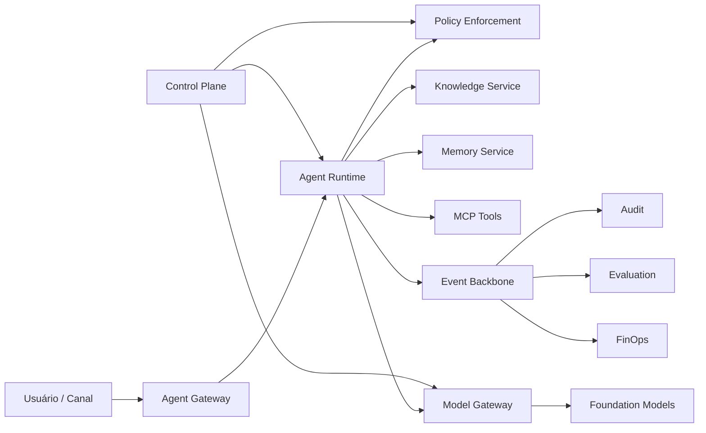

# Enterprise AI Platform — Book de Referência

[](https://github.com/leandrosflora/enterprise-ai-platform-demo-arch/actions/workflows/quality.yml)
[](https://github.com/leandrosflora/enterprise-ai-platform-demo-arch/actions/workflows/docs.yml)
[](https://github.com/leandrosflora/enterprise-ai-platform-demo-arch/actions/workflows/book.yml)

Um **book de referência para orientar o desenho, a governança, a implementação e a operação de plataformas corporativas de IA**.

O repositório organiza estratégia, capacidades, decisões arquiteturais, operating model, contratos, controles e caminhos de adoção para organizações que precisam construir sua própria Enterprise AI Platform.

## Natureza e objetivo

Este repositório é uma **referência documental e arquitetural**. Ele não entrega uma plataforma pronta, não representa uma distribuição de software e não prescreve uma implementação tecnológica única.

Os componentes e serviços descritos representam capacidades lógicas que devem ser adaptadas ao contexto, aos riscos, à maturidade e às tecnologias de cada organização.

O conteúdo fornece:

- **Book:** narrativa, decisões, operating model, estudos de caso e checklists;
- **Arquitetura de referência:** princípios, C4, ADRs, contratos, policies e runbooks;
- **Amostra de validação:** vertical slice mínima para verificar contratos e alguns controles documentados, sem pretensão de representar uma implementação produtiva.

## Leia como livro

Comece em [Enterprise AI Platform Book](docs/book/index.md).

| Perfil | Caminho recomendado |
|---|---|
| Executivo | [Por que uma AI Platform?](docs/book/01-why-ai-platform.md) → [Capability Map](docs/book/02-capability-map.md) → [Roadmap](docs/book/07-adoption-roadmap.md) |
| Arquiteto | [Capability Map](docs/book/02-capability-map.md) → [Operating Model](docs/book/03-operating-model.md) → [Decision Guides](docs/book/06-decision-guides.md) |
| Engenharia de plataforma | [Capability Map](docs/book/02-capability-map.md) → [Lifecycle](docs/book/04-agent-lifecycle.md) → [Checklists](docs/book/08-production-checklists.md) |
| Product squad | [Lifecycle](docs/book/04-agent-lifecycle.md) → [Caso RAG](docs/book/05-case-study-document-agent.md) → [Checklists](docs/book/08-production-checklists.md) |
| Segurança e LGPD | [Operating Model](docs/book/03-operating-model.md) → [Lifecycle](docs/book/04-agent-lifecycle.md) → [Segurança de RAG e memória](docs/security/rag-memory-security.md) |
| SRE e FinOps | [Capability Map](docs/book/02-capability-map.md) → [Roadmap](docs/book/07-adoption-roadmap.md) → [Checklists](docs/book/08-production-checklists.md) |

A pipeline `book.yml` gera automaticamente o manuscrito consolidado, o PDF e previews renderizados como artifact do GitHub Actions.

## Visão da plataforma de referência



O diagrama representa uma decomposição lógica. Ele não determina quantidade de serviços, tecnologia, produto ou topologia de implantação.

## Estado dos artefatos

| Área | Natureza | Fonte principal |
|---|---|---|
| Book | narrativa e orientação para implementação | `docs/book/` |
| APIs HTTP | contratos de referência validados em CI | `docs/contracts/openapi.yaml` |
| Eventos Kafka | contratos de referência validados em CI | `docs/contracts/async-api.yaml` |
| Policies | controles de referência validados em CI | `policies/` |
| C4 | modelos arquiteturais validados em CI | `docs/architecture/diagrams/` |
| Governança e risco | modelo operacional de referência | `docs/governance/` |
| Segurança de RAG e memória | padrão, policy e testes negativos | `docs/security/rag-memory-security.md` |
| Observabilidade e SLOs | diretrizes operacionais de referência | `docs/observability/` |
| Amostra técnica | validação de contratos e controles, não produção | `samples/vertical-slice/` |
| PDF | publicação automatizada do book | `.github/workflows/book.yml` |

## Mapa da documentação técnica

### Arquitetura

- [Princípios arquiteturais](docs/architecture/principles/principles.md)
- [Requisitos não funcionais](docs/architecture/non-functional-requirements.md)
- [Control plane e data plane](docs/architecture/control-plane-data-plane.md)
- [Modelo C4](docs/architecture/diagrams/)
- [ADRs](docs/adr/)

### Domínios e capacidades

- [Domínios](docs/domains/)
- [Serviços de referência](docs/services/)
- [Model Gateway](docs/services/model-gateway.md)
- [Knowledge Service](docs/services/knowledge-service.md)
- [Memory Service](docs/services/memory-service.md)

### Contratos

- [OpenAPI](docs/contracts/openapi.yaml)
- [AsyncAPI](docs/contracts/async-api.yaml)
- [Convenções de eventos](docs/contracts/events.md)
- [Contratos MCP](docs/contracts/mcp-contracts.md)
- [Data stores](docs/contracts/data-stores.md)

### Governança, segurança e operação

- [AI Risk Framework](docs/governance/ai-risk-framework.md)
- [Autorização](docs/security/authorization.md)
- [Segurança de RAG e memória](docs/security/rag-memory-security.md)
- [Threat Model](docs/security/threat-model.md)
- [Tracing e SLOs](docs/observability/tracing.md)
- [Runbooks](docs/runbooks/)
- [Roadmap para implementação](docs/roadmap/implementation-roadmap.md)

## Amostra técnica de validação

A pasta `samples/vertical-slice/` contém uma amostra mínima para exercitar contratos, estados do lifecycle, segregação de funções, retrieval seguro, memória e telemetria.

Ela funciona como **especificação executável de apoio à documentação**. Não deve ser interpretada como arquitetura física recomendada ou base de uma plataforma produtiva.

### Execução opcional

```bash
cd samples/vertical-slice
docker compose up --build
```

Em outro terminal:

```bash
bash scripts/demo.sh
```

A amostra percorre cadastro, submissão, aprovação, publicação, retrieval seguro, memória, eventos, métricas e traces.

## Qualidade automatizada

A pipeline `quality.yml` executa:

- lint de OpenAPI e AsyncAPI;
- validações semânticas de contratos e policies;
- verificação do manifest do book;
- verificação de links e integridade documental;
- compilação dos diagramas PlantUML;
- testes da amostra técnica;
- validação do Docker Compose;
- build do site MkDocs.

A pipeline `book.yml` executa:

- consolidação ordenada dos capítulos;
- exportação PDF com Pandoc e WeasyPrint;
- inspeção da estrutura do PDF;
- renderização das páginas iniciais;
- publicação do manuscrito, PDF e previews como artifact.

## Limites da referência

Este material não substitui threat modeling específico, análise jurídica, sizing, homologação de fornecedores, testes de carga ou desenho detalhado de infraestrutura.

Persistência, IdP corporativo, KMS, políticas de rede, alta disponibilidade, topologia, escolha de provedores e integrações reais devem ser definidos durante a implementação de cada organização.

## Contribuição e segurança

- [Como contribuir](CONTRIBUTING.md)
- [Política de segurança](SECURITY.md)

## Licença

MIT.
