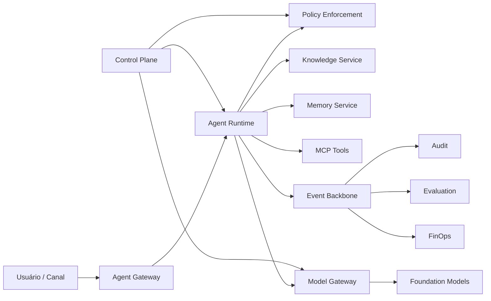

# Enterprise AI Platform — Arquitetura de Referência

[](https://github.com/leandrosflora/enterprise-ai-platform-demo-arch/actions/workflows/quality.yml)
[](https://github.com/leandrosflora/enterprise-ai-platform-demo-arch/actions/workflows/docs.yml)

Arquitetura de referência para projetar, governar e operar uma plataforma corporativa de IA com **agentes**, **RAG**, **memória**, **MCP**, **governança**, **avaliação**, **observabilidade**, **segurança** e **FinOps**.

O repositório contém dois tipos de artefato:

- **Arquitetura de referência:** princípios, C4, ADRs, contratos, controles e runbooks.
- **Vertical slice executável:** uma demo mínima que percorre cadastro, governança, publicação e invocação de um agente, com RAG simulado, tool call, eventos e telemetria.

## Visão da plataforma



## Quickstart

### Pré-requisitos

- Docker Engine 24+
- Docker Compose v2
- `curl`

### Subir a demo

```bash
cd samples/vertical-slice
docker compose up --build
```

Em outro terminal:

```bash
bash scripts/demo.sh
```

A demo executa:

1. cadastro do agente `policy-assistant`;
2. submissão e aprovação de governança;
3. publicação da versão;
4. invocação com resposta citada;
5. publicação de eventos;
6. exposição de métricas e traces.

Endpoints locais:

| Recurso | URL |
|---|---|
| API | `http://localhost:8080` |
| Swagger | `http://localhost:8080/docs` |
| Jaeger | `http://localhost:16686` |
| Prometheus | `http://localhost:9090` |
| Redpanda Console | `http://localhost:8081` |

## Estado dos artefatos

| Área | Status | Fonte principal |
|---|---|---|
| APIs HTTP | Implementável e validada em CI | `docs/contracts/openapi.yaml` |
| Eventos Kafka | Implementável e validada em CI | `docs/contracts/async-api.yaml` |
| Convenções de eventos | Normativa | `docs/contracts/events.md` |
| C4 | Fonte PlantUML validada em CI | `docs/architecture/diagrams/` |
| Governança e risco | Referência operacional | `docs/governance/` |
| Observabilidade e SLOs | Referência operacional | `docs/observability/` |
| Demo executável | Vertical slice, não produção | `samples/vertical-slice/` |

## Mapa da documentação

### Arquitetura

- [Princípios arquiteturais](docs/architecture/principles/principles.md)
- [Requisitos não funcionais](docs/architecture/non-functional-requirements.md)
- [Control plane e data plane](docs/architecture/control-plane-data-plane.md)
- [Modelo C4](docs/architecture/diagrams/)
- [ADRs](docs/adr/)

### Domínios e serviços

- [Domínios](docs/domains/)
- [Serviços](docs/services/)
- [Model Gateway](docs/services/model-gateway.md)

### Contratos

- [OpenAPI](docs/contracts/openapi.yaml)
- [AsyncAPI](docs/contracts/async-api.yaml)
- [Convenções de eventos](docs/contracts/events.md)
- [Contratos MCP](docs/contracts/mcp-contracts.md)
- [Data stores](docs/contracts/data-stores.md)

### Governança, segurança e operação

- [AI Risk Framework](docs/governance/ai-risk-framework.md)
- [Autorização](docs/security/authorization.md)
- [Threat Model](docs/security/threat-model.md)
- [Tracing e SLOs](docs/observability/tracing.md)
- [Runbooks](docs/runbooks/)
- [Roadmap](docs/roadmap/implementation-roadmap.md)

## Qualidade automatizada

A pipeline `quality.yml` executa:

- lint de OpenAPI e AsyncAPI com Spectral;
- validações semânticas de contratos;
- verificação de links e integridade documental;
- compilação dos diagramas PlantUML;
- testes da vertical slice;
- validação do Docker Compose;
- build do site MkDocs.

## Limites da demo

A vertical slice usa armazenamento em memória e respostas determinísticas. Ela prova o fluxo arquitetural e os contratos; não substitui uma implementação de produção. Persistência, IAM corporativo, KMS, políticas de rede, alta disponibilidade e integrações reais devem seguir os artefatos de arquitetura e implantação.

## Contribuição e segurança

- [Como contribuir](CONTRIBUTING.md)
- [Política de segurança](SECURITY.md)

## Licença

MIT.
