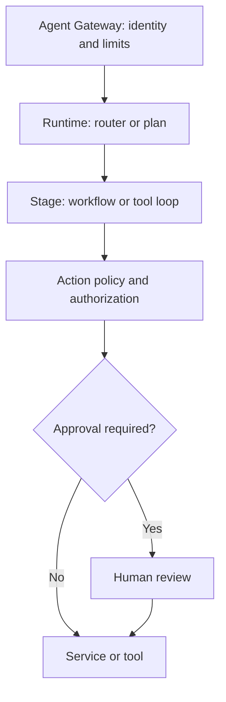

# Agent design patterns

This page turns recurring agent coordination patterns into architecture choices for the platform. A pattern describes **how execution is organized**; it does not prescribe a number of deployed services, models, or agents. Choose the least autonomy that satisfies the use case. Deterministic steps can coexist with LLM interpretation.

## Quick selection

| Need | Starting pattern | Main concern |
|---|---|---|
| Next step depends on a tool result | Reason–Act–Observe | Bound iterations, tools, time, and cost |
| Long task with dependencies | Plan–Then–Execute | Persist progress and define replanning triggers |
| Planning and execution need distinct responsibilities | Planner–Worker | Validate delegated tasks and results |
| Requests span distinct domains | Router | Measure routing errors and provide fallback |
| Known sequence of stages | Workflow | Prefer deterministic orchestration of transitions |
| Participants share intermediate work | Blackboard | Govern access, provenance, retention, and concurrency |
| Actions or data require enforceable limits | Guardrails | Enforce policy outside prompts at each boundary |
| Sensitive action requires a human decision | Human-in-the-Loop | Approve the precise effect before execution |
| External inputs may contain hostile instructions | User Input Firewall | Treat external content as untrusted data |

## Coordination patterns

### Reason–Act–Observe

The runtime chooses an action from the goal and current state, calls a tool, observes its result, and decides whether to continue. Use it when the full sequence of queries is unknown in advance. Set maximum steps, time and budget per invocation, allowed tools, and stopping conditions. Trace each decision and result. A model request for another tool never grants additional authorization.

### Plan–Then–Execute

Create a plan of verifiable steps before executing a long task with dependencies. Persist status and results per step, replan when an assumption fails, and recheck permissions before every action. A generated plan proposes work; it does not authorize it.

### Planner–Worker

Separate task decomposition from execution of a work unit. Software components or specialized agents can fulfill these roles; separate deployments are optional. Give the worker only necessary context and tools, validate its output contract, and tie the result to its originating step and plan.

### Router

Classify a request and select a specialized route. For high-impact routes, use rules or validated classification with an explicit path for ambiguous input. Low confidence must not silently select an arbitrary route. Evaluate routing accuracy, misroutes, and latency.

### Workflow

Connect steps with explicit inputs, outputs, and transitions. Code or a workflow engine owns ordering, retries, compensation, and state; use an LLM only where interpretation is needed. Specialized agents can perform stages, while a known sequence need not be reinvented by the model at every turn.

### Blackboard

Participants share facts, hypotheses, and intermediate results through common state. Distinguish verified facts from inferences; record author, provenance, version, and validity; handle concurrent writes. See [Memory Service](../services/memory-service.md) and [RAG and memory security](../security/rag-memory-security.md). A blackboard is not the system of record for balances, contracts, or official decisions.

## Control patterns

### Guardrails

Validate identity, scopes, data, tool arguments, usage limits, and output formats at execution boundaries. The [Agent Gateway](../services/agent-gateway.md), [Agent Runtime](../services/agent-runtime.md), and destination service enforce their relevant controls; final authorization remains with the protected resource. Model instructions guide behavior but do not replace [authorization](../security/authorization.md) or enforceable policies.

### Human-in-the-Loop

Pause before a sensitive action and show the reviewer its proposed effect, relevant data, and context. Bind approval to an action version or digest, reviewer identity, and expiry; any material change needs a fresh approval. Record approval, rejection, expiry, and execution. See the [approval workflow](../governance/approval-workflow.md). Lower-risk actions can run within limits under supervision as described in the [decision guides](../book/06-decision-guides.md).

### User Input Firewall

Track origin and trust level for user input, documents, search results, email, and tool responses. Validate format, length, and content for the channel, and isolate external instructions as data. Detectors and filters add defense but cannot guarantee prevention of prompt injection: blocking words such as “ignore” creates false positives and is easily bypassed. The decisive control is preventing untrusted content from changing permissions or invoking privileged tools. See the [threat model](../security/threat-model.md).

## Composition in the architecture

Knowledge and memory can inform decisions, but cannot grant privileges. Tracing, audit, and evaluation span every stage; pattern selection does not change the platform's security contracts.

### Example: conversational credit journey

1. A **Router** identifies intent and selects the credit journey; ambiguous input prompts clarification.
2. A **Workflow** fixes the order of identification, eligibility, offers, and formalization. **Reason–Act–Observe** may choose the next informational query within bounds.
3. **Guardrails** validate identity, scope, customer identifier, arguments, and authorization at the business service. A transactional tool uses an idempotency key.
4. **Human-in-the-Loop**, where risk policy requires it, presents the exact terms and obtains approval before creating a contract. Conversational confirmation alone does not replace the required control.
5. Official contract state stays in the system of record; memory retains only permitted conversational context.

## Evaluate the choice

Compare the design with a simpler baseline on real tasks. Measure task success, routing and plan quality, improper tool calls, authorization failures, actions without approval, recovery from errors, latency, tokens, and cost. Include hostile external content and failing tools in the test set. Correlate prompt, policy, model, and tool versions with traces. See the [Evaluation Framework](../governance/evaluation-framework.md) and [Tracing and SLOs](../observability/tracing.md).

## Source and adaptation

The nine pattern names and recurring problems were inspired by Shaun Wassell's presentation *Design Patterns for AI Agents* (provided by the repository author). Implementation guidance, controls, the banking example, and evaluation criteria here are adaptations for this reference architecture, rather than claims made in the original presentation.
