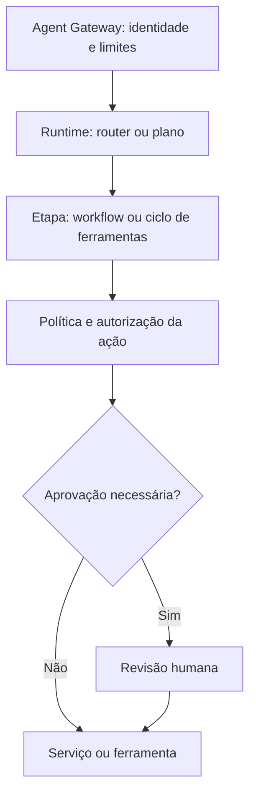

# Padrões de design de agentes

Esta página traduz padrões de coordenação de agentes em escolhas de arquitetura para a plataforma. Um padrão descreve **como o fluxo se organiza**, não determina o número de serviços, modelos ou agentes implantados. Prefira o menor nível de autonomia que satisfaça o caso de uso; uma etapa determinística pode coexistir com interpretação por LLM.

## Escolha rápida

| Necessidade | Padrão inicial | Atenção principal |
|---|---|---|
| Próximo passo depende da resposta de uma ferramenta | Reason–Act–Observe | Limitar iterações, ferramentas, tempo e custo |
| Tarefa longa com dependências | Plan–Then–Execute | Persistir progresso e replanejar sob condições explícitas |
| Plano e execução exigem responsabilidades distintas | Planner–Worker | Validar tarefas delegadas e resultados |
| Pedidos pertencem a domínios diferentes | Router | Medir erro de roteamento e permitir fallback |
| Sequência conhecida de etapas | Workflow | Preferir orquestração determinística para as transições |
| Participantes precisam compartilhar trabalho parcial | Blackboard | Governar acesso, proveniência, retenção e concorrência |
| Ações ou dados exigem limites verificáveis | Guardrails | Aplicar políticas fora do prompt, em cada fronteira |
| Uma ação sensível requer decisão humana | Human-in-the-Loop | Aprovar o efeito exato, antes da execução |
| Entradas externas podem conter instruções hostis | User Input Firewall | Tratar conteúdo externo como dado não confiável |

## Padrões de coordenação

### Reason–Act–Observe

O runtime escolhe uma ação a partir do objetivo e do estado atual, executa uma ferramenta, inspeciona o resultado e decide se continua. É útil quando não se conhece antecipadamente toda a sequência de consultas. Defina `maxSteps`, tempo e orçamento por invocação, conjunto de ferramentas permitido e condição de parada. Registre cada decisão e resultado no trace. Não conceda autorização adicional porque o modelo pediu outra ferramenta.

### Plan–Then–Execute

Produz um plano de etapas verificáveis antes da execução. É adequado para tarefas demoradas, com dependências e retomada após falha. Persista estado e resultado por etapa; replaneje quando uma premissa falhar e valide novamente as permissões antes de cada ação. O plano gerado é uma proposta de execução, não uma autorização.

### Planner–Worker

Separa quem decompõe a tarefa de quem executa uma unidade de trabalho. Pode ser realizado por componentes de software ou agentes especializados, sem impor uma implantação multiagente. Passe ao worker apenas contexto e ferramentas necessários; valide o contrato de saída e associe o resultado à etapa e ao plano de origem.

### Router

Classifica a solicitação e escolhe uma rota especializada. Para rotas de alto risco, use regras ou classificação validada e um caminho para ambiguidade; uma confiança baixa não deve virar seleção arbitrária. Avalie acerto de rota, falso encaminhamento e impacto no tempo de resposta.

### Workflow

Encadeia etapas com entradas, saídas e transições explícitas. Use código ou um mecanismo de workflow para ordem, retries, compensação e estado; use LLM apenas nas etapas que exigem interpretação. Agentes especializados podem executar etapas, mas a sequência conhecida não precisa ser decidida pelo modelo a cada interação.

### Blackboard

Participantes compartilham fatos, hipóteses e resultados intermediários em um estado comum. Diferencie fatos verificados de inferências, registre autor, origem, versão e validade, e controle escritas concorrentes. Consulte o [Memory Service](../services/memory-service.md) e a [segurança de RAG e memória](../security/rag-memory-security.md). O blackboard não substitui sistemas de registro para saldos, contratos ou decisões oficiais.

## Padrões de controle

### Guardrails

Valide identidade, escopos, dados, argumentos da ferramenta, limites de uso e formato de saída nos pontos de execução. O [Agent Gateway](../services/agent-gateway.md), o [Agent Runtime](../services/agent-runtime.md) e o serviço de destino aplicam controles pertinentes; a autorização efetiva deve continuar no recurso protegido. Instruções ao modelo ajudam no comportamento, mas não substituem [autorização](../security/authorization.md) nem políticas verificáveis.

### Human-in-the-Loop

Pause antes da ação sensível e apresente ao aprovador o efeito proposto, os dados relevantes e o contexto. Vincule a aprovação à versão ou digest da ação, identidade do aprovador e prazo de validade; qualquer mudança material exige nova aprovação. Registre aprovação, rejeição, expiração e execução. Veja o [fluxo de aprovação](../governance/approval-workflow.md). Ações de baixo risco podem operar sob limites e supervisão, conforme o [guia de decisões](../book/06-decision-guides.md).

### User Input Firewall

Identifique origem e nível de confiança de entradas do usuário, documentos, resultados de busca, e-mails e respostas de ferramentas. Valide formato, tamanho e conteúdo de acordo com o canal e isole instruções externas como dados. Detectores e filtros são defesa adicional, não garantia contra prompt injection: bloquear palavras como “ignore” causa falsos positivos e pode ser contornado. A proteção decisiva é impedir que conteúdo não confiável altere permissões ou acione ferramentas privilegiadas. Veja o [modelo de ameaças](../security/threat-model.md).

## Composição na arquitetura

Conhecimento e memória podem apoiar a decisão, mas não concedem privilégios. Trace, auditoria e avaliação atravessam todas as etapas; a escolha dos padrões não altera os contratos de segurança da plataforma.

### Exemplo: jornada de crédito conversacional

1. **Router** identifica a intenção e encaminha para a jornada de crédito; uma solicitação ambígua pede esclarecimento.
2. **Workflow** estabelece a ordem de identificação, elegibilidade, ofertas e formalização. **Reason–Act–Observe** pode ajudar a escolher a próxima consulta informativa dentro de limites.
3. **Guardrails** validam identidade, escopo, CPF, argumentos e autorização no serviço de negócio. A ferramenta transacional usa chave de idempotência.
4. **Human-in-the-Loop**, quando exigido pela política de risco, mostra os termos exatos e captura a aprovação antes da criação do contrato. Confirmação conversacional, por si só, não substitui o controle exigido.
5. O estado oficial do contrato permanece no sistema de registro; memória mantém apenas contexto permitido da conversa.

## Como avaliar a escolha

Compare o fluxo com uma alternativa mais simples em um conjunto de tarefas reais. Meça sucesso da tarefa, qualidade da rota e do plano, chamadas indevidas, falhas de autorização, ações sem aprovação, recuperação após erro, latência, tokens e custo. Inclua testes com conteúdo externo malicioso e condições de falha das ferramentas. Registre versões de prompt, política, modelo e ferramentas com o trace. Consulte o [Evaluation Framework](../governance/evaluation-framework.md) e [Tracing e SLOs](../observability/tracing.md).

## Origem e adaptação

Os nove nomes e problemas recorrentes foram inspirados na apresentação *Design Patterns for AI Agents*, de Shaun Wassell (material fornecido pelo autor do repositório). As recomendações de implementação, controles, exemplo bancário e critérios de avaliação nesta página são uma adaptação para esta arquitetura de referência; não são afirmações da apresentação original.
