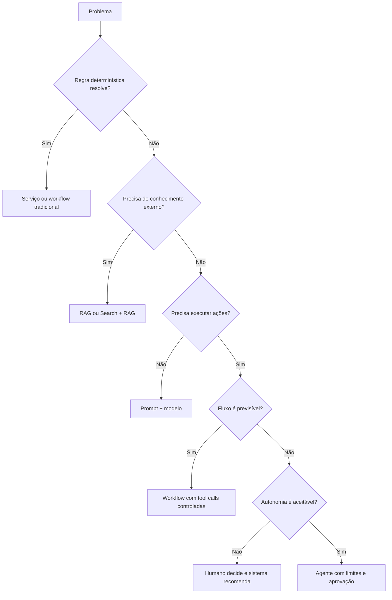

# AI Solution Decision Matrix

## Objet

Boost the indifferenced use of agents and select the most simple way to meet the business requirement.

## Matriz principal

| Necessidade | Preferential paw | When to avoid |
|---|---|---|
| Reposal on corporative content | RAG | when the deterministic rules are resolved |
| Content updated and citable | Search + RAG | when the source does not have a government or ACL |
| Specific import and style | Prompt + few-shot | when the problem is lack of knowledge |
| Specialised knowledge | Fine-tuning | when the data change in frequency |
| Preventive and audited procedure | deterministic Workflow | when the stages need to be statistically discovered |
| Statistical selection of stages | Agent | when there is no real need for autonomia |
| Embraced use of the tools | MCP | when a simple and exclusive API is enough |
| Reduishing of lativity and cost | Cache | when data are sensitive, volatilised or personalised |
| Temporary conversation context | Short-term memory | when there is no consent or completion |
| Permanent preferences | Long-term memory | when the father can be recovered from the official source |
|                                                                                                                                                                                                 | Model Gateway + Router | when there is only a approved and stable model |
| Complex tyre with separate areas | Multi-agent | when a single agent with tools resolves |

## Decision tree

## RAG versus fine-tuning

| Criteria | RAG | Fine-tuning |
|---|---|---|
| Knowledge update | Quickly | exige novo treino |
| Citations and rastreability | forte | limitada |
| Change of behavior | limitada | forte |
| Private data | - Get out of the weight | may be incorporated into the bodies |
| Custo inicial | menor | maior |
| Operation | Index and ingest | training and registry pipeline |

Use RAG for knowledge. Use fine-tuning for behaviour, format or specialization that is not achieved prompt and examples.

## Agent versus workflow

Choose only when real value is set in a dynamically determining which stages or tools are used. For regulatory, financial or other relevant collateral effects, it provides explanatory workflow, defined transactions and human approval.

## Selection criteria

The decision shall be recorded:

- requisito funcional e alternativa mais simples;
- risk level and autonomia;
- latability and volume;
- custo esperado;
- data and classification;
- the need for explanation;
- assessment strategy;
- fallback e rollback.
