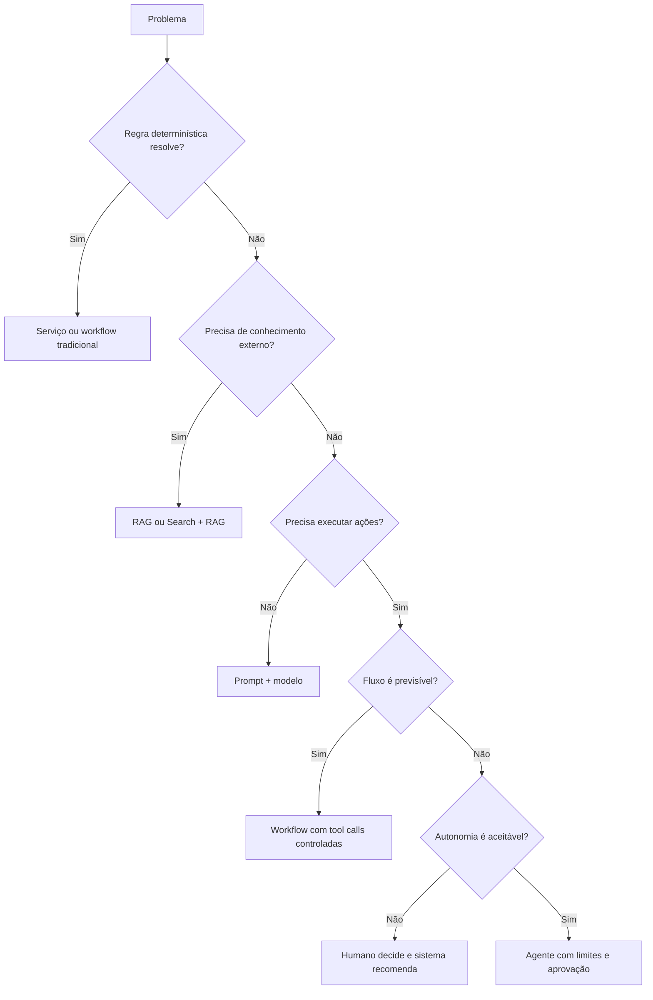

# AI Solution Decision Matrix

## Objective

Avoid the indiscriminate use of agents and select the simplest pattern that satisfies the business requirement.

## Matriz principal

| Need | Preferential pattern | When to avoid |
|---|---|---|
| Corporate content response | RAG | when deterministic rules solve |
| Updated and cytable content | Search + RAG | when the source has no governance or ACL |
| Specific behavior and style | Prompt + few-shot | when the problem is lack of knowledge |
| Stable expertise | Fine tuning | when the data change frequently |
| Foreseeable and auditable process | Deterministic workflow | when steps need to be dynamically discovered, the study aims to analyze the dynamics of these steps. |
| Dynamic choice of steps | Agent | when there is no real need for autonomy, there is a need for the study of the students. |
| Standard access to tools | MCP | when a simple and exclusive PIA is sufficient |
| Latency reduction and cost reduction | Cache | when data are sensitive, volatile or customized |
| Temporary conversation context | Short-term memory | Where there is no consent or purpose |
| Persistent preferences | Long-term memory | when the data can be recovered from the official source |
| Multiple providers/models | Model Gateway + Router | when there is only one approved and stable model, it is necessary to analyze the application of these models. |
| Complex task with separate domains | Multi-agent | when a single agent with tools solves the problem, it is necessary to apply these tools. |

## Decision tree

## RAG versus fine-tuning

| Criteria | RAG | Fine-tuning |
|---|---|---|
| Updating of knowledge | rapid | exige novo treino |
| Citations and traceability | forte | limitada |
| Change in behaviour | limitada | forte |
| Private data | are out of weight | may be incorporated to the weights |
| Initial cost | menor | maior |
| Operation | index and intake | training and registry pipeline |

Use RAG for knowledge; use fine-tuning for behavior, format or specialization that is not achieved by prompt and examples.

## Agent versus workflow

Choose agent only when there is real value in deciding dynamically which steps or tools to use. For regulated, financial or relevant side effects processes, prefer explicit workflow, delimited transactions and human approval.

## Selection criteria

The decision shall record:

- functional requirement and simpler alternative;
- level of risk and autonomy;
- latency and volume;
- expected cost;
- data and classification;
- need for explainability
- assessment strategy;
- fallback and rollback.
