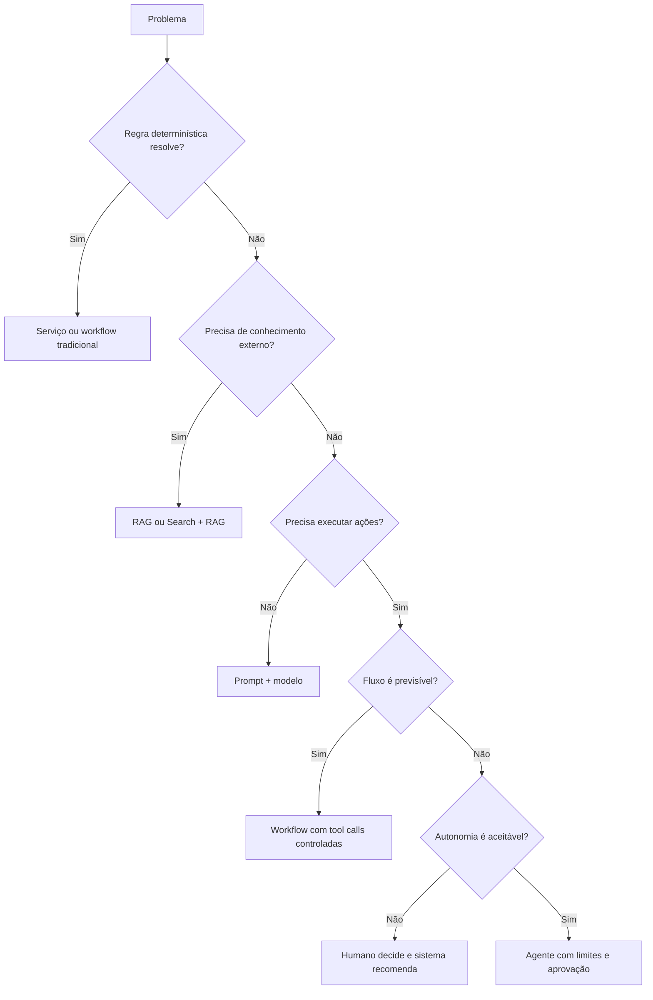

# AI Solution Decision Matrix

## Objective

Avoid the indiscriminate use of agents and select the simplest pattern that meets the business requirement.

## Matriz principal

| Necessidade | Preferential standard | When to Avoid |
|---|---|---|
| Corporate content response | RAG | when deterministic rules resolve |
| Updated and cited content | Search + RAG | where the source has no governance or ACL |
| Specific behaviour and style | Prompt + few-shot | When the problem is lack of knowledge |
| Stable specialised knowledge | Fine-tuning | When data changes frequently |
| Foreseeable and auditable process | Deterministic workflow | When stages need to be dynamically discovered |
| Dynamic selection of steps | Agent | When there is no real need for autonomy |
| Standardised access to tools | MCP | when a single API is sufficient |
| Reduction of latency and cost | Cache | where data is sensitive, volatile or personalized |
| Temporary context of the conversation | Short-term memory | where there is no consent or purpose |
| Persistent preferences | Long-term memory | when the data can be retrieved from the official source |
| Multiple providers/models | Model Gateway + Router | where there is only one approved and stable model |
| Complex task with separate domains | Multi-agent | When a single agent with tools solves |

## Decision tree

## RAG versus fine-tuning

| Criterion of use | RAG | Fine-tuning |
|---|---|---|
| Updating of knowledge | rapidly | exige novo treino |
| Citations and traceability | forte | limitada |
| Changes in behaviour | limitada | forte |
| Private data | They're out of bounds. | may be incorporated into weights |
| Custo inicial | menor | maior |
| Operations | Index and intake | Training and registration pipeline |

Use RAG for knowledge. Use fine-tuning for behavior, format or specialization that is not achieved by prompt and examples.

## Agent versus workflow

Choose an agent only when there is real value in dynamically deciding which steps or tools to use. For regulated, financial or relevant side-effects processes, prefer explicit workflow, delimited transactions and human approval.

## Selection criteria

The decision shall record:

- a simpler functional and alternative requirement;
- the level of risk and autonomy;
- latency and volume;
- custo esperado;
- data and classification;
- the need for explainability;
- the evaluation strategy;
- Fallback and rollback.
