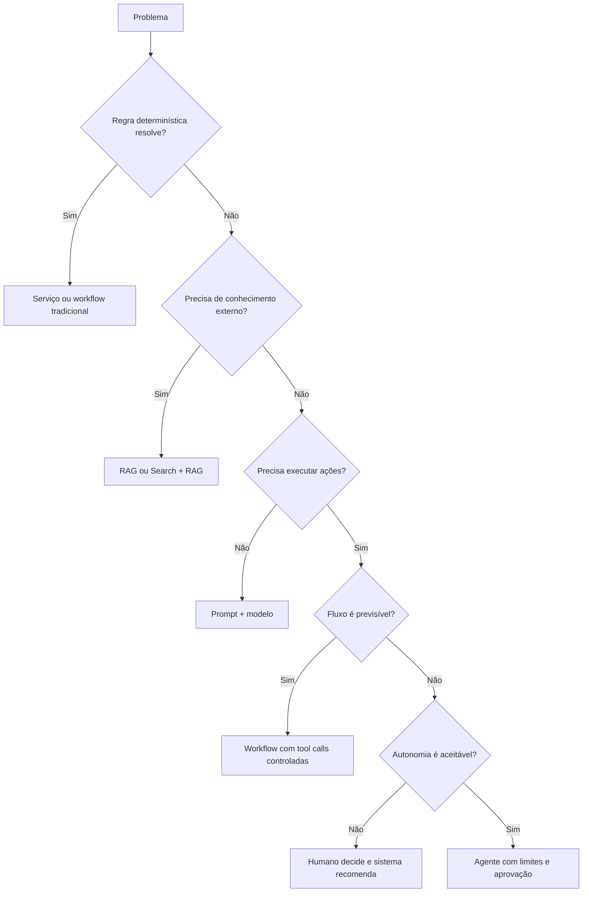

# AI Solution Decision Matrix

## Objetivo

Evitar o uso indiscriminado de agentes e selecionar o padrão mais simples que satisfaça o requisito de negócio.

## Matriz principal

| Necessidade | Padrão preferencial | Quando evitar |
|---|---|---|
| Resposta sobre conteúdo corporativo | RAG | quando regras determinísticas resolvem |
| Conteúdo atualizado e citável | Search + RAG | quando a fonte não possui governança ou ACL |
| Comportamento e estilo específicos | Prompt + few-shot | quando o problema é falta de conhecimento |
| Conhecimento especializado estável | Fine-tuning | quando os dados mudam com frequência |
| Processo previsível e auditável | Workflow determinístico | quando etapas precisam ser descobertas dinamicamente |
| Escolha dinâmica de etapas | Agente | quando não há necessidade real de autonomia |
| Acesso padronizado a ferramentas | MCP | quando uma API simples e exclusiva é suficiente |
| Redução de latência e custo | Cache | quando dados são sensíveis, voláteis ou personalizados |
| Contexto temporário de conversa | Short-term memory | quando não há consentimento ou finalidade |
| Preferências persistentes | Long-term memory | quando o dado pode ser recuperado da fonte oficial |
| Múltiplos provedores/modelos | Model Gateway + Router | quando existe apenas um modelo aprovado e estável |
| Tarefa complexa com domínios separados | Multi-agent | quando um único agente com ferramentas resolve |

## Árvore de decisão

## RAG versus fine-tuning

| Critério | RAG | Fine-tuning |
|---|---|---|
| Atualização de conhecimento | rápida | exige novo treino |
| Citações e rastreabilidade | forte | limitada |
| Alteração de comportamento | limitada | forte |
| Dados privados | ficam fora dos pesos | podem ser incorporados aos pesos |
| Custo inicial | menor | maior |
| Operação | índice e ingestão | pipeline de treino e registry |

Use RAG para conhecimento. Use fine-tuning para comportamento, formato ou especialização que não seja alcançada por prompt e exemplos.

## Agente versus workflow

Escolha agente somente quando houver valor real em decidir dinamicamente quais etapas ou ferramentas usar. Para processos regulados, financeiros ou com efeitos colaterais relevantes, prefira workflow explícito, transações delimitadas e aprovação humana.

## Critérios de seleção

A decisão deve registrar:

- requisito funcional e alternativa mais simples;
- nível de risco e autonomia;
- latência e volume;
- custo esperado;
- dados e classificação;
- necessidade de explicabilidade;
- estratégia de avaliação;
- fallback e rollback.
