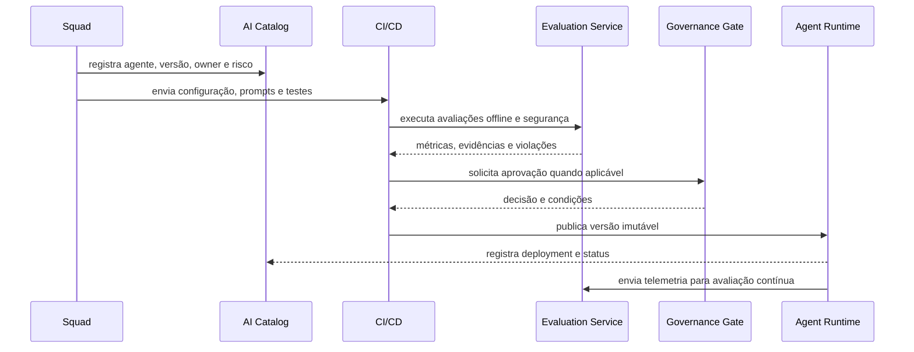

# Diagramas C4 e fluxos principais

Os níveis 1, 2 e 3 seguem a notação **C4-PlantUML**. Os arquivos `.puml` são as fontes canônicas; o workflow de documentação gera automaticamente os artefatos **SVG** e **PNG** usados pelo MkDocs, apresentações e documentos externos.

## Nível 1 — C4 System Context

O diagrama de contexto trata a **Enterprise AI Platform** como um único sistema e mostra pessoas, canais, provedores e sistemas corporativos que interagem com ela. O layout prioriza leitura vertical, com a plataforma no centro e sistemas externos ao redor.

[](diagrams/c4/c4-level-1-context.svg)

[Visualizar SVG](diagrams/c4/c4-level-1-context.svg) · [Abrir PNG](diagrams/c4/c4-level-1-context.png) · [Fonte PlantUML](diagrams/c4/src/c4-level-1-context.puml)

## Nível 2 — C4 Container

O diagrama de containers abre a plataforma em **data plane**, **control plane** e fundação operacional. A boundary principal, as boundaries internas, os containers azuis e os sistemas externos cinza seguem o estilo visual padrão do C4-PlantUML.

[](diagrams/c4/c4-level-2-container.svg)

[Visualizar SVG](diagrams/c4/c4-level-2-container.svg) · [Abrir PNG](diagrams/c4/c4-level-2-container.png) · [Fonte PlantUML](diagrams/c4/src/c4-level-2-container.puml)

## Nível 3 — Agent Runtime

O Agent Runtime coordena a execução de versões imutáveis de agentes, aplicando políticas e integrando modelo, conhecimento, memória, ferramentas, estado e telemetria.

[](diagrams/c4/c4-level-3-agent-runtime.svg)

[Visualizar SVG](diagrams/c4/c4-level-3-agent-runtime.svg) · [Abrir PNG](diagrams/c4/c4-level-3-agent-runtime.png) · [Fonte PlantUML](diagrams/c4/src/c4-level-3-agent-runtime.puml)

## Nível 3 — Knowledge Service

O Knowledge Service separa os pipelines de **ingestão** e **retrieval**, mantendo classificação, autorização, linhagem e citações explícitas.

[](diagrams/c4/c4-level-3-knowledge-service.svg)

[Visualizar SVG](diagrams/c4/c4-level-3-knowledge-service.svg) · [Abrir PNG](diagrams/c4/c4-level-3-knowledge-service.png) · [Fonte PlantUML](diagrams/c4/src/c4-level-3-knowledge-service.puml)

## Nível 3 — Evaluation Service

O Evaluation Service executa avaliações offline e contínuas, combina judges determinísticos, baseados em modelo e humanos, e produz evidências para release gates e governança.

[](diagrams/c4/c4-level-3-evaluation-service.svg)

[Visualizar SVG](diagrams/c4/c4-level-3-evaluation-service.svg) · [Abrir PNG](diagrams/c4/c4-level-3-evaluation-service.png) · [Fonte PlantUML](diagrams/c4/src/c4-level-3-evaluation-service.puml)

## Fluxo de publicação de agentes



## Regeneração dos diagramas

O script baixa uma versão fixa do PlantUML, valida o checksum e gera os cinco pares SVG/PNG:

```bash
sudo apt-get install graphviz default-jre curl
bash scripts/render-c4-diagrams.sh
```

O workflow `render-c4-diagrams.yml` executa o mesmo processo quando uma fonte `.puml`, o renderer ou o próprio workflow são alterados. Os artefatos gerados são versionados no mesmo branch.

## Princípios

- definições de agentes são versionadas e imutáveis após publicação;
- promoção entre ambientes depende de evidências, não apenas de aprovação manual;
- rollback deve selecionar uma versão conhecida, sem editar produção;
- tracing conecta canal, agente, modelo, retrieval e ferramentas.
