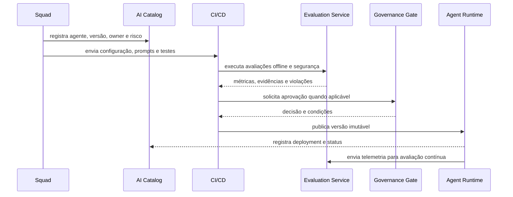

# C4 diagrams and main flows

Levels 1, 2 and 3 are marked **C4-PlantUML**. The `.puml` files are the canonical sources; the documentation workflow automatically generates the **SVG** and **PNG** artifacts used by the MkDocs, presentations and external documents.

## Level 1 C4 System Context

The context diagram treats **Enterprise AI Platform** as a single system and shows people, channels, providers and corporate systems interacting with it.

[](diagrams/c4/c4-level-1-context.svg)

[Visualizar SVG](diagrams/c4/c4-level-1-context.svg) · [Open the PNG](diagrams/c4/c4-level-1-context.png) · [The Commission shall adopt implementing acts.](diagrams/c4/src/c4-level-1-context.puml)

## Level 2  C4 Container

The container diagram opens the platform in **data plane**, **control plane** and operational foundation. The main boundary, internal boundaries, blue containers and gray external systems follow the standard visual style of C4-PlantUML.

[](diagrams/c4/c4-level-2-container.svg)

[Visualizar SVG](diagrams/c4/c4-level-2-container.svg) · [Open the PNG](diagrams/c4/c4-level-2-container.png) · [The Commission shall adopt implementing acts.](diagrams/c4/src/c4-level-2-container.puml)

## Level 3 Agent Runtime

Agent Runtime coordinates the execution of immutable versions of agents, applying policies and integrating model, knowledge, memory, tools, status and telemetry.

[](diagrams/c4/c4-level-3-agent-runtime.svg)

[Visualizar SVG](diagrams/c4/c4-level-3-agent-runtime.svg) · [Open the PNG](diagrams/c4/c4-level-3-agent-runtime.png) · [The Commission shall adopt implementing acts.](diagrams/c4/src/c4-level-3-agent-runtime.puml)

## Level 3 Knowledge Service

The Knowledge Service separates the intake and retrieval pipelines, maintaining classification, authorisation, lineage and explicit citations.

[](diagrams/c4/c4-level-3-knowledge-service.svg)

[Visualizar SVG](diagrams/c4/c4-level-3-knowledge-service.svg) · [Open the PNG](diagrams/c4/c4-level-3-knowledge-service.png) · [The Commission shall adopt implementing acts.](diagrams/c4/src/c4-level-3-knowledge-service.puml)

## Level 3 Evaluation Service

Evaluation Service carries out offline and ongoing assessments, combines deterministic, model-based and human judges, and produces evidence for release gates and governance.

[](diagrams/c4/c4-level-3-evaluation-service.svg)

[Visualizar SVG](diagrams/c4/c4-level-3-evaluation-service.svg) · [Open the PNG](diagrams/c4/c4-level-3-evaluation-service.png) · [The Commission shall adopt implementing acts.](diagrams/c4/src/c4-level-3-evaluation-service.puml)

## Flow of publication of agents



## Regeneration of the diagrams

The script downloads a fixed version of PlantUML, validates the checksum, and generates the five SVG/PNG pairs:

```bash
sudo apt-get install graphviz default-jre curl
bash scripts/render-c4-diagrams.sh
```

The `render-c4-diagrams.yml` workflow performs the same process when a `.puml` source, renderer, or workflow itself is changed.

## Principles

- definitions of agents are versioned and unchanged after publication;
- cross-environment promotion depends on evidence, not just manual approval;
- rollback shall select a known version without editing production;
- tracing connects channel, agent, model, retrieval and tools.
