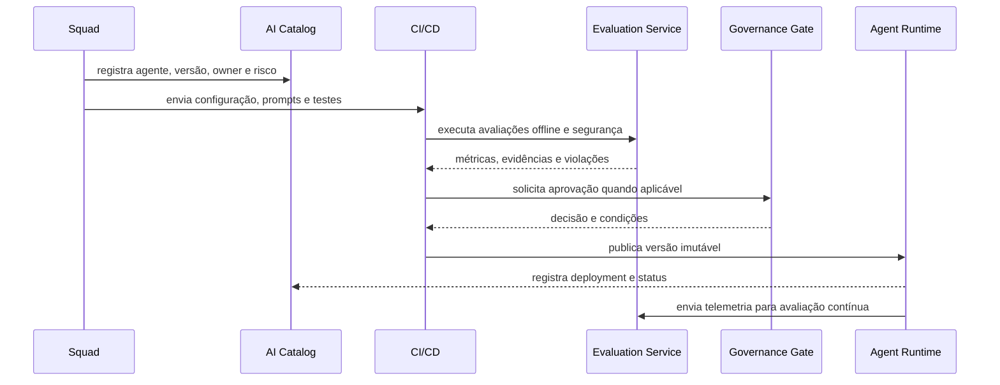

# Diagramas C4 e fluxos principais

Numbers 1, 2 and 3 follow the note **C4-PlantUML**. `.puml` files are the canonical sources; the documenting workflow automatically generates the artefacts **SVG** and **PNG** used by MkDocs, presentations and external documents.

## Level 1 — C4 System Context

The context diagram is a **Enterprise AI Platform** as a single system and shows people, canaries, speakers and corporative systems interageing with it. The layout prioritizes vertical reading, with the platform in the centre and external systems to the network.

[](diagrams/c4/c4-level-1-context.svg)

[Visualizar SVG](diagrams/c4/c4-level-1-context.svg) · [Abrir PNG](diagrams/c4/c4-level-1-context.png) · [Fonte PlantUML](diagrams/c4/src/c4-level-1-context.puml)

## Level 2 — C4 Container

The container diagram covers the plate in **data plane**, **control plane** and operational foundation. The main boundary, internal boundaries, the azuis containers and the external systems five follow the visual style of C4-PlantUML.

[](diagrams/c4/c4-level-2-container.svg)

[Visualizar SVG](diagrams/c4/c4-level-2-container.svg) · [Abrir PNG](diagrams/c4/c4-level-2-container.png) · [Fonte PlantUML](diagrams/c4/src/c4-level-2-container.puml)

## Level 3 — Agent Runtime

Agent Runtime coordinates the implementation of mutable agents versions, applying policies and integrating model, knowledge, memory, tools, state and telemetry.

[](diagrams/c4/c4-level-3-agent-runtime.svg)

[Visualizar SVG](diagrams/c4/c4-level-3-agent-runtime.svg) · [Abrir PNG](diagrams/c4/c4-level-3-agent-runtime.png) · [Fonte PlantUML](diagrams/c4/src/c4-level-3-agent-runtime.puml)

## Level 3 — Knowledge Service

Knowledge Service separates the **ingesto** and **retrieval** pipelines, maintaining classification, authorisation, line and explcitative quotations.

[](diagrams/c4/c4-level-3-knowledge-service.svg)

[Visualizar SVG](diagrams/c4/c4-level-3-knowledge-service.svg) · [Abrir PNG](diagrams/c4/c4-level-3-knowledge-service.png) · [Fonte PlantUML](diagrams/c4/src/c4-level-3-knowledge-service.puml)

## Level 3 — Evaluation Service

Evaluation Service executes offline and continuous evaluations, combinates certain judges, based on model and human models, and produces evidence to release gates and government.

[](diagrams/c4/c4-level-3-evaluation-service.svg)

[Visualizar SVG](diagrams/c4/c4-level-3-evaluation-service.svg) · [Abrir PNG](diagrams/c4/c4-level-3-evaluation-service.png) · [Fonte PlantUML](diagrams/c4/src/c4-level-3-evaluation-service.puml)

## - Publication of agents



## Restore of the diagrams

The script has a fixed version of PlantUML, valids the checksum and generates the five SVG/PNG:

```bash
sudo apt-get install graphviz default-jre curl
bash scripts/render-c4-diagrams.sh
```

The `render-c4-diagrams.yml` workflow executes the same process when a source `.puml`, the renderer or the own workflow are altered. The generated artefacts are re-created in the same branch.

## Principles

- definitions of agents are updated and imutable after publication;
- promotion of the environment depends on evidence, not just on manual approval;
- rollback should select a known version without editing production;
- tracing connection canal, agent, model, retrieval and tools.
