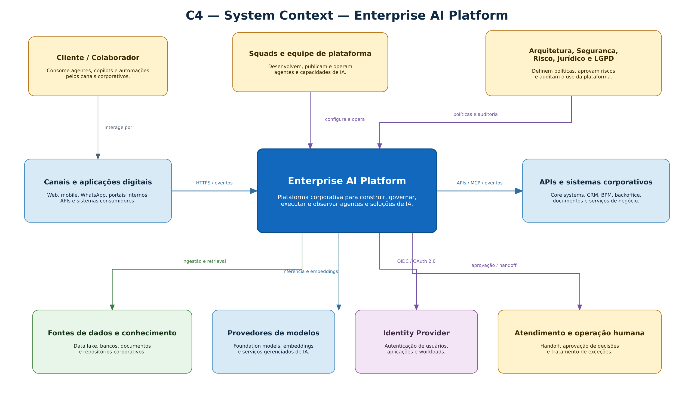
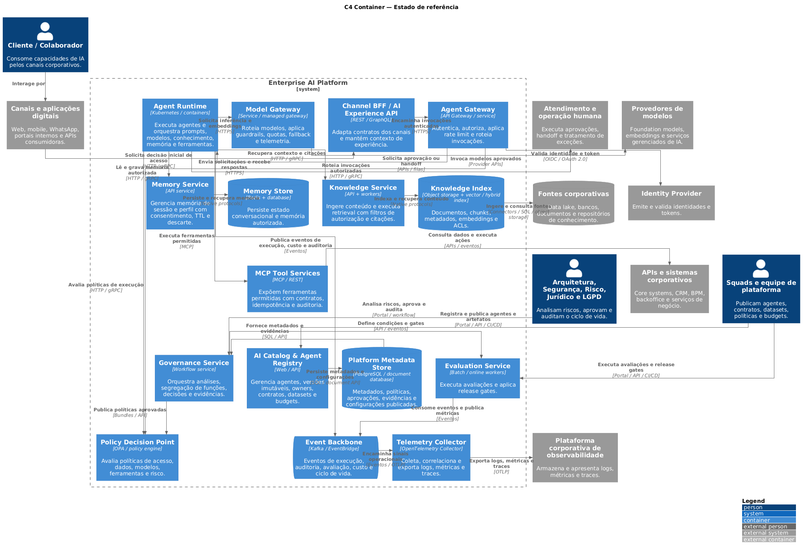
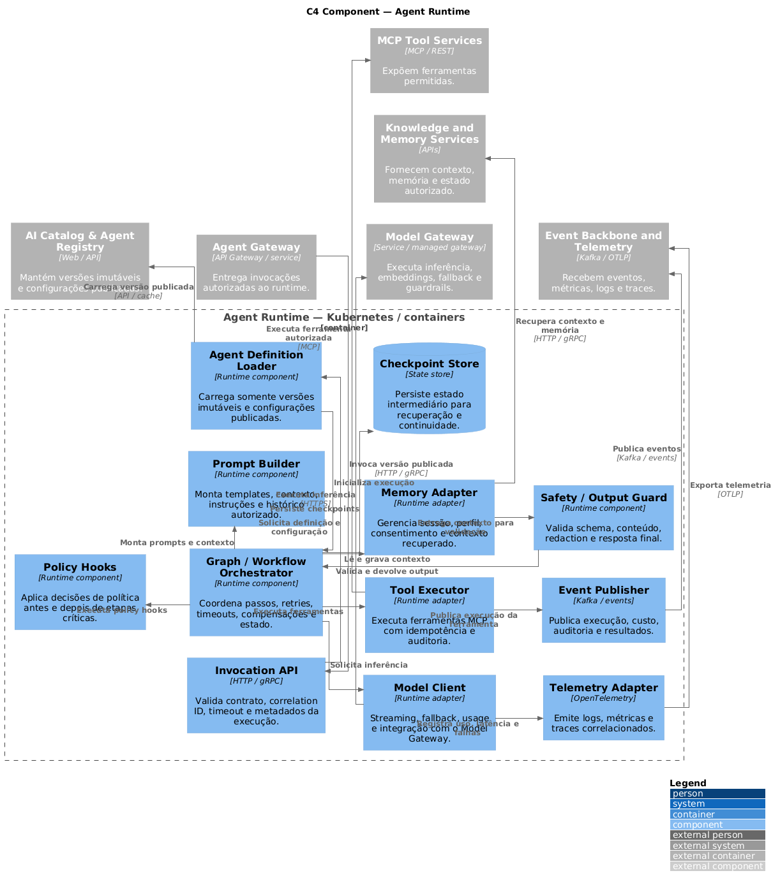
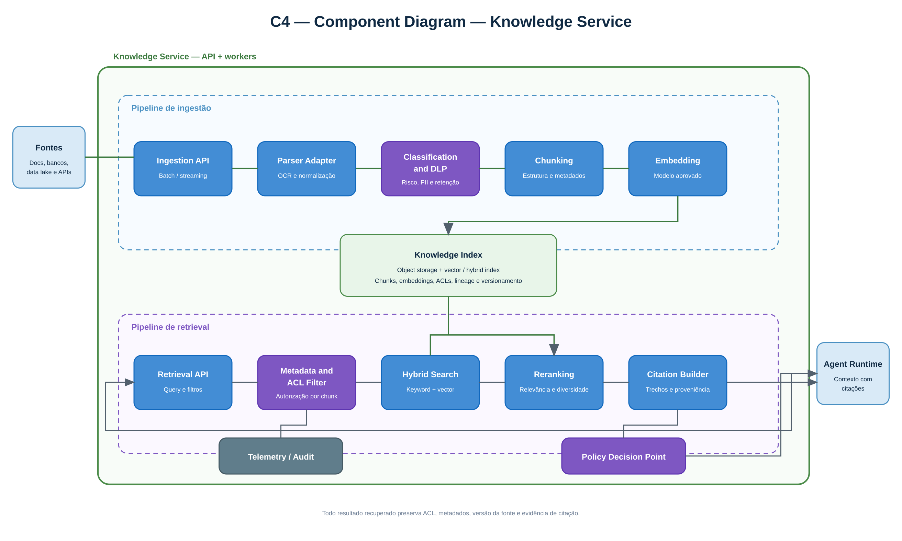
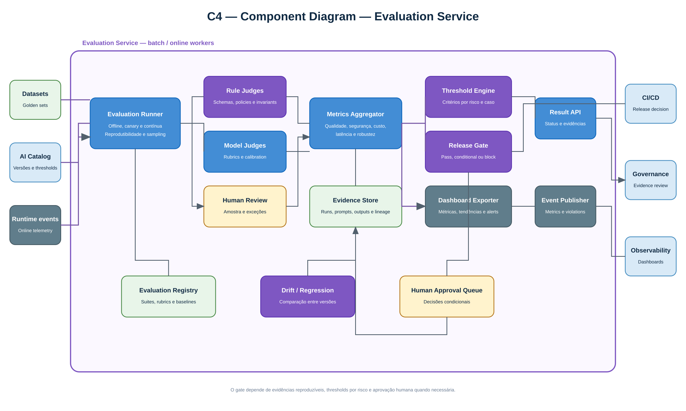
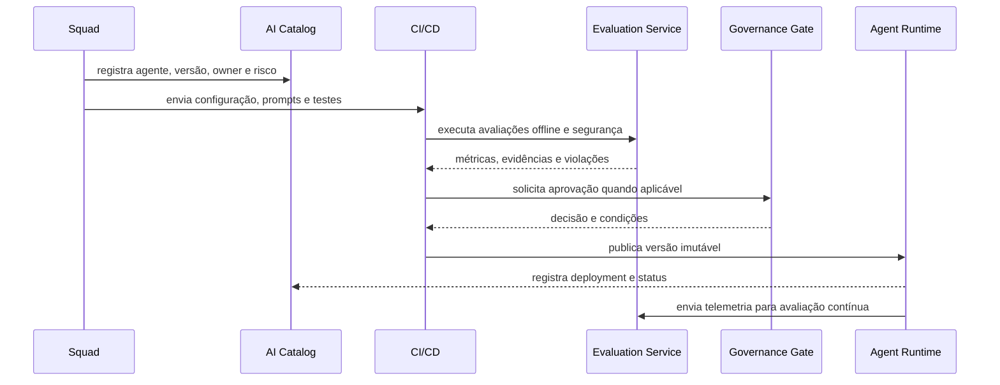

# C4 diagrams and main flows

Levels 1, 2 and 3 follow the notification **C4-PlantUML**. Os arquivos `.puml` they are canonical sources; the documentation workflow automatically generates the artifacts that are used in the workflow. **SVG** e **PNG** MkDocs, presentations and external documents.

## Level 1 — C4 System Context

The context diagram deals with the **Enterprise AI Platform** as a single system and shows people, channels, providers and corporate systems that interact with it.The layout prioritizes vertical reading, with the platform in the center and external systems around.

[](diagrams/c4/c4-level-1-context.svg)

[Visualizar SVG](diagrams/c4/c4-level-1-context.svg) · [Abrir PNG](diagrams/c4/c4-level-1-context.png) · [PlantUML Source](diagrams/c4/src/c4-level-1-context.puml)

## Level 2 — C4 Container

O diagrama de containers abre a plataforma em **data plane**, **control plane** e operational foundation. The main boundary, internal boundaries, blue containers and external gray systems follow the standard visual style of C4-PlantUML.

[](diagrams/c4/c4-level-2-container.svg)

[Visualizar SVG](diagrams/c4/c4-level-2-container.svg) · [Abrir PNG](diagrams/c4/c4-level-2-container.png) · [PlantUML Source](diagrams/c4/src/c4-level-2-container.puml)

## Level 3 — Agent Runtime

The Agent Runtime coordinates the implementation of immutable versions of agents, applying policies and integrating model, knowledge, memory, tools, state and telemetry.

[](diagrams/c4/c4-level-3-agent-runtime.svg)

[Visualizar SVG](diagrams/c4/c4-level-3-agent-runtime.svg) · [Abrir PNG](diagrams/c4/c4-level-3-agent-runtime.png) · [PlantUML Source](diagrams/c4/src/c4-level-3-agent-runtime.puml)

## Level 3 — Knowledge Service

O Knowledge Service separa os pipelines de **Ingestion** e **retrieval**, maintaining classification, authorization, lineage and explicit citations.

[](diagrams/c4/c4-level-3-knowledge-service.svg)

[Visualizar SVG](diagrams/c4/c4-level-3-knowledge-service.svg) · [Abrir PNG](diagrams/c4/c4-level-3-knowledge-service.png) · [PlantUML Source](diagrams/c4/src/c4-level-3-knowledge-service.puml)

## Level 3 — Evaluation Service

The Evaluation Service performs offline and continuous evaluations, combines deterministic judges, based on model and humans, and produces evidence for release gates and governance.

[](diagrams/c4/c4-level-3-evaluation-service.svg)

[Visualizar SVG](diagrams/c4/c4-level-3-evaluation-service.svg) · [Abrir PNG](diagrams/c4/c4-level-3-evaluation-service.png) · [PlantUML Source](diagrams/c4/src/c4-level-3-evaluation-service.puml)

## Publication flow of officials



## Regeneration of diagrams

The script downloads a fixed version of the PlantUML, validates the checksum and generates the five pairs SVG/PNG:

```bash
sudo apt-get install graphviz default-jre curl
bash scripts/render-c4-diagrams.sh
```

O workflow `render-c4-diagrams.yml` it performs the same process when a source is a source of `.puml`, the render or the workflow itself are altered, and the artifacts generated are versioned in the same branch.

## Principles

- definitions of agents are versioned and immutable after publication;
- promotion between environments depends on evidence, not only manual approval;
- rollback must select a known version, without editing production;
- tracing connects canal, agent, model, retrieval and tools.
