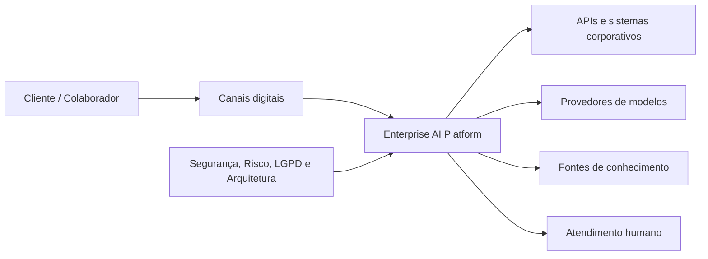
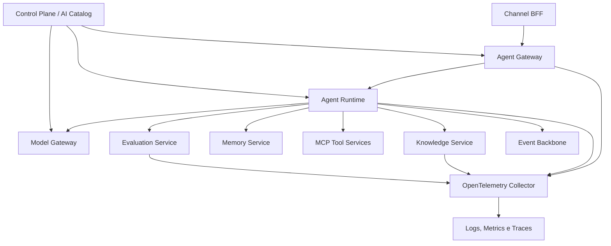
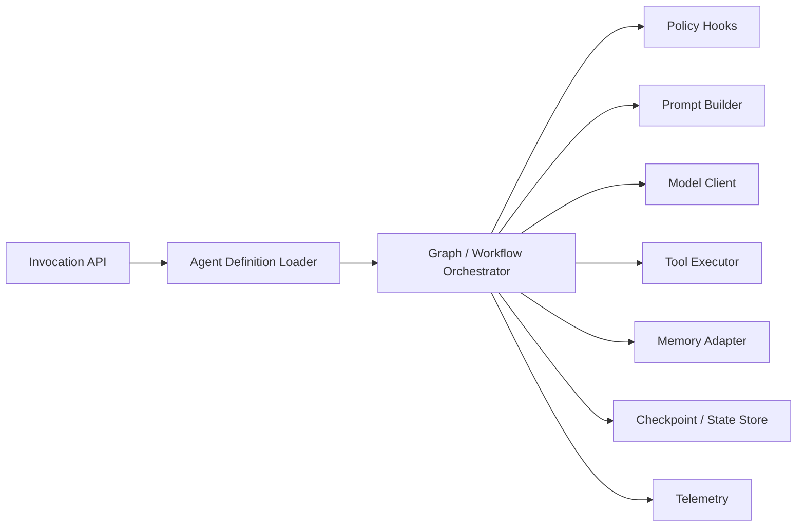
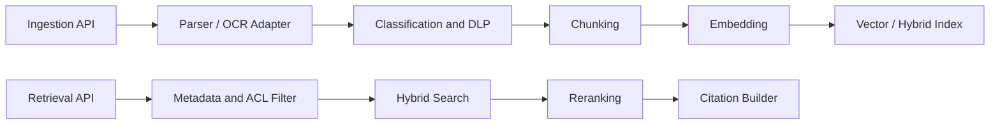
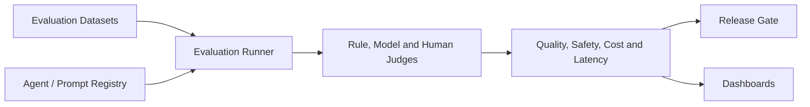
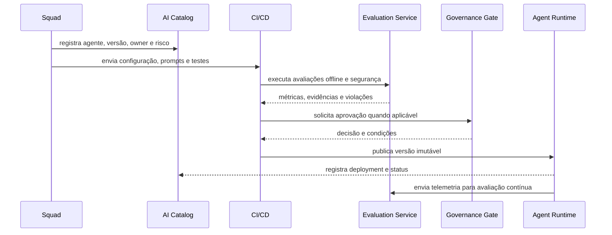

# Diagramas C4 e fluxos principais

Os diagramas usam Mermaid para permanecerem versionáveis e renderizáveis no MkDocs.

## Nível 1 — Contexto

## Nível 2 — Containers

## Nível 3 — Agent Runtime

## Nível 3 — Knowledge Service

## Nível 3 — Evaluation Service

## Fluxo de publicação de agentes

## Princípios

- definições de agentes são versionadas e imutáveis após publicação;
- promoção entre ambientes depende de evidências, não apenas de aprovação manual;
- rollback deve selecionar uma versão conhecida, sem editar produção;
- tracing conecta canal, agente, modelo, retrieval e ferramentas.