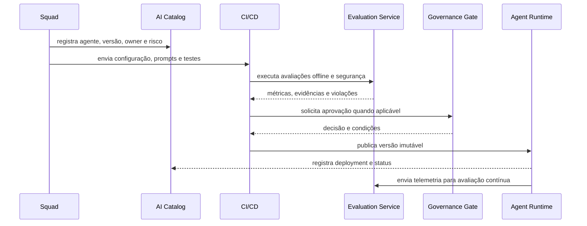

# Diagramas C4 e fluxos principais

Os níveis 1, 2 e 3 são publicados como artefatos estáticos em **SVG** e **PNG**. O SVG é a fonte canônica; o PNG é gerado automaticamente para compatibilidade com o MkDocs, exportação e consumo fora do navegador.

## Nível 1 — C4 System Context

O diagrama de contexto trata a **Enterprise AI Platform** como um único sistema e mostra pessoas, canais, provedores e sistemas corporativos que interagem com ela.

[](diagrams/c4/c4-level-1-context.svg)

[Visualizar SVG](diagrams/c4/c4-level-1-context.svg) · [Abrir PNG](diagrams/c4/c4-level-1-context.png)

## Nível 2 — C4 Container

O diagrama de containers abre a plataforma em **data plane**, **control plane** e fundação operacional. Ele destaca as principais unidades executáveis, data stores, integrações e relações de governança.

[](diagrams/c4/c4-level-2-container.svg)

[Visualizar SVG](diagrams/c4/c4-level-2-container.svg) · [Abrir PNG](diagrams/c4/c4-level-2-container.png)

## Nível 3 — Agent Runtime

O Agent Runtime coordena a execução de versões imutáveis de agentes, aplicando políticas e integrando modelo, conhecimento, memória, ferramentas, estado e telemetria.

[](diagrams/c4/c4-level-3-agent-runtime.svg)

[Visualizar SVG](diagrams/c4/c4-level-3-agent-runtime.svg) · [Abrir PNG](diagrams/c4/c4-level-3-agent-runtime.png)

## Nível 3 — Knowledge Service

O Knowledge Service separa os pipelines de **ingestão** e **retrieval**, mantendo classificação, autorização, linhagem e citações explícitas.

[](diagrams/c4/c4-level-3-knowledge-service.svg)

[Visualizar SVG](diagrams/c4/c4-level-3-knowledge-service.svg) · [Abrir PNG](diagrams/c4/c4-level-3-knowledge-service.png)

## Nível 3 — Evaluation Service

O Evaluation Service executa avaliações offline e contínuas, combina judges determinísticos, baseados em modelo e humanos, e produz evidências para release gates e governança.

[](diagrams/c4/c4-level-3-evaluation-service.svg)

[Visualizar SVG](diagrams/c4/c4-level-3-evaluation-service.svg) · [Abrir PNG](diagrams/c4/c4-level-3-evaluation-service.png)

## Fluxo de publicação de agentes


```mermaid
sequenceDiagram
  participant Squad
  participant Catalog as AI Catalog
  participant CI as CI/CD
  participant Eval as Evaluation Service
  participant Gov as Governance Gate
  participant Runtime as Agent Runtime
  Squad->>Catalog: registra agente, versão, owner e risco
  Squad->>CI: envia configuração, prompts e testes
  CI->>Eval: executa avaliações offline e segurança
  Eval-->>CI: métricas, evidências e violações
  CI->>Gov: solicita aprovação quando aplicável
  Gov-->>CI: decisão e condições
  CI->>Runtime: publica versão imutável
  Runtime-->>Catalog: registra deployment e status
  Runtime->>Eval: envia telemetria para avaliação contínua
```

## Regeneração dos PNGs

```bash
sudo apt-get install librsvg2-bin
./scripts/render-c4-png.sh
```

O workflow `render-c4-diagrams.yml` executa o mesmo processo quando um SVG é alterado e versiona os PNGs gerados.

## Princípios

- definições de agentes são versionadas e imutáveis após publicação;
- promoção entre ambientes depende de evidências, não apenas de aprovação manual;
- rollback deve selecionar uma versão conhecida, sem editar produção;
- tracing conecta canal, agente, modelo, retrieval e ferramentas.
