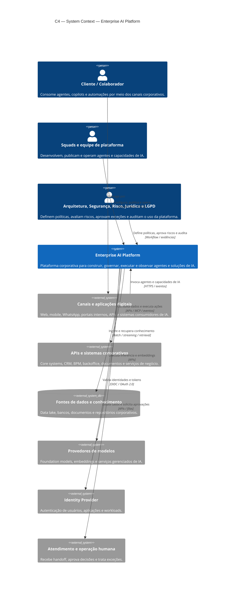
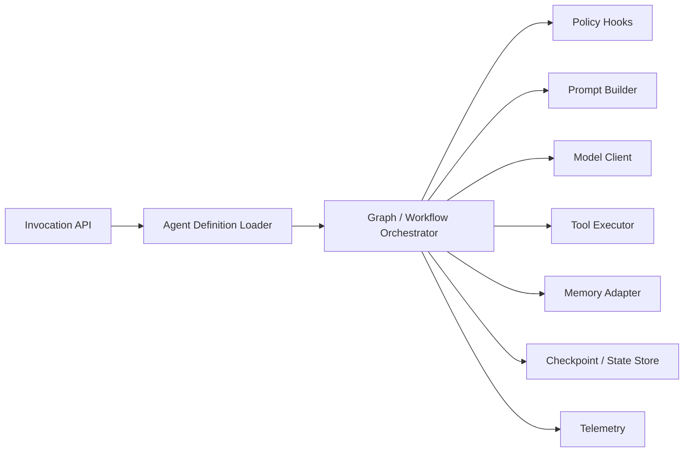
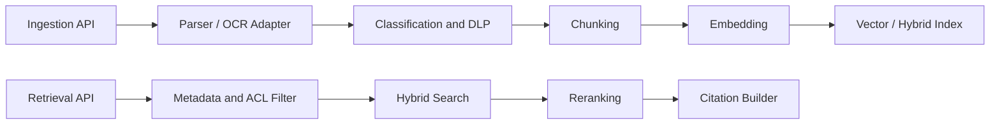
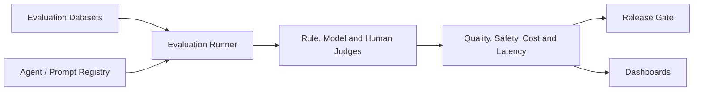
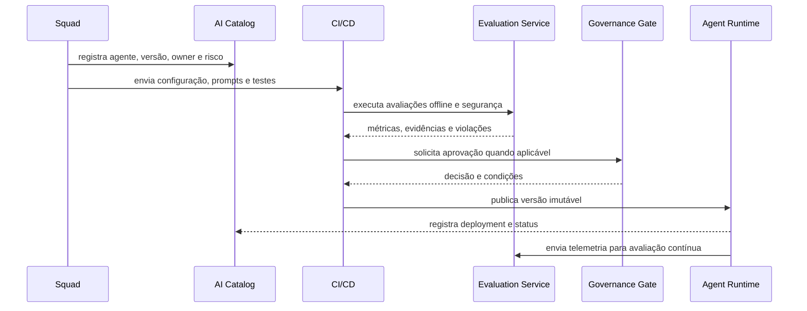

# Diagramas C4 e fluxos principais

Os níveis 1 e 2 usam a notação C4 nativa do Mermaid para separar corretamente **contexto do sistema** e **containers internos**. O nível 1 trata a Enterprise AI Platform como uma única caixa; o nível 2 abre essa caixa e mostra aplicações, serviços, data stores e infraestrutura executável.

## Nível 1 — C4 System Context

O diagrama de contexto mostra pessoas e sistemas que interagem com a plataforma. Componentes internos não aparecem neste nível.

```mermaid
C4Context
  title C4 — System Context — Enterprise AI Platform

  Person(user, "Cliente / Colaborador", "Consome agentes, copilots e automações por meio dos canais corporativos.")
  Person(platform_team, "Squads e equipe de plataforma", "Desenvolvem, publicam e operam agentes e capacidades de IA.")
  Person(governance, "Arquitetura, Segurança, Risco, Jurídico e LGPD", "Definem políticas, avaliam riscos, aprovam exceções e auditam o uso da plataforma.")

  System(ai_platform, "Enterprise AI Platform", "Plataforma corporativa para construir, governar, executar e observar agentes e soluções de IA.")

  System_Ext(channels, "Canais e aplicações digitais", "Web, mobile, WhatsApp, portais internos, APIs e sistemas consumidores de IA.")
  System_Ext(corporate_systems, "APIs e sistemas corporativos", "Core systems, CRM, BPM, backoffice, documentos e serviços de negócio.")
  SystemDb_Ext(knowledge_sources, "Fontes de dados e conhecimento", "Data lake, bancos, documentos e repositórios corporativos.")
  System_Ext(model_providers, "Provedores de modelos", "Foundation models, embeddings e serviços gerenciados de IA.")
  System_Ext(identity_provider, "Identity Provider", "Autenticação de usuários, aplicações e workloads.")
  System_Ext(human_service, "Atendimento e operação humana", "Recebe handoff, aprova decisões e trata exceções.")

  Rel(user, channels, "Interage por")
  Rel(channels, ai_platform, "Invoca agentes e capacidades de IA", "HTTPS / eventos")
  Rel(platform_team, ai_platform, "Configura, publica e opera", "Portal / APIs / CI/CD")
  Rel(governance, ai_platform, "Define políticas, aprova riscos e audita", "Workflow / evidências")
  Rel(ai_platform, corporate_systems, "Consulta dados e executa ações", "APIs / MCP / eventos")
  Rel(ai_platform, knowledge_sources, "Ingere e recupera conhecimento", "Batch / streaming / retrieval")
  Rel(ai_platform, model_providers, "Executa inferência e embeddings", "APIs")
  Rel(ai_platform, identity_provider, "Valida identidades e tokens", "OIDC / OAuth 2.0")
  Rel(ai_platform, human_service, "Escala casos e solicita aprovações", "APIs / filas")

  UpdateLayoutConfig($c4ShapeInRow="4", $c4BoundaryInRow="1")
```

## Nível 2 — C4 Container

O diagrama de containers mostra as principais unidades executáveis e data stores da Enterprise AI Platform. Cada container possui responsabilidade e tecnologia explícitas.

```mermaid
C4Container
  title C4 — Container Diagram — Enterprise AI Platform

  Person(user, "Cliente / Colaborador", "Consome capacidades de IA pelos canais corporativos.")
  Person(platform_team, "Squads e equipe de plataforma", "Publicam agentes, contratos, datasets, políticas e budgets.")
  Person(governance, "Arquitetura, Segurança, Risco, Jurídico e LGPD", "Analisam riscos, aprovam e auditam o ciclo de vida.")

  System_Ext(channels, "Canais e aplicações digitais", "Web, mobile, WhatsApp, portais internos e APIs consumidoras.")
  System_Ext(corporate_systems, "APIs e sistemas corporativos", "Serviços de negócio executados por ferramentas e agentes.")
  SystemDb_Ext(knowledge_sources, "Fontes corporativas", "Data lake, bancos, documentos e repositórios de conhecimento.")
  System_Ext(model_providers, "Provedores de modelos", "Foundation models, embeddings e serviços gerenciados de IA.")
  System_Ext(identity_provider, "Identity Provider", "Emite e valida identidades e tokens.")
  System_Ext(human_service, "Atendimento e operação humana", "Executa aprovações, handoff e tratamento de exceções.")
  System_Ext(observability_backend, "Plataforma corporativa de observabilidade", "Armazena e apresenta logs, métricas e traces.")

  Container_Boundary(platform, "Enterprise AI Platform") {
    Container(channel_bff, "Channel BFF / AI Experience API", "REST / GraphQL", "Adapta contratos dos canais e mantém contexto de experiência.")
    Container(agent_gateway, "Agent Gateway", "API Gateway / service", "Autentica, autoriza, aplica rate limit e roteia invocações.")
    Container(agent_runtime, "Agent Runtime", "Kubernetes / containers", "Executa agentes e orquestra prompts, modelos, conhecimento, memória e ferramentas.")
    Container(model_gateway, "Model Gateway", "Service / managed gateway", "Roteia modelos, aplica guardrails, quotas, fallback e telemetria.")

    Container(knowledge_service, "Knowledge Service", "API + workers", "Ingere conteúdo e executa retrieval com filtros de autorização e citações.")
    ContainerDb(knowledge_index, "Knowledge Index", "Object storage + vector / hybrid index", "Armazena documentos, chunks, metadados, embeddings e ACLs.")
    Container(memory_service, "Memory Service", "API service", "Gerencia memória de sessão e perfil com consentimento, TTL e descarte.")
    ContainerDb(memory_store, "Memory Store", "Redis + database", "Persiste estado conversacional e memória autorizada.")

    Container(mcp_services, "MCP Tool Services", "MCP / REST", "Expõem ferramentas permitidas com contratos, idempotência e auditoria.")
    Container(policy_decision, "Policy Decision Point", "OPA / policy engine", "Avalia políticas de acesso, dados, modelos, ferramentas e risco com baixa latência.")

    Container(ai_catalog, "AI Catalog & Agent Registry", "Web / API", "Gerencia agentes, versões imutáveis, owners, contratos, datasets, budgets e estado do ciclo de vida.")
    ContainerDb(platform_metadata, "Platform Metadata Store", "PostgreSQL / document database", "Persiste metadados, políticas, aprovações, evidências e configurações publicadas.")
    Container(governance_service, "Governance Service", "Workflow service", "Orquestra análises, segregação de funções, decisões e evidências de governança.")
    Container(evaluation_service, "Evaluation Service", "Batch / online workers", "Executa avaliações de qualidade, segurança, custo e latência e aplica release gates.")

    ContainerQueue(event_backbone, "Event Backbone", "Kafka / EventBridge", "Distribui eventos de execução, auditoria, avaliação, custo e ciclo de vida.")
    Container(telemetry_collector, "Telemetry Collector", "OpenTelemetry Collector", "Coleta, correlaciona e exporta logs, métricas e traces.")
  }

  Rel(user, channels, "Interage por")
  Rel(channels, channel_bff, "Envia solicitações e recebe respostas", "HTTPS")
  Rel(channel_bff, agent_gateway, "Encaminha invocações autenticadas", "HTTPS")
  Rel(agent_gateway, identity_provider, "Valida identidade e token", "OIDC / OAuth 2.0")
  Rel(agent_gateway, policy_decision, "Solicita decisão inicial de acesso", "HTTP / gRPC")
  Rel(agent_gateway, agent_runtime, "Roteia invocações autorizadas", "HTTP / gRPC")

  Rel(agent_runtime, ai_catalog, "Carrega somente versões publicadas", "API / cache")
  Rel(agent_runtime, policy_decision, "Avalia políticas de execução", "HTTP / gRPC")
  Rel(agent_runtime, model_gateway, "Solicita inferência e embeddings", "HTTPS")
  Rel(model_gateway, model_providers, "Invoca modelos aprovados", "Provider APIs")

  Rel(agent_runtime, knowledge_service, "Recupera contexto e citações", "HTTP / gRPC")
  Rel(knowledge_service, knowledge_sources, "Ingere e consulta fontes", "Connectors / SQL / object storage")
  Rel(knowledge_service, knowledge_index, "Indexa e recupera conteúdo", "Native protocols")
  Rel(agent_runtime, memory_service, "Lê e grava memória autorizada", "HTTP / gRPC")
  Rel(memory_service, memory_store, "Persiste e recupera memória", "Native protocols")

  Rel(agent_runtime, mcp_services, "Executa ferramentas permitidas", "MCP")
  Rel(mcp_services, corporate_systems, "Consulta dados e executa ações", "APIs / eventos")
  Rel(agent_runtime, human_service, "Solicita aprovação ou handoff", "APIs / filas")

  Rel(platform_team, ai_catalog, "Registra e publica agentes e artefatos", "Portal / API / CI/CD")
  Rel(platform_team, evaluation_service, "Executa avaliações e release gates", "Portal / API / CI/CD")
  Rel(governance, governance_service, "Analisa riscos, aprova e audita", "Portal / workflow")
  Rel(governance_service, ai_catalog, "Atualiza estado, decisões e evidências", "API")
  Rel(ai_catalog, platform_metadata, "Persiste metadados e configurações", "SQL / document API")
  Rel(governance_service, policy_decision, "Publica políticas aprovadas", "Bundles / API")
  Rel(evaluation_service, ai_catalog, "Lê versões, datasets e thresholds", "API")

  Rel(agent_runtime, evaluation_service, "Envia resultados para avaliação", "Eventos / API")
  Rel(agent_runtime, event_backbone, "Publica eventos de execução, custo e auditoria", "Eventos")
  Rel(evaluation_service, event_backbone, "Consome eventos e publica métricas", "Eventos")

  Rel(agent_gateway, telemetry_collector, "Exporta telemetria", "OpenTelemetry")
  Rel(agent_runtime, telemetry_collector, "Exporta telemetria", "OpenTelemetry")
  Rel(knowledge_service, telemetry_collector, "Exporta telemetria", "OpenTelemetry")
  Rel(evaluation_service, telemetry_collector, "Exporta telemetria", "OpenTelemetry")
  Rel(telemetry_collector, observability_backend, "Exporta logs, métricas e traces", "OTLP")

  UpdateLayoutConfig($c4ShapeInRow="4", $c4BoundaryInRow="1")
```

## Nível 3 — Agent Runtime

```mermaid
flowchart LR
  API[Invocation API] --> LOAD[Agent Definition Loader]
  LOAD --> ORCH[Graph / Workflow Orchestrator]
  ORCH --> POLICY[Policy Hooks]
  ORCH --> PROMPT[Prompt Builder]
  ORCH --> MODEL[Model Client]
  ORCH --> TOOLS[Tool Executor]
  ORCH --> MEMORY[Memory Adapter]
  ORCH --> STATE[Checkpoint / State Store]
  ORCH --> TELEMETRY[Telemetry]
```

## Nível 3 — Knowledge Service

```mermaid
flowchart LR
  ING[Ingestion API] --> PARSE[Parser / OCR Adapter]
  PARSE --> CLASS[Classification and DLP]
  CLASS --> CHUNK[Chunking]
  CHUNK --> EMB[Embedding]
  EMB --> INDEX[Vector / Hybrid Index]
  RET[Retrieval API] --> ACL[Metadata and ACL Filter]
  ACL --> SEARCH[Hybrid Search]
  SEARCH --> RERANK[Reranking]
  RERANK --> CITE[Citation Builder]
```

## Nível 3 — Evaluation Service

```mermaid
flowchart LR
  DS[Evaluation Datasets] --> RUN[Evaluation Runner]
  REG[Agent / Prompt Registry] --> RUN
  RUN --> JUDGE[Rule, Model and Human Judges]
  JUDGE --> METRICS[Quality, Safety, Cost and Latency]
  METRICS --> GATE[Release Gate]
  METRICS --> DASH[Dashboards]
```

## Fluxo de publicação de agentes

```mermaid
sequenceDiagram
  participant Squad
  participant Catalog as AI Catalog
  participant CI as CI/CD
  participant Eval as Evaluation Service
  participant Gov as Governance Gate
  participant Runtime as Agent Runtime
  Squad->>Catalog: registra agente, versão, owner e risco
  Squad->>CI: envia configuração, prompts e testes
  CI->>Eval: executa avaliações offline e segurança
  Eval-->>CI: métricas, evidências e violações
  CI->>Gov: solicita aprovação quando aplicável
  Gov-->>CI: decisão e condições
  CI->>Runtime: publica versão imutável
  Runtime-->>Catalog: registra deployment e status
  Runtime->>Eval: envia telemetria para avaliação contínua
```

## Princípios

- definições de agentes são versionadas e imutáveis após publicação;
- promoção entre ambientes depende de evidências, não apenas de aprovação manual;
- rollback deve selecionar uma versão conhecida, sem editar produção;
- tracing conecta canal, agente, modelo, retrieval e ferramentas.
