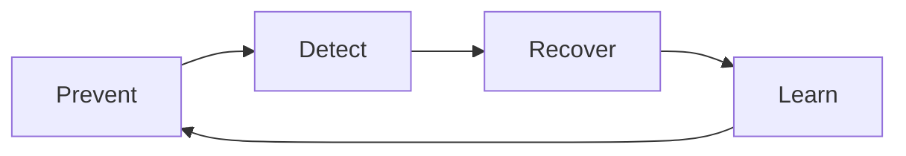

# Hallucination Mitigation Strategies

## Objective

Reduce the probability, detect occurrences and limit the impact of factually incorrect or no evidence responses.

## Prevent, detect, recover model



## Prevent

- restrict the case scope of use;
- use RAG with approved, current and traceable sources;
- require citations and evidence;
- to instruct the model to declare contextual insufficiency;
- reduzir temperature em tarefas factuais;
- use structured output and validation of schema;
- choose a model suitable for the domain and language;
- separate creative generation from factual response;
- use deterministic tools for calculation, consultation and rules.

## Detect

| Technique | Implementation |
|---|---|
| Groundedness | checks whether statements are supported by the context |
| Citation correctness | confirms whether the cited source supports the response |
| Entailment | compares statement and evidence |
| Self-check | second passage identifies inconsistencies |
| Cross-model review | different model reviews the response of the study. |
| Rule validation | validates dates, IDs, calculations and formats |
| Human review | mandatory for high-impact decisions |

Self-check and LLM-as-judge are signals, not proofs, and they may repeat the same error as the generator.

## Recover

Where confidence or evidence is insufficient, the system shall:

1. not invent a response;
2. request additional context where necessary;
3. return to the found sources and explain the limitation;
4. forwarding to human or official system;
5. prevent tool call based on unconfirmed information;
6. register the case for evaluation and correction.

## Safe response pattern

```text
Não encontrei evidência suficiente nas fontes autorizadas para confirmar essa informação.
Fontes consultadas: {fontes}.
Próxima ação segura: {consulta adicional ou escalonamento}.
```

## Strategies per case of use

| Case | Priority controls |
|---|---|
| Q&A documental | RAG, citation, groundedness and abstention |
| Resumo | coverage, fidelity and comparison with stretches |
| Extraction | scheme, validation and field confidence |
| Code | tests, lint, sandbox and review |
| Transactional agent | confirmation, official source and human approval |
| Adjusted decision | explanation, deterministic rule and final human decision |

## Metrics

- hallucination rate;
- unsupported claim rate;
- citation precision;
- abstention precision and recall;
- correction rate;
- human override rate;
- impacto por severidade.

## Anti-standards

- only trust the trust declared by the model;
- Adding RAG without measuring retrieval;
- enabling responses without a source in a regulated context;
- to use chain of thought as evidence;
- to implement irreversible action based on generated text;
- hide user uncertainty.
