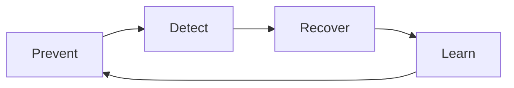

# Hallucination Mitigation Strategies

## Objet

Reduce probability, detect events and limit the impact of factual errors or without evidence.

## Model prevent, detect, recover



## Prevent

- limiting the scope of the use case;
- using RAG with approved, acoustic and rastreave sources;
- requiring references and evidence passes;
- to instruct the model to declare context failure;
- reduce temperature in factual tasks;
- using structured output and schema validation;
- choose a suitable model for the field and the language;
- separate generating a factual response;
- Use certain methods for calculation, consult and rules.

## Detect

| Technical | Application |
|---|---|
| Groundedness | check whether statements are borne out in the context |
| Citation correctness | confirms that the source cited supports the answer |
| Entailment | compare affirmation and evidence |
| Self-check | The second passage identifies inconsistencies |
| Cross-model review | different model revision the response |
| Rule validation | valid dates, IDs, calculations and formats |
| Human review | obligation for high impact decisions |

Self-check and LLM-as-judge are signs, don't prove, they can repeat the same mistake of the manager.

## Recover

When confidence or evidence is insufficient, the system shall:

1. not to invent a response;
2. requesting additional context where necessary;
3. retracing found sources and imposing the limit;
4. to be sent to the human or official system;
5. imposing tool call based on unconfirming information;
6. registrating the case for evaluation and correction.

## Security answer pad

```text
Não encontrei evidência suficiente nas fontes autorizadas para confirmar essa informação.
Fontes consultadas: {fontes}.
Próxima ação segura: {consulta adicional ou escalonamento}.
```

## Strategy for use

| Caso | Priority checks |
|---|---|
| Documentary Q&A | RAG, citation, groundedness and abstention |
| Resumo | coverage, reliability and comparison with changes |
| Extradition | schema, validation and confidence in the field |
| Code | tests, lint, sandbox and review |
| Transnational Agent | confirmation, official source and human approval |
| Regulation Decision | explanation, deterministic rule and final human decision |

## Mechanics

- hallucination rate;
- unsupported claim rate;
- citation precision;
- abstention precision e recall;
- correction rate;
- human override rate;
- Impact on severity.

## Anti-Pawns

- only trust the trust declared by the model;
- adding RAG without removing it;
- allowing answers without source in a prescribed context;
- use a penchant-like syringe;
- executing irreversible action on the basis of a written text;
- ocult a fucking user.
