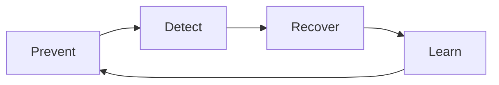

# Hallucination Mitigation Strategies

## Objective

Reducing the likelihood, detecting occurrences and limiting the impact of factually incorrect or unproven responses.

## Model prevent, detect, recover



## Prevent

- restrict the scope of the use case;
- use RAG with approved, current and traceable sources;
- require submissions and evidence;
- instruct the model to declare a lack of context;
- reducing temperature in factual tasks;
- use structured output and schema validation;
- choose a model appropriate to the domain and language;
- separate creative generation from factual response;
- use deterministic tools for calculation, consultation and rules.

## Detect

| Technical | Application of this Regulation |
|---|---|
| Groundedness | verify that statements are supported by context |
| Citation correctness | confirms whether the cited source supports the answer |
| Entailment | Comparison of claim and evidence |
| Self-check | The second paragraph identifies inconsistencies |
| Cross-model review | A different model reviews the answer |
| Rule validation | validates dates, IDs, calculations and formats |
| Human review | Mandatory for high impact decisions |

Self-check and LLM-as-judge are signals, not evidence.

## Recover

Where confidence or evidence is insufficient, the system shall:

1. not to invent an answer;
2. request additional context where necessary;
3. return found sources and explain the limitation;
4. refer to a human or an official system;
5. prevent tool call based on unconfirmed information;
6. record the case for assessment and correction.

## Safe response pattern

```text
Não encontrei evidência suficiente nas fontes autorizadas para confirmar essa informação.
Fontes consultadas: {fontes}.
Próxima ação segura: {consulta adicional ou escalonamento}.
```

## Strategy by use case

| Case in point | Priority controls |
|---|---|
| Documentary Q&A | RAG, submission, groundedness and abstention |
| Summary | coverage, fidelity and comparison with excerpts |
| Mining | Schema, validation and confidence by field |
| Code | Tests, lint, sandbox and review |
| Transactional agent | Confirmation, official source and human approval |
| Regulated decision | Explanation, deterministic rule and final human decision |

## The following information shall be provided:

- hallucination rate;
- unsupported claim rate;
- citation precision;
- abstention precision and recall;
- correction rate;
- human override rate;
- impact by severity.

## The following information shall be provided:

- rely solely on the confidence declared by the model;
- add RAG without measuring retrieval;
- allowing sourceless responses in a regulated context;
- use chain of thought as evidence;
- execute an irreversible action based on generated text;
- conceal the user's uncertainty.
