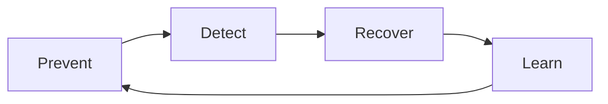

# Hallucination Mitigation Strategies

## Objetivo

Reduzir a probabilidade, detectar ocorrências e limitar o impacto de respostas factualmente incorretas ou sem evidência.

## Modelo prevent, detect, recover



## Prevent

- restringir o escopo do caso de uso;
- usar RAG com fontes aprovadas, atuais e rastreáveis;
- exigir citações e trechos de evidência;
- instruir o modelo a declarar insuficiência de contexto;
- reduzir temperature em tarefas factuais;
- usar structured output e validação de schema;
- escolher modelo adequado ao domínio e idioma;
- separar geração criativa de resposta factual;
- usar ferramentas determinísticas para cálculo, consulta e regras.

## Detect

| Técnica | Aplicação |
|---|---|
| Groundedness | verifica se afirmações são suportadas pelo contexto |
| Citation correctness | confirma se a fonte citada sustenta a resposta |
| Entailment | compara afirmação e evidência |
| Self-check | segunda passagem identifica inconsistências |
| Cross-model review | modelo diferente revisa a resposta |
| Rule validation | valida datas, IDs, cálculos e formatos |
| Human review | obrigatório para decisões de alto impacto |

Self-check e LLM-as-judge são sinais, não provas. Eles podem repetir o mesmo erro do gerador.

## Recover

Quando a confiança ou evidência for insuficiente, o sistema deve:

1. não inventar uma resposta;
2. solicitar contexto adicional quando necessário;
3. retornar fontes encontradas e explicitar a limitação;
4. encaminhar para humano ou sistema oficial;
5. impedir tool call baseada em informação não confirmada;
6. registrar o caso para avaliação e correção.

## Padrão de resposta segura

```text
Não encontrei evidência suficiente nas fontes autorizadas para confirmar essa informação.
Fontes consultadas: {fontes}.
Próxima ação segura: {consulta adicional ou escalonamento}.
```

## Estratégias por caso de uso

| Caso | Controles prioritários |
|---|---|
| Q&A documental | RAG, citação, groundedness e abstention |
| Resumo | cobertura, fidelidade e comparação com trechos |
| Extração | schema, validação e confidence por campo |
| Código | testes, lint, sandbox e revisão |
| Agente transacional | confirmação, fonte oficial e human approval |
| Decisão regulada | explicação, regra determinística e decisão humana final |

## Métricas

- hallucination rate;
- unsupported claim rate;
- citation precision;
- abstention precision e recall;
- correction rate;
- human override rate;
- impacto por severidade.

## Anti-padrões

- confiar apenas na confiança declarada pelo modelo;
- adicionar RAG sem medir retrieval;
- permitir respostas sem fonte em contexto regulado;
- usar cadeia de pensamento como evidência;
- executar ação irreversível com base em texto gerado;
- ocultar incerteza do usuário.
