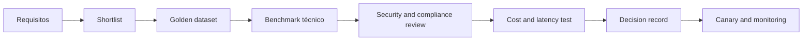

# Model Selection Framework

## Objective

Select models based on evidence of the case of use, avoiding decisions guided only by generic benchmark, brand or size.

## Criteria

| Dimension | Questions |
|---|---|
| Quality | Does the model reach the thresholds in golden dataset? |
| Modalidade | Does it support text, image, audio or required documents? |
| Context | Does the effective window meet the case without degrading quality? |
| Tool use | Calls tools with precision and follows schema? |
| Security | Resist attacks and meet content policies? |
| privacy | What is the retention, training and residency policy? |
| Latency | Does it meet p95 and expected throughput? |
| Cost | What is the cost per successful task, not only for token? |
| Operation | Is there SLA, observability, quotas and fallback? |
| Portabilidade | Does the contract reduce lock-in and allow replacement? |

## Procedure

## Scorecard sugerido

| Criteria | Initial weight |
|---|---:|
| Quality in case of use | 30% |
| Security and compliance | 20% |
| Latency and availability | 15% |
| Cost per task | 15% |
| Tool use and structured output | 10% |
| Operability and portability | 10% |

Weights must change according to risk. For CRITICAL cases, safety, explainability and compliance prevail over cost.

## Model classes

| Classe | Typical use | Trade-off |
|---|---|---|
| Small and fast | classification, routing, simple extraction | less reasoning ability |
| Balanced general | chat, RAG and common automation | average cost and latency |
| Reasoning | planning, complex analysis and code | higher cost and time |
| Embedding | semantic search and clustering | it requires specific evaluation of the corpus of the study. |
| Multimodal | Documents, images and audio | cost and additional privacy risks |
| Especializado/fine-tuned | domain or restricted format | maintenance and higher lock-in |

## Model Router

The Model Gateway can route by:

- risk and classification of data;
- task complexity;
- modality and language;
- latency available;
- budget;
- availability of the provider;
- residence requirements;
- desempenho observado.

Fallback should not silently reduce safety or quality.Model changes need to be registered in trace and assessed by regression.

## Benchmark correto

- use real anonymized or synthetic representative data;
- measuring complete task, including retrieval and tools;
- repeat tests for variability;
- evaluate languages and relevant segments;
- separate average quality from critical failures;
- measure cost per approved response or completed task;
- register the exact version of the model and parameters.

## Minimum ADR

The decision shall document:

- evaluated models and reason for the shortlist;
- dataset, heading and thresholds;
- quality, safety, cost and latency results;
- contractual and data restrictions;
- primary model and fallback;
- residual risks;
- triggers for reassessment.

## Re-evaluation triggers

- new version of the model;
- change of price or SLA;
- regression detected;
- safety incident;
- new regulatory requirement;
- significant increase in volume;
- domain, language or data source changes.
