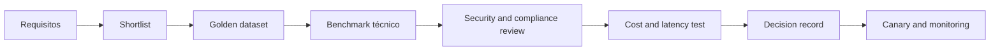

# Model Selection Framework

## Objet

Select models on the basis of evidence of the use case, avoiding decisions based only on genetic benchmark, mark or size.

## Criteria

| Dimensive | Perguntas |
|---|---|
| Qualidade | The model hits the thresholds in the golden dataset? |
| Modalidade | Do you suggest text, image, audio or required documents? |
| Contexto | The window screams at the case without degraded quality? |
| Tool use | Do you call the tools with a need and a second schema? |
| Security | Do you stand up to attacks and take account policies? |
| Privacidade | What's the retention policy, training and residence? |
| Latence | Atende p95 e throughput esperados? |
| Custo | What's the cost for being well-suced, not just for token? |
| Operation | SLA, observation, quotas and fallback? |
| Portabilidade | Does the contract reduce lock-in and allow replacement? |

## Procedure

## Scorecard sugerido

| Criteria | Peso inicial |
|---|---:|
| Quality in the case of use | 30% |
| Security and compliance | 20% |
| Latitude and availability | 15% |
| Care for task | 15% |
| Tool use e structured output | 10% |
| Operabilidade e portabilidade | 10% |

The weight must change according to the risk. In cases of CRITICAL, safety, explanation and compliance, costs should be assessed.

## Model classes

| Classe | Typical use | Trade-off |
|---|---|---|
| Small and quick | classification, coding, simple extraction |                                                                                                                                                                                                 |
| Geral balanceado | chat, RAG and common automapping | - Care and medium-sized lattice |
| Reasoning | Planning, complex analysis and code | maior custo e tempo |
| Embedding | syringe and clustering | Specific assessment of the body |
| Multimodal | documents, images and audio | costs and additional risk of privacy |
| Especializado/fine-tuned | a field or restricted format | maintenance and lock-in larger |

## Model Router

Model Gateway can be rote by:

- risk and classification of data;
- complexity of the task;
- modalidade e idioma;
- available latability;
- budget;
- the availability of the driver;
- residence requirements;
- desempenho observado.

Fallback should not be a relatively low risk or quality. Model changes need to be recorded in the trace and evaluated by return.

## Benchmark correto

- using real anonimidated or representative statistical data;
- medir tarefa completa, incluindo retrieval e ferramentas;
- repeating tests for variability;
- avaliar idiomas e segmentos relevantes;
- separate the medium quality of critical statements;
- reducing costs by a satisfactory response or final task;
- registrating exat version of the model and slacks.

## Minimum ADR

The decision must document:

- models assessed and the reason for the shortlist;
- dataset, rubrica e thresholds;
- quality, safety, cost and consistency;
- contractual restrictions and data;
- first model and fallback;
- residual risks;
- - a re-evaluation pig.

## Revaluation tips

- new version of the model;
- price change or SLA;
- relapse detected;
- security incident;
- new regulatory requirement;
- volume increase;
- Change in the domain, language or source of data.
