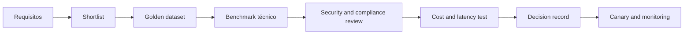

# Model Selection Framework

## Objective

Select models based on evidence from the use case, avoiding decisions guided only by generic benchmark, brand or size.

## Criteria for the application of this Regulation

| Size | Perguntas |
|---|---|
| Qualidade | Does the model meet the thresholds in the golden dataset? |
| Modalidade | Does it support required text, image, audio or documents? |
| Contexto | Does the effective window serve the case without degrading quality? |
| Tool use | You call tools accurately and follow a pattern? |
| Security | Resistant to attacks and complying with content policies? |
| Privacidade | What is the retention, training and residence policy? |
| Latency | Does it respond to p95 and the expected throughput? |
| Custo | What's the cost per successful task, not just per token? |
| Operations | Is there ALS, observability, quotas and fallback? |
| Portabilidade | The contract reduces lock-in and allows replacement? |

## The procedure

## Scorecard sugerido

| Criterion of use | Peso inicial |
|---|---:|
| Quality in case of use | 30% |
| Safety and compliance | 20% |
| Latency and availability | 15% |
| Cost per task | 15% |
| Tool use and structured output | 10% |
| Operational and portability | 10% |

Weights must change as the risk increases, and for CRITICAL cases, safety, explainability and compliance prevail over cost.

## Model classes

| Classe | Typical use | Trade-off |
|---|---|---|
| Small and fast | Classification, routing, simple extraction | Less reasoning ability |
| Geral balanceado | chat, RAGand common automation | Average cost and latency |
| Reasoning | planning, complex analysis and coding | higher cost and time |
| Embedding | Semantic search and clustering | requires a specific assessment of the corpus |
| Multimodal | Documents, images and audio | cost and additional privacy risks |
| Especializado/fine-tuned | Restricted domain or format | Larger maintenance and lock-in |

## Model routers

The Model Gateway may be routed by:

- risk and classification of data;
- the complexity of the task;
- modality and language;
- the available latency;
- budget;
- availability of the provider;
- residence requirements;
- desempenho observado.

Fallback should not silently reduce safety or quality. Model changes need to be recorded in the trace and evaluated by regression.

## Benchmark correto

- use real anonymised or representative synthetic data;
- Measuring complete task, including retrieval and tools;
- repeat tests for variability;
- evaluate relevant languages and segments;
- separating average quality from critical defects;
- measuring cost per approved response or completed task;
- record the exact version of the model and parameters.

## Minimum ADR

The decision shall document:

- the models evaluated and the reason for the shortlist;
- data set, heading and thresholds;
- quality, safety, cost and latency results;
- contractual and data restrictions;
- primary model and fallback;
- residual risks;
- triggers for reassessment.

## Reassessment triggers

- new version of the model;
- price change or SLA;
- detected regression;
- the safety incident;
- the new regulatory requirement;
- a significant increase in volume;
- change of domain, language or data source.
