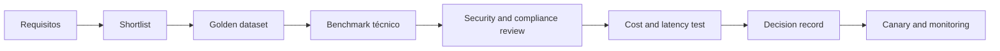

# Model Selection Framework

## Objetivo

Selecionar modelos com base em evidências do caso de uso, evitando decisões orientadas apenas por benchmark genérico, marca ou tamanho.

## Critérios

| Dimensão | Perguntas |
|---|---|
| Qualidade | O modelo atinge os thresholds no golden dataset? |
| Modalidade | Suporta texto, imagem, áudio ou documentos exigidos? |
| Contexto | A janela efetiva atende o caso sem degradar qualidade? |
| Tool use | Chama ferramentas com precisão e segue schema? |
| Segurança | Resiste a ataques e atende políticas de conteúdo? |
| Privacidade | Qual é a política de retenção, treinamento e residência? |
| Latência | Atende p95 e throughput esperados? |
| Custo | Qual é o custo por tarefa bem-sucedida, não apenas por token? |
| Operação | Há SLA, observabilidade, quotas e fallback? |
| Portabilidade | O contrato reduz lock-in e permite substituição? |

## Processo

## Scorecard sugerido

| Critério | Peso inicial |
|---|---:|
| Qualidade no caso de uso | 30% |
| Segurança e compliance | 20% |
| Latência e disponibilidade | 15% |
| Custo por tarefa | 15% |
| Tool use e structured output | 10% |
| Operabilidade e portabilidade | 10% |

Os pesos devem mudar conforme o risco. Para casos CRITICAL, segurança, explicabilidade e compliance prevalecem sobre custo.

## Classes de modelo

| Classe | Uso típico | Trade-off |
|---|---|---|
| Pequeno e rápido | classificação, roteamento, extração simples | menor capacidade de raciocínio |
| Geral balanceado | chat, RAG e automação comum | custo e latência médios |
| Reasoning | planejamento, análise complexa e código | maior custo e tempo |
| Embedding | busca semântica e clustering | exige avaliação específica do corpus |
| Multimodal | documentos, imagens e áudio | custo e riscos adicionais de privacidade |
| Especializado/fine-tuned | domínio ou formato restrito | manutenção e lock-in maiores |

## Router de modelos

O Model Gateway pode rotear por:

- risco e classificação dos dados;
- complexidade da tarefa;
- modalidade e idioma;
- latência disponível;
- budget;
- disponibilidade do provedor;
- requisitos de residência;
- desempenho observado.

Fallback não deve reduzir silenciosamente segurança ou qualidade. Mudanças de modelo precisam ser registradas no trace e avaliadas por regressão.

## Benchmark correto

- usar dados reais anonimizados ou sintéticos representativos;
- medir tarefa completa, incluindo retrieval e ferramentas;
- repetir testes para variabilidade;
- avaliar idiomas e segmentos relevantes;
- separar qualidade média de falhas críticas;
- medir custo por resposta aprovada ou tarefa concluída;
- registrar versão exata do modelo e parâmetros.

## ADR mínimo

A decisão deve documentar:

- modelos avaliados e motivo da shortlist;
- dataset, rubrica e thresholds;
- resultados de qualidade, segurança, custo e latência;
- restrições contratuais e de dados;
- modelo primário e fallback;
- riscos residuais;
- gatilhos para reavaliação.

## Gatilhos de reavaliação

- nova versão do modelo;
- mudança de preço ou SLA;
- regressão detectada;
- incidente de segurança;
- nova exigência regulatória;
- aumento relevante de volume;
- alteração de domínio, idioma ou fonte de dados.
