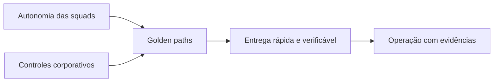

# 1. Why a Platform AI?

## The problem is not only to access a model

The first generation of corporate AI initiatives usually starts with independent experiments: a chatbot in one area, a co-pilot in another, a document automation and some tests with agents. Each initiative can demonstrate value alone, but the organization starts to repeat the same decisions and risks.

The most common symptoms are:

- different integrations for each model provider;
- prompts, datesets and evaluations without versioning;
- access to data determined within each application;
- logs with sensitive content;
- difficult to allocate costs;
- publication without comparable evidence;
- tools with excessive privileges;
- direct dependence on product, model and infrastructure;
- no clear deactivation process.

This scenario is not solved only by choosing a framework of agents, the organization needs shared capacities to transform experiments into operable products.

## Definition

One **Corporate AI Platform** it is a set of capabilities, standards, services and processes that allows to create and operate AI solutions with controlled autonomy.

She must provide:

- standardized ways to build and publish;
- Clear borders between product, platform and governance;
- policies applied during implementation, not only in documents;
- portability between models and providers;
- knowledge and memory with authorization and life cycle;
- continuous assessment of quality, safety, cost and performance;
- rastreabilidade ponta a ponta;
- containment, rollback and deactivation mechanisms.

## Platform is not a single product

A platform may contain internal products, shared services, contracts and procedures. It shall not be confused with:

| It is not | Why |
|---|---|
| a portal with a catalog of prompts | the portal is only an experience on deeper capabilities in the field of technology and technology. |
| a framework of orchestration | frameworks change; contracts, policies and operation need to survive the exchange of technologies. |
| a single provider of foundation models | the platform should reduce coupling and apply routing policies for the study of the study. |
| a central team that develops all the agents involved in this process is the study. | this creates queue, low organizational scale and little business ownership |
| approval committee | governance is part of the life cycle and needs to produce verifiable decisions. |
| a Kubernetes infrastructure | infrastructure is necessary, but does not define product capabilities and trust. |

## Central tension: autonomy and control

The objective is not to maximize control or maximize autonomy; the platform should increase the autonomy of squads while reducing the dangerous variation.

Balance is achieved by:

- templates and SDKs instead of obligatoryly centralized implementations;
- declarative policies instead of repetitive manual validations;
- risk proportional gates;
- appropriate contracts;
- observability and audit by standard;
- ownership of the case of use maintained in the squad responsible for the result.

## When to build a platform

The construction becomes justifiable when several signals appear simultaneously:

- three or more squads repeat integrations and controls;
- agents need to access corporate data or tools;
- there is more than one provider or family of models;
- the organization must demonstrate conformity and traceability;
- AI costs already need budget and allocation;
- solutions have availability and support requirements;
- risks of leakage, prompt injection or improper actions are material;
- the cycle between experiment and production is blocked by unstandardized approvals.

## When not build

A complete platform is likely to be premature when:

- there is only one low-risk experiment;
- no solution will be operated in production;
- there is no team to keep shared services;
- the organization has not yet defined the product ownership;
- the case can be treated with an approved and isolated SaaS;
- the operational complexity costs more than the expected reuse.

In these cases, the recommendation is to adopt minimum standards and evolve as repetition appears.

## Expected results

A Platform IA should be measured by the results it allows, and not by the amount of components implanted.

| Dimension | Expected result |
|---|---|
| Time-to-market | reduced time between approved idea and first version controlled |
| Security | policies applied consistently at the implementing frontiers |
| Quality | regressions detected before and after publication |
| Portabilidade | exchange of model or provider without rewriting the whole product |
| Operation | traces diagnosable incidents, events and evidence |
| FinOps | costs attributed by agent, area, model and environment |
| Governance | traceable and risk proportional decisions |
| Reuso | less duplication of connectors, pipelines and controls |

## Antiobjetivos

The platform shall not:

- hiding costs or risks behind abstractions;
- allow agents to coordinate registration systems;
- create a universal runtime for any problem;
- transforming every automation into an agent;
- eliminate local decisions which belong to the product;
- replace software engineering, security or data management.

## Question for a decision

Before adding a capacity, ask:

> Does this component reduce a relevant repetition or apply a control that needs to be consistent in various products?

When the response is no, the capacity should probably remain in the application until there is evidence of re-use.

## Next chapter

The [Business Outcomes Framework](02-business-outcomes.md) connects the platform strategy to measurable results that justify capabilities and investment.
