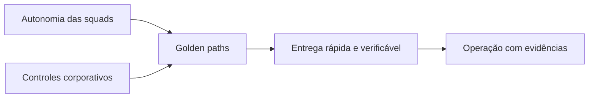

# Why a AI Platform?

## The problem is not just accessing a model.

The first generation of corporate AI initiatives usually starts with independent experiments: a chatbot in one area, a co-pilot in another, document automation and some testing with agents.

The most common symptoms are:

- different integrations for each model provider;
- The following information shall be provided in accordance with the provisions of this Regulation:
- access to data decided within each application;
- logs with sensitive content;
- costs that are difficult to attribute;
- publication without comparable evidence;
- tools with excessive privileges;
- direct dependence between product, model and infrastructure;
- the absence of a clear deactivation process.

This scenario is not solved just by choosing an agent framework. The organization needs shared capabilities to turn experiments into viable products.

## Definition of the term

A corporate AI Platform** is a set of capabilities, standards, services and processes that allows AI solutions to be created and operated with controlled autonomy.

It shall provide:

- standardized pathways for building and publishing;
- clear boundaries between product, platform and governance;
- policies applied during implementation, not just in documents;
- portability between models and suppliers;
- authorised knowledge and memory and life cycle;
- continuous evaluation of quality, safety, cost and performance;
- end-to-end traceability;
- containment, rollback and deactivation mechanisms.

## Platform is not a single product

A platform may contain internal products, shared services, contracts and processes.

| It 's not . | Why ? |
|---|---|
| a portal with a catalogue of prompts | The portal is just an experiment on deeper capabilities. |
| an orchestration framework | Framework changes; contracts, policies and operations need to survive the exchange |
| a single supplier of foundation models | the platform shall reduce coupling and implement routing policies; |
| A central team that develops all the agents | This creates queue, low organizational scale and little business ownership. |
| an approval committee | Governance is part of the life cycle and needs to produce verifiable decisions |
| a Kubernetes infrastructure | infrastructure is needed but does not define product capabilities and reliability |

## Central voltage: autonomy and control

The goal is not to maximize control or maximize autonomy, the platform should increase the autonomy of the squads while reducing dangerous variation.

The balance is obtained by:

- Templates and SDKs instead of mandatory centralised implementations;
- declarative policies instead of repetitive manual validations;
- gates proporcionais ao risco;
- versioned contracts;
- Observability and auditing by default;
- ownership of the use case kept in the resulting squad.

## When building a platform

The construction becomes justifiable when several signs appear simultaneously:

- three or more squads repeat integrations and controls;
- agents need access to corporate data or tools;
- there is more than one supplier or model family;
- the organisation needs to demonstrate compliance and traceability;
- AI costs already need budgeting and allocation;
- solutions have availability and support requirements;
- leakage risks, prompt injection or wrongful actions are material;
- the cycle between experiment and production is blocked by non-standard approvals.

## When not to build

A complete platform is likely to be premature when:

- there is only one low-risk experiment;
- no solution shall be operated in production;
- there is no team to maintain shared services;
- the organisation has not yet defined product ownership;
- the case can be handled with an approved and isolated SaaS;
- the operational complexity costs more than the expected reuse.

In such cases, the recommendation is to adopt minimum standards and evolve as repetition arises.

## Expected results

A AI Platform shall be measured by the results it enables, not by the number of components implanted.

| Size | Expected result |
|---|---|
| Time-to-market | reducing the time between an approved idea and the first controlled version |
| Security | policies consistently implemented at implementing borders |
| Qualidade | Returns detected before and after publication |
| Portabilidade | change of model or supplier without rewriting the whole product |
| Operations | incidents that can be diagnosed by traces, events and evidence |
| FinOps | costs attributable by agent, area, model and environment |
| Governance | Traceable and risk-proportionate decisions |
| Reuso | Less duplication of connectors, pipelines and controls |

## Antiobjetivos

The platform shall not:

- concealing costs or risks behind abstractions;
- allow agents to circumvent registration systems;
- create a universal runtime for any problem;
- transform all automation into an agent;
- eliminate local decisions relating to the product;
- replace software engineering, security or data management.

## Question for a decision

Before you add a capability, ask:

> Does this component reduce a relevant repetition or does it apply a control that needs to be consistent across multiple products?

If the answer is no, the capacity should probably remain in use until there is evidence of reuse.

## Next chapter

The [Business Outcomes Framework](02-business-outcomes.md) connects the platform strategy to measurable results that justify capacity and investment.
