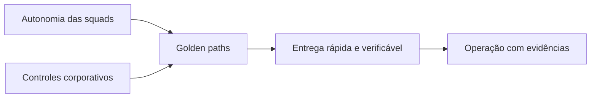

# 1. Why a AI Platform?

## The problem is not just accessing a model

The first generation of corporative IA initiatives normally starts with independent experiments: a chatbot in one area, a baby in another, a documentary automapping and some tests with agents. Each initiative can demonstrate its value individually, but the organisation is repeating the same decisions and the same risks.

The most common symptoms are:

- different integrations for each model tester;
- prompts, datasets and assessments without versioning;
- access to data determined within each application;
- logs with a sensitive content;
- difficult to allocate;
- publication without comparable evidence;
- ferrous ferrous privileged;
- a direct dependence between product, model and infrastructure;
- a clear deactivation procedure.

This scenario is not merely a framework of agents. The organisation needs a set of ables to transform experiments into operational products.

## Definition

A **AI Platform corporative** is a set of capacities, procedures, services and processes that allow to create and operate IA solutions with controlled autonomy.

She must provide:

- paved paths to build and publish;
- clear borders between product, platform and government;
- policies applied during implementation, not just in documents;
- portability between models and testers;
- knowledge and memory with authorisation and life cycle;
- quality, safety, cost and performance assessment;
- rastreability point to point;
- - a re-use, rollback and deactivation mechanisms.

## Plateform is not a single product

A plate can contain inter-products, comparable services, contracts and procedures.

| It's not. | Why? |
|---|---|
| a portal with prompts catalog | the portal is just an experience on the most deep capacities |
| a framework of orqueration | frameworks change; contracts, policies and operations need to survive the trade |
| a single foundation models test | the plate must reduce the alignment and apply rotating policies |
| a central time that develops all agents | That creates a line, a little organizational skewed and little business ownership |
| a approval committee | Government is part of the life cycle and needs to produce verified decisions |
| a Kubernetes infrastructure | infrastructure is necessary, but it does not define the production and trust capacities. |

## Central tension: autonomia and control

The objective is not to maximise control and to maximise autonomy. The platform must increase the autonomy of squads while decreasing the risky variation.

The balance is obtained by means of:

- templates and SDKs instead of mandatoryly centralised implementations;
- declared policies rather than repeated monthly validations;
- gates proporcionais ao risco;
- contratos versionados;
- observation and auditory performance;
- ownership of the case of use kept in the squad responsible for the result.

## When building a platform

Construction is justified when several signs appear simultaneously:

- three or more squads repeat integrations and controls;
- agents need to access data or corporative tools;
- there is more of a model producer or family;
- the organisation needs to demonstrate conformity and consistency;
- the cost of AI already needs budget and allocation;
- solutions may require availability and support;
- vaccinating risks, prompt injection or unsolved actions are material;
- the cycle between experiment and production is blocked by non-patronized approvals.

## When you don't build

A complete plate is probably prematurated when:

- there is only a low risk experiment;
- no solution shall be made in production;
- there is no team to keep comparable services;
- the organisation has not yet defined the ownership of the product;
- the case may be examined with a approuvé and isolated SaaS;
- the operational complexity costs more than the reuse.

In these cases, the recommendation is to adopt minimum rules and evolve accordingly to the repeat.

## Resultados esperados

A AI Platform must be measured by the results that enable it, not by the quantity of components implanted.

| Dimensive | Resultado esperado |
|---|---|
| Time-to-market | Reduced time between approved idea and first controlled version |
| Security | policies applied in a consistent manner in the implementation borders |
| Qualidade | relapses detected before and after publication |
| Portabilidade | model or a producer without rewriting the whole product |
| Operation | diagnostic incidents by trace, event and evidence |
| FinOps | cost attributed by agent, area, model and environment |
| Government | Risk-related and proportional decisions |
| Reuso | fewer duplication of conectors, pipelines and controls |

## Antiobjetivos

The plate must not:

- conceal costs or risks behind absorptions;
- allowing agents to keep records;
- creating a universal runtime for any problem;
- turning all the auto into an agent;
- to eliminate local decisions which belong to the product;
- replace software, security or data management.

## Question of decision

Before adding a capacity, ask:

> Does this component reduce a relevant repeat or implement a control that needs to be consistent in several products?

When the answer is not, the capacity may remain in application until evidence of reuse exists.

## Next chapter

The [Business Outcomes Framework](02-business-outcomes.md) connects the platform strategy to the relevant results which justify capacity and investment.
