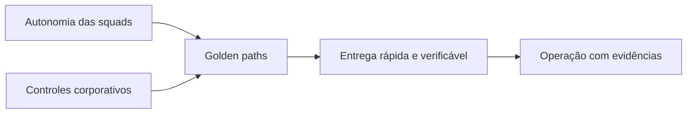

# 1. Por que uma AI Platform?

## O problema não é apenas acessar um modelo

A primeira geração de iniciativas corporativas de IA normalmente começa com experimentos independentes: um chatbot em uma área, um copiloto em outra, uma automação documental e alguns testes com agentes. Cada iniciativa pode demonstrar valor isoladamente, mas a organização passa a repetir as mesmas decisões e os mesmos riscos.

Os sintomas mais comuns são:

- integrações diferentes para cada provedor de modelo;
- prompts, datasets e avaliações sem versionamento;
- acesso a dados decidido dentro de cada aplicação;
- logs com conteúdo sensível;
- custos difíceis de atribuir;
- publicação sem evidências comparáveis;
- ferramentas com privilégios excessivos;
- dependência direta entre produto, modelo e infraestrutura;
- ausência de um processo claro de desativação.

Esse cenário não é resolvido apenas escolhendo um framework de agentes. A organização precisa de capacidades compartilhadas para transformar experimentos em produtos operáveis.

## Definição

Uma **AI Platform corporativa** é um conjunto de capacidades, padrões, serviços e processos que permite criar e operar soluções de IA com autonomia controlada.

Ela deve fornecer:

- caminhos padronizados para construir e publicar;
- fronteiras claras entre produto, plataforma e governança;
- políticas aplicadas durante a execução, não apenas em documentos;
- portabilidade entre modelos e provedores;
- conhecimento e memória com autorização e ciclo de vida;
- avaliação contínua de qualidade, segurança, custo e desempenho;
- rastreabilidade ponta a ponta;
- mecanismos de contenção, rollback e desativação.

## Plataforma não é um único produto

Uma plataforma pode conter produtos internos, serviços compartilhados, contratos e processos. Ela não deve ser confundida com:

| Não é | Por quê |
|---|---|
| um portal com catálogo de prompts | o portal é apenas uma experiência sobre capacidades mais profundas |
| um framework de orquestração | frameworks mudam; contratos, políticas e operação precisam sobreviver à troca |
| um único provedor de foundation models | a plataforma deve reduzir acoplamento e aplicar políticas de roteamento |
| um time central que desenvolve todos os agentes | isso cria fila, baixa escala organizacional e pouco ownership de negócio |
| um comitê de aprovação | governança é parte do ciclo de vida e precisa produzir decisões verificáveis |
| uma infraestrutura Kubernetes | infraestrutura é necessária, mas não define as capacidades de produto e confiança |

## Tensão central: autonomia e controle

O objetivo não é maximizar controle nem maximizar autonomia. A plataforma deve aumentar a autonomia das squads enquanto reduz a variação perigosa.

O equilíbrio é obtido por meio de:

- templates e SDKs em vez de implementações obrigatoriamente centralizadas;
- políticas declarativas em vez de validações manuais repetitivas;
- gates proporcionais ao risco;
- contratos versionados;
- observabilidade e auditoria por padrão;
- ownership do caso de uso mantido na squad responsável pelo resultado.

## Quando construir uma plataforma

A construção passa a ser justificável quando vários sinais aparecem simultaneamente:

- três ou mais squads repetem integrações e controles;
- agentes precisam acessar dados ou ferramentas corporativas;
- existe mais de um provedor ou família de modelos;
- a organização precisa demonstrar conformidade e rastreabilidade;
- custos de IA já precisam de budget e atribuição;
- soluções possuem requisitos de disponibilidade e suporte;
- riscos de vazamento, prompt injection ou ações indevidas são materiais;
- o ciclo entre experimento e produção é bloqueado por aprovações não padronizadas.

## Quando não construir

Uma plataforma completa provavelmente é prematura quando:

- existe apenas um experimento de baixo risco;
- nenhuma solução será operada em produção;
- não há equipe para manter serviços compartilhados;
- a organização ainda não definiu ownership de produto;
- o caso pode ser atendido com um SaaS aprovado e isolado;
- a complexidade operacional custa mais do que a reutilização esperada.

Nesses casos, a recomendação é adotar padrões mínimos e evoluir conforme a repetição surgir.

## Resultados esperados

Uma AI Platform deve ser medida pelos resultados que habilita, e não pela quantidade de componentes implantados.

| Dimensão | Resultado esperado |
|---|---|
| Time-to-market | redução do tempo entre ideia aprovada e primeira versão controlada |
| Segurança | políticas aplicadas de forma consistente nas fronteiras de execução |
| Qualidade | regressões detectadas antes e depois da publicação |
| Portabilidade | troca de modelo ou provedor sem reescrever o produto inteiro |
| Operação | incidentes diagnosticáveis por traces, eventos e evidências |
| FinOps | custos atribuíveis por agente, área, modelo e ambiente |
| Governança | decisões rastreáveis e proporcionais ao risco |
| Reuso | menor duplicação de conectores, pipelines e controles |

## Antiobjetivos

A plataforma não deve:

- esconder custos ou riscos atrás de abstrações;
- permitir que agentes contornem sistemas de registro;
- criar um runtime universal para qualquer problema;
- transformar toda automação em agente;
- eliminar decisões locais que pertencem ao produto;
- substituir engenharia de software, segurança ou gestão de dados.

## Pergunta de decisão

Antes de adicionar uma capacidade, pergunte:

> Este componente reduz uma repetição relevante ou aplica um controle que precisa ser consistente em vários produtos?

Quando a resposta é não, a capacidade provavelmente deve permanecer na aplicação até que exista evidência de reutilização.

## Próximo capítulo

O [Capability Map](02-capability-map.md) transforma essa definição em um mapa de capacidades e fronteiras de responsabilidade.
