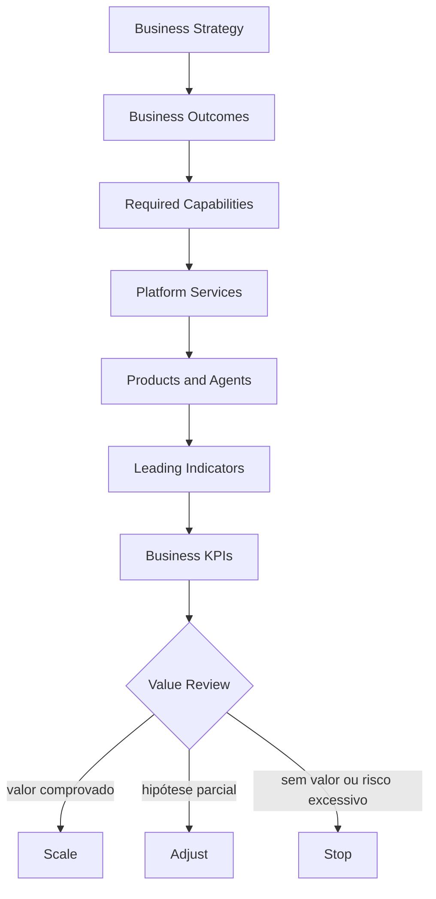

# 2. Business Outcomes

## Objective

A Enterprise AI Platform does not exist to provide models, agents or infrastructure.

It exists to accelerate the generation of value for the business in a governed, repeatable and scalable manner.

The success of the platform should be measured by the results produced for customers, collaborators, business areas, operations and regulatory ecosystem — not by the quantity of models, components or agents in production.

## From technology to value

A frequent error in AI initiatives is to start discussions about technologies:

- qual LLM utilizar;
- qual vector database adotar;
- which framework of agents to use;
- qual cloud provider escolher.

These decisions are important, but secondary. The main question is:

> What business results do we want to achieve and what abilities do we need to develop to achieve them?

The platform enables capabilities. Capabilities, when combined in products and journeys, produce measurable results.



## Strategic outcome domains

### 1. Revenue growth

**Objective:** increase acquisition, conversion, retention and customer relationship.

| Examples of application | Result indicators |
|---|---|
| Personalized recommendations | Conversion |
| next best action | receita incremental |
| intelligent offerings | cross-sell and upsell |
| assistentes comerciais | produtividade comercial |
| hyperpersonalization | retention and churn |

### 2. Operational efficiency

**Objective:** reduce human effort, cycle time and waste, increasing operational capacity.

| Examples of application | Result indicators |
|---|---|
| Document automation | average processing time |
| Operating agents | automation rate |
| automatic call resolution | backlog reduction |
| processing of contracts | Cost per transaction |
| Classification of documents | hours saved and rework |

### 3. Patient experience

**Objective:** offer faster, contextual, accessible and consistent interactions.

| Examples of application | Result indicators |
|---|---|
| assistentes conversacionais | RHR and containment |
| atendimento omnichannel | Mean duration of care |
| busca inteligente | Time to resolution |
| autoatendimento | CSAT and conclusion rate |
| atendimento assistido | SPL and perceived quality |

### 4. Risk Management and Compliance

**Objective:** reduce operational, regulatory, privacy and reputational risks.

| Examples of application | Result indicators |
|---|---|
| continuous monitoring | incidents and avoided losses |
| automated document review | non-conformities detected |
| due diligence assistida | Time of analysis |
| AI governance | coverage and effectiveness of controls |
| LGPD control | Violations and response time |

### 5. Organisational intelligence

**Objective:** transform institutional knowledge into accessible, reusable and reliable active.

| Examples of application | Result indicators |
|---|---|
| RAG corporativo | time to find information |
| knowledge graphs | coverage and connection of knowledge |
| unified search | search success rate |
| copilots internos | tempo economizado por tarefa |
| Specialized assistants | satisfaction and re-use of knowledge |

## Mapeamento Outcome → Capability

Each outcome depends on a set of capacities. There is no exclusive correspondence: the same capacity can support different results, and a outcome usually requires the combination of several capacities.

| Outcome | Required capacities |
|---|---|
| Revenue growth | personalization, analytics, agent platform, experimentation |
| Operational efficiency | workflow automation, document intelligence, agent runtime, tool execution |
| Patient experience | conversational AI, search, omnichannel, personalization |
| Risk Management and Compliance | AI governance, risk management, policy enforcement, observability, audit |
| Organizational intelligence | knowledge platform, RAG, retrieval, knowledge graph, authorization |

No technology generates value alone, when capabilities are combined to solve a real problem and their contribution can be demonstrated with evidence.

## Outcome Card

Each case of use must record a measurable hypothesis before implementation.

| Campo | Definition |
|---|---|
| Strategic aim | the business direction to which the case contributes |
| Problema | current condition that needs to change |
| Outcome | expected measurable change |
| Baseline | current situation, source and period |
| Target | meta quantitativa ou qualitativa |
| Horizonte | deadline to assess the result |
| Indicadores principais | final business metrics |
| Leading indicators | early signs of progress |
| Guardrails | quality limits, risk, cost and compliance |
| Capacities | capacities needed to produce the result |
| Products and agents | solutions that materialize the capabilities |
| Owner | accountable for the result |
| Evidence | systems and method of measurement |
| Decision | escalar, ajustar, pausar ou descontinuar |

### Template

```yaml
strategicObjective: reduzir esforço operacional no backoffice
problem: alto tempo de processamento e backlog crescente
outcome: aumentar a capacidade sem crescimento proporcional da equipe
baseline:
  processingTimeHours: 18
  automationRatePercent: 12
target:
  processingTimeHours: 6
  automationRatePercent: 55
timeHorizon: 6 meses
leadingIndicators:
  - percentual de documentos classificados automaticamente
  - taxa de conclusão sem intervenção
businessKpis:
  - tempo total de processamento
  - horas economizadas
  - redução do backlog
guardrails:
  - taxa de erro abaixo de 1%
  - zero acesso não autorizado
  - custo por processo dentro do budget
capabilities:
  - Document Intelligence
  - Agent Platform
  - Workflow Orchestration
  - Knowledge Retrieval
owner: backoffice-product-owner
reviewCadence: mensal
```

## Hyerarquia of metrics

Technical metrics are necessary, but they do not prove value alone.

| Level | Pergunta | Examples |
|---|---|---|
| Business KPI | Did the entrepreneurial outcome change? | Revenue, HRR, cycle time, avoided losses |
| Product outcome | Did the user's behavior or process change? | adoption, conclusion, resolution, satisfaction |
| Leading indicator | Are we advancing in the expected direction? | task success, recurrent use, automation rate |
| Platform KPI | Does the platform accelerate and sustain delivery? | lead time, reuse, golden path, cost per solution |
| Technical metric | Does the solution work properly? | latency, groundedness, errors, availability |
| Guardrail | Does the gain remain acceptable? | incidents, biases, complaints, costs and violations |

The availability of an agent, for example, is an operational condition, it does not demonstrate that the process has become more efficient or that the client has had the problem solved.

## Value Realization

### Baseline

The baseline should be registered before the pilot.Without it, improvement and attribution become opinions. When there is no reliable history, perform a limited initial measurement and register uncertainty.

### Target

The goal must have value, time and population. “Improving productivity” is not a target; “reducing the median time from 18 to 6 hours in six months” is.

### Assignment

Results may depend on changes in process, training, communication or policies beyond AI. Whenever possible, use comparison with baseline, progressive rollout, control cohort or A/B test. Do not automatically attribute all gains to the model.

### Review cadence

| Momento | Question for a decision |
|---|---|
| Intake | is there problem, baseline, outcome and owner? |
| Piloto | os leading indicators justificam continuar? |
| 30 dias | quality, adoption and guardrails are within the expected? |
| 60–90 days | is there evidence of operational or business impact? |
| Every three months | should the investment scale, adjust or stop? |

### Decision-making criteria

- **Escalar:** target or trajectory achieved, guardrails served and sustainable cost.
- **Ajustar:** value signals exist, but product, process or ability limits the result.
- **Date of delay:** Insufficient evidence, critical dependence or temporarily untreated risk.
- **Discontinue:** persistent lack of value, disproportional cost or unacceptable risk.

## Example — Operational efficiency

| Elemento | Definition |
|---|---|
| Strategic aim | reduce operational effort in backoff processes |
| Outcome | reduce cycle time and backlog |
| Capacities | document intelligence, agent platform, workflow orchestration, knowledge retrieval |
| Possible solutions | legal authorisation, HR assistant, operational agents |
| KPIs | processing time, automation rate, saved hours, backlog |
| Guardrails | errors, rework, inappropriate access and cost per process |

## Example — customer experience

| Elemento | Definition |
|---|---|
| Strategic aim | improve customer experience and resolution |
| Outcome | increase first contact resolution |
| Capacities | conversational AI, voice analytics, search, personalization |
| Possible solutions | client voice, virtual agent, assistance |
| KPIs | HRR, NPS, CSAT and length of stay |
| Guardrails | complaints, incorrect responses, inadequate handoffs and cost per workload |

## Ownership

The owner of the use case is the outcome, and the platform team is the shared capacity and metrics such as adoption, lead time, reliability, cost and reuse. Governance, Security, Privacy, Legal, Date, SRE and FinOps define or monitor guardrails according to risk.

The platform should not assume credit for any business result or allow a solution to remain indefinitely in production only because its technical metrics are healthy.

## Next chapter

The [Capability Map](02-capability-map.md) it transforms outcomes into organizational capacities and techniques needed to produce them.
