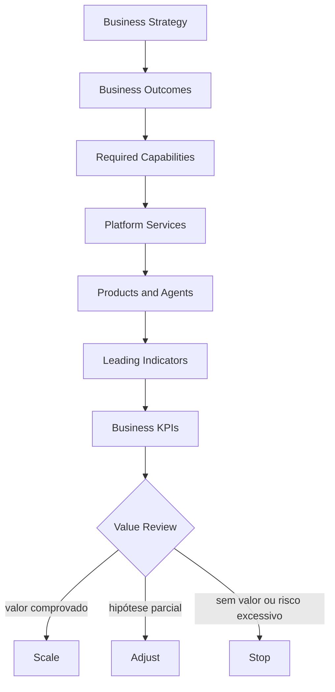

# 2. Business Outcomes

## Objective

A Enterprise AI Platform does not exist to make models, agents or infrastructure available.

It exists to accelerate the generation of business value in a governed, repeatable and scalable way.

The success of the platform should be measured by the results produced for customers, employees, business areas, operations and regulatory ecosystems  not by the number of models, components or agents in production.

## From technology to value

A common mistake in AI initiatives is to start the discussion about technologies:

- qual LLM utilizar;
- qual vector database adotar;
- which agent framework to employ;
- qual cloud provider escolher.

These decisions are important, but secondary.

> What business outcomes do we want to achieve and what capabilities do we need to develop to achieve them?

The platform enables capabilities, and when combined in products and journeys, they produce measurable results.



## Strategic outcome areas

### 1. Increase in revenue

**Objective:** increase acquisition, conversion, retention and relationship with customers.

| Examples of application | Indicators of outcome |
|---|---|
| Personalised recommendations | conversion |
| next best action | receita incremental |
| ofertas inteligentes | cross-sell and upsell |
| assistentes comerciais | produtividade comercial |
| the use of the information referred to in paragraph 1 | retention and churn |

### 2. operational efficiency

**Objective:** reduce human effort, cycle time and waste by increasing operational capacity.

| Examples of application | Indicators of outcome |
|---|---|
| documentary automation | Average processing time |
| Operating agents | Automation rate |
| Automatic call resolution | Reduction of backlog |
| processing of contracts | Cost per transaction |
| classification of documents | Saved hours and rework |

### 3. Customer experience

**Objective:** to provide faster, more contextual, more accessible and consistent interactions.

| Examples of application | Indicators of outcome |
|---|---|
| assistentes conversacionais | FCR and containment |
| atendimento omnichannel | average attendance time |
| Smart search | time until resolution |
| autoatendimento | CSAT and completion rate |
| atendimento assistido | NPS and perceived quality |

### 4. Risk management and compliance

**Objective:** to reduce operational, regulatory, privacy and reputational risks.

| Examples of application | Indicators of outcome |
|---|---|
| continuous monitoring | Incidents and losses avoided |
| Automated document review | Non-conformity detected |
| due diligence assistida | time of analysis |
| AI governance | coverage and effectiveness of controls |
| Controls LGPD | breaches and response time |

### 5. organizational intelligence

**Objective:** transform institutional knowledge into an accessible, reusable and reliable asset.

| Examples of application | Indicators of outcome |
|---|---|
| RAG corporativo | time to find information |
| knowledge graphs | knowledge coverage and connection |
| Unified search | Search success rate |
| copilots internos | time saved per task |
| assistentes especializados | knowledge satisfaction and reuse |

## Mapeamento Outcome → Capability

Each outcome depends on a set of capabilities. There is no exclusive correspondence: the same capability can support different outcomes, and an outcome typically requires the combination of several capabilities.

| Outcome | Capacities required |
|---|---|
| Increase in revenue | This is the main reason why the Commission is not prepared to take any further action. |
| Operational efficiency | workflow automation, document intelligence, agent runtime, tool execution |
| Customer experience | conversational AI, search, omnichannel, personalization |
| Risk management and compliance | AI governance, risk management, policy enforcement, observability, audit |
| This is the case in the European Union. | knowledge platform, RAG, retrieval, knowledge graph, authorization |

No technology generates value alone. Value arises when capabilities are combined to solve a real problem and its contribution can be demonstrated with evidence.

## Outcome Card

Each use case shall record a measurable chance before implementation.

| Campo | Definition of the term |
|---|---|
| Strategic objective | business management to which the case contributes |
| Problema | current condition that needs to change |
| Outcome | expected measurable change |
| Baseline | current situation with source and period |
| Target | meta quantitativa ou qualitativa |
| Horizonte | time limit for evaluating the result |
| Indicadores principais | final business metrics |
| Leading indicators | Early signs of progress |
| Guardrails | limits on quality, risk, cost and compliance |
| Capacities | the capacity required to produce the result |
| Products and agents | solutions that materialize the capabilities |
| Owner | accountable for the outcome |
| Evidence | Measurement systems and method |
| Decision | escalar, ajustar, pausar ou descontinuar |

### Template

```yaml
strategicObjective: reduzir esforço operacional no backoffice
problem: alto tempo de processamento e backlog crescente
outcome: aumentar a capacidade sem crescimento proporcional da equipe
baseline:
  processingTimeHours: 18
  automationRatePercent: 12
target:
  processingTimeHours: 6
  automationRatePercent: 55
timeHorizon: 6 meses
leadingIndicators:
  - percentual de documentos classificados automaticamente
  - taxa de conclusão sem intervenção
businessKpis:
  - tempo total de processamento
  - horas economizadas
  - redução do backlog
guardrails:
  - taxa de erro abaixo de 1%
  - zero acesso não autorizado
  - custo por processo dentro do budget
capabilities:
  - Document Intelligence
  - Agent Platform
  - Workflow Orchestration
  - Knowledge Retrieval
owner: backoffice-product-owner
reviewCadence: mensal
```

## Hierarchy of metrics

Technical metrics are necessary, but they do not prove value on their own.

| Level | Pergunta | Examples |
|---|---|---|
| Business KPI | Has the business outcome changed? | The Commission shall take into account the following information: |
| Product outcome | Has the user's behavior or process changed? | The Commission shall adopt implementing acts in accordance with the procedure referred to in paragraph 1 of this Article. |
| Leading indicator | Are we moving in the desired direction? | The following information shall be provided: |
| Platform KPI | The platform speeds up and supports delivery? | Lead time, reuse, golden path, cost per solution |
| Technical metric | Does the solution work properly? | The Commission shall adopt delegated acts in accordance with Article 21 of Regulation (EU) No 182/2011 and in accordance with Article 21 thereof. |
| Guardrail | Does the gain remain acceptable? | Incidents, biases, complaints, costs and infringements |

The availability of an agent, for example, is an operational condition. It does not demonstrate that the process became more efficient or that the client had his problem solved.

## Value Realization

### Baseline

The baseline must be recorded before the pilot. Without it, improvement and assignment become opinions. When there is no reliable history, run a limited initial measurement and register uncertainty.

### Target

Improving productivity is not a target; Reducing median time from 18 to 6 hours in six months is.

### Allocation

Results may depend on process changes, training, communication or policies beyond AI. Wherever possible, use comparison with baseline, progressive rollout, control cohort, or A/B testing. Do not automatically attribute all gains to the model.

### Date of revision

| Momento | Question for a decision |
|---|---|
| Intake | Is there a problem, baseline, outcome and owner? |
| Piloto | Do the leading indicators justify continuing? |
| 30 dias | Are the quality, adoption and guardrails within expectations? |
| 60–90 dias | is there evidence of operational or business impact? |
| Trimestral | Should the investment scale, adjust or stop? |

### Decision criteria

- **Scaling:** target or trajectory reached, guardrails served and sustainable cost.
- ** Adjust:** value signals exist, but the product, process or capacity limits the result.
- **Pause:** insufficient evidence, critical dependence or temporarily untreated risk.
- **Descontinued:** persistent lack of value, disproportionate cost or unacceptable risk.

## Example  operational efficiency

| Elemento | Definition of the term |
|---|---|
| Strategic objective | reduce operational stress in back office processes |
| Outcome | reducing cycle time and backlog |
| Capacities | document intelligence, agent platform, workflow orchestration, knowledge retrieval |
| Possible solutions | Legal automation, HR assistant, operational staff |
| KPIs | The Commission shall adopt delegated acts in accordance with Article 21 of Regulation (EU) No 1303/2013. |
| Guardrails | errors, retrofitting, misuse and cost per process |

## Example  customer experience

| Elemento | Definition of the term |
|---|---|
| Strategic objective | Improve customer experience and resolve |
| Outcome | increase resolution at first contact |
| Capacities | conversational AI, voice analytics, search, personalization |
| Possible solutions | the customer's voice, virtual agent, assisted service |
| KPIs | FCR, NPS, CSAT and time of service |
| Guardrails | complaints, incorrect replies, inadequate handoffs and cost per trip |

## Ownership

The use case owner is responsible for the outcome. The platform team is responsible for the shared capacity and metrics such as adoption, lead time, reliability, cost and reuse. Governance, Security, Privacy, Legal, Date, SRE, and FinOps define or monitor guardrails as risk.

The platform should not take credit for any business outcome or allow a solution to remain in production indefinitely simply because its technical metrics are sound.

## Next chapter

The [Capability Map](02-capability-map.md) transforms outcomes into the organizational and technical capabilities needed to produce them.
