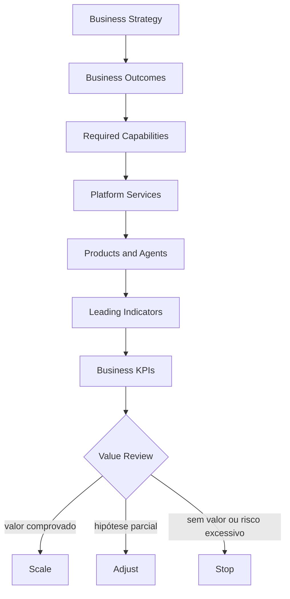

# 2. Business Outcomes

## Objet

A Enterprise AI Platform is not available to provide models, agents or infrastructure.

She exists to accelerate the generation of value for the business in a controlled, repeatable and stable way.

The success of the platform shall be measured by the results produced for customers, partners, business areas, operations and regulatory ecosystems — not by the quantity of models, components or producers.

## Technology for value

A common mistake in AI initiatives is to initiate the discussion on technologies:

- qual LLM utilizar;
- qual vector database adotar;
- which agency framework to work;
- qual cloud provider escolher.

These decisions are important, but secundaries.

> What business results do we want to achieve and what capabilities do we need to develop to reach them?

The platform enables capabilities, and when combined with products and journals, they produce significant results.



## Strategic outcomes areas

### 1. Reception reduction

**Objection:** increase acquisition, conversion, retention and relationship with customers.

| Implementation examples | Results indicators |
|---|---|
| personalised recommendations | conversation |
| next best action | receita incremental |
| ofertas inteligentes | cross-sell e upsell |
| assistentes comerciais | produtividade comercial |
| hypopersonalisation | retention and churn |

### 2. Operative efficiency

**Objection:** reduce human effort, cycle time and wasted, increasing operational capacity.

| Implementation examples | Results indicators |
|---|---|
| documentary automapping | medium time of processing |
| Operations agents | Auto rate |
| automatician resolution of calls | re-log reduction |
| Contract processing | cost per transaction |
| classification of documents | horas economizadas e retrabalho |

### 3. Experience of the client

**Objection:** offers faster, contextual, accessible and consistent interactions.

| Implementation examples | Results indicators |
|---|---|
| assistentes conversacionais | CR and citation |
| atendimento omnichannel | medium time of adjustment |
| smart search | time until the resolution |
| autoatendimento | CSAT and conclusion rate |
| atendimento assistido | NPS e qualidade percebida |

### 4. Risk management and compliance

**Objection:** reduce operational risks, regulatory, privacy and reputation.

| Implementation examples | Results indicators |
|---|---|
| Monitoring of the contents | incidentes e perdas evitadas |
| Automatic document review | not detected |
| due diligence assistida | analysis time |
| IA government | coverage and effectiveness of checks |
| LGPD | violences and response time |

### 5. Organizational intelligence

**Objection:** transform institutional knowledge into accessible, reusable and reliable.

| Implementation examples | Results indicators |
|---|---|
| RAG corporativo | time to find information |
| knowledge graphs | cover and connection of knowledge |
| - Unlocked | a return rate of the acquisition |
| copilots internos | time economised by task |
| assistentes especializados | satisfaction and re-use of knowledge |

## Mapeamento Outcome → Capability

Each outcome depends on a set of capacities. There is no exclusive correlation: a same capacity can support different results, and a normal outcome requires the combination of several capacities.

| Outcome | Capacity necessary |
|---|---|
| Reception Crescement | Personalisation, analytics, agent platform, experimentation |
| Operational efficiency | workflow automation, document intelligence, agent runtime, tool execution |
| Experience of the client | conversational AI, search, omnichannel, personalization |
| Risk management and compliance | AI governance, risk management, policy enforcement, observability, audit |
| Organisational intelligence | knowledge platform, RAG, retrieval, knowledge graph, authorization |

No technology generates value alone. The value surges when capabilities are combined to solve a real problem and its contribution can be demonstrated with evidence.

## Outcome Card

Every use should register a minimal chance before implementation.

| Campo | Definition |
|---|---|
| Strategic objective | - a business direction to which the case contributes |
| Problema | Current condition you need to change |
| Outcome | a minimal change |
| Baseline | Current situation, with source and period |
| Target | meta quantitativa ou qualitativa |
| Horizonte | time to evaluate the result |
| Indicadores principais | End-of-business methods |
| Leading indicators | earliest signs of progress |
| Guardrails | quality limits, risk, cost and compliance |
| Capacidades | capacity necessary to produce the result |
| Products and agents | solutions that materialise the capacities |
| Owner | accountable pelo resultado |
| Evidence | systems and method of measuring |
| Decision | escalar, ajustar, pausar ou descontinuar |

### Template

```yaml
strategicObjective: reduzir esforço operacional no backoffice
problem: alto tempo de processamento e backlog crescente
outcome: aumentar a capacidade sem crescimento proporcional da equipe
baseline:
  processingTimeHours: 18
  automationRatePercent: 12
target:
  processingTimeHours: 6
  automationRatePercent: 55
timeHorizon: 6 meses
leadingIndicators:
  - percentual de documentos classificados automaticamente
  - taxa de conclusão sem intervenção
businessKpis:
  - tempo total de processamento
  - horas economizadas
  - redução do backlog
guardrails:
  - taxa de erro abaixo de 1%
  - zero acesso não autorizado
  - custo por processo dentro do budget
capabilities:
  - Document Intelligence
  - Agent Platform
  - Workflow Orchestration
  - Knowledge Retrieval
owner: backoffice-product-owner
reviewCadence: mensal
```

## Mechanic hierarchy

Technical methods are necessary, but they do not buy value alone.

| N-n-n- | Pergunta | Exemplos |
|---|---|---|
| Business KPI | The business result changed? | recurrence, FCR, cycle time, avoided losses |
| Product outcome | The user's behavior or procedure changed? | adoption, conclusion, resolution, satisfaction |
| Leading indicator | Are we moving forward in the direction? | task success, recorrent, automapping rate |
| Platform KPI | The tee-tee-tee and keeps the delivery? | lead time, reuse, golden path, cost for solution |
| Technical metric | Does the solution work properly? | latability, groundedness, errors, availability |
| Guardrail | Is the win still acceptable? | incidents, deaths, complaints, costs and violations |

The availability of an agent, for example, is an operational condition, and she does not show that the process was more efficient or that the client had its problem resolved.

## Value Realization

### Baseline

The baseline must be recorded before the pilot. Without her, improvement and assignation has become opinions. When there is no reliable historical, execute a limited initial measure and record the uncertainty.

### Target

The half must be able to be worth, time and population. “Melo-production” is not a target; “reducing the average time of 18 to 6 hours in six months” is.

### Atribution

Results may depend on changes in process, training, communication or policy beyond the A. Where possible, comparison with baseline, progressiv rollout, control coordination or A/B test. It does not automatically apply to the model.

### Review committee

| Momento | Question of decision |
|---|---|
| Intake | existe problema, baseline, outcome e owner? |
| Piloto | the leading indicators justify continuing? |
| 30 dias | quality, adoption and guardrails are in the space? |
| 60–90 dias | Is there evidence of operational impact or business? |
| Trimestral | the investment must slip, adjust or stop? |

### Decision criteria

- **Escalar:** target or route hit, guardrails attached and durable cost.
- **Ajust:** value levels exist, but product, process or capacity limit the result.
- **Pausal:** inadequate evidence, critical dependence or temporary untreated risk.
- **Remain:** persistent absence of value, unsuitable cost or unacceptable risk.

## Expenditure — operational efficiency

| Elemento | Definition |
|---|---|
| Strategic objective | Operative effort in backoffice procedures is reduced |
| Outcome | Reduce cycle time and backlog |
| Capacidades | document intelligence, agent platform, workflow orchestration, knowledge retrieval |
| Possible solutions | Legal automapping, H.R.A. assistant, operational agents |
| KPIs | time of processing, automapping rate, economised hours, backlog |
| Guardrails | errors, rework, undestructible access and cost by procedure |

## — experience of the client

| Elemento | Definition |
|---|---|
| Strategic objective | improve the experience and customer resolution |
| Outcome | increasing the resolution in the first account |
| Capacidades | conversational AI, voice analytics, search, personalization |
| Possible solutions | Message from the client, virtual agent, assistive response |
| KPIs | FCR, NPS, CSAT and time of adjustment |
| Guardrails | complaints, incorrect replies, inappropriate handoffs and costs for a newspaper |

## Ownership

The owner of the case responds to the outcome. The time of the application responds by the corresponding capacity and by methods such as adoption, lead time, confidentiality, cost and reuse. Government, Security, Privacy, Legal, Data, SRE and FinOps define or monitor guardrails according to the risk.

The platform must not be credited for all business results nor allow a solution to remain indefinitely in production only because its technical methods are healthy.

## Next chapter

The [Capability Map](02-capability-map.md) transforms the outcomes into organizational and technical capacities necessary to produce them.
