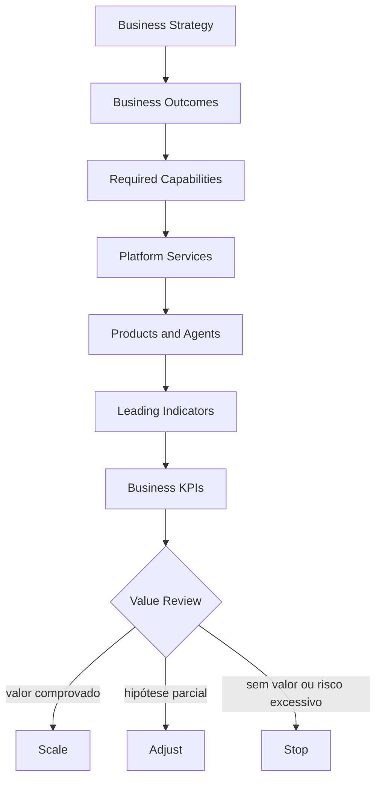

# 2. Business Outcomes

## Objetivo

Uma Enterprise AI Platform não existe para disponibilizar modelos, agentes ou infraestrutura.

Ela existe para acelerar a geração de valor para o negócio de forma governada, repetível e escalável.

O sucesso da plataforma deve ser medido pelos resultados produzidos para clientes, colaboradores, áreas de negócio, operações e ecossistema regulatório — não pela quantidade de modelos, componentes ou agentes em produção.

## Da tecnologia para o valor

Um erro frequente em iniciativas de IA é iniciar a discussão pelas tecnologias:

- qual LLM utilizar;
- qual vector database adotar;
- qual framework de agentes empregar;
- qual cloud provider escolher.

Essas decisões são importantes, mas secundárias. A pergunta principal é:

> Quais resultados de negócio queremos atingir e quais capacidades precisamos desenvolver para alcançá-los?

A plataforma habilita capacidades. As capacidades, quando combinadas em produtos e jornadas, produzem resultados mensuráveis.



## Domínios estratégicos de outcomes

### 1. Crescimento de receita

**Objetivo:** aumentar aquisição, conversão, retenção e relacionamento com clientes.

| Exemplos de aplicação | Indicadores de resultado |
|---|---|
| recomendações personalizadas | conversão |
| next best action | receita incremental |
| ofertas inteligentes | cross-sell e upsell |
| assistentes comerciais | produtividade comercial |
| hiperpersonalização | retenção e churn |

### 2. Eficiência operacional

**Objetivo:** reduzir esforço humano, tempo de ciclo e desperdício, aumentando a capacidade operacional.

| Exemplos de aplicação | Indicadores de resultado |
|---|---|
| automação documental | tempo médio de processamento |
| agentes operacionais | taxa de automação |
| resolução automática de chamados | redução de backlog |
| processamento de contratos | custo por transação |
| classificação de documentos | horas economizadas e retrabalho |

### 3. Experiência do cliente

**Objetivo:** oferecer interações mais rápidas, contextuais, acessíveis e consistentes.

| Exemplos de aplicação | Indicadores de resultado |
|---|---|
| assistentes conversacionais | FCR e contenção |
| atendimento omnichannel | tempo médio de atendimento |
| busca inteligente | tempo até a resolução |
| autoatendimento | CSAT e taxa de conclusão |
| atendimento assistido | NPS e qualidade percebida |

### 4. Gestão de riscos e compliance

**Objetivo:** reduzir riscos operacionais, regulatórios, de privacidade e reputacionais.

| Exemplos de aplicação | Indicadores de resultado |
|---|---|
| monitoramento contínuo | incidentes e perdas evitadas |
| revisão documental automatizada | não conformidades detectadas |
| due diligence assistida | tempo de análise |
| governança de IA | cobertura e eficácia de controles |
| controles LGPD | violações e tempo de resposta |

### 5. Inteligência organizacional

**Objetivo:** transformar conhecimento institucional em ativo acessível, reutilizável e confiável.

| Exemplos de aplicação | Indicadores de resultado |
|---|---|
| RAG corporativo | tempo para encontrar informação |
| knowledge graphs | cobertura e conexão do conhecimento |
| busca unificada | taxa de sucesso da busca |
| copilots internos | tempo economizado por tarefa |
| assistentes especializados | satisfação e reutilização do conhecimento |

## Mapeamento Outcome → Capability

Cada outcome depende de um conjunto de capacidades. Não existe correspondência exclusiva: uma mesma capacidade pode suportar diferentes resultados, e um outcome normalmente exige a combinação de várias capacidades.

| Outcome | Capacidades necessárias |
|---|---|
| Crescimento de receita | personalização, analytics, agent platform, experimentation |
| Eficiência operacional | workflow automation, document intelligence, agent runtime, tool execution |
| Experiência do cliente | conversational AI, search, omnichannel, personalization |
| Gestão de riscos e compliance | AI governance, risk management, policy enforcement, observability, audit |
| Inteligência organizacional | knowledge platform, RAG, retrieval, knowledge graph, authorization |

Nenhuma tecnologia gera valor isoladamente. O valor surge quando capacidades são combinadas para resolver um problema real e sua contribuição pode ser demonstrada com evidências.

## Outcome Card

Todo caso de uso deve registrar uma hipótese mensurável antes da implementação.

| Campo | Definição |
|---|---|
| Objetivo estratégico | direção empresarial à qual o caso contribui |
| Problema | condição atual que precisa mudar |
| Outcome | mudança mensurável esperada |
| Baseline | situação atual, com fonte e período |
| Target | meta quantitativa ou qualitativa |
| Horizonte | prazo para avaliar o resultado |
| Indicadores principais | métricas finais de negócio |
| Leading indicators | sinais antecipados de progresso |
| Guardrails | limites de qualidade, risco, custo e compliance |
| Capacidades | capacidades necessárias para produzir o resultado |
| Produtos e agentes | soluções que materializam as capacidades |
| Owner | accountable pelo resultado |
| Evidências | sistemas e método de medição |
| Decisão | escalar, ajustar, pausar ou descontinuar |

### Template

```yaml
strategicObjective: reduzir esforço operacional no backoffice
problem: alto tempo de processamento e backlog crescente
outcome: aumentar a capacidade sem crescimento proporcional da equipe
baseline:
  processingTimeHours: 18
  automationRatePercent: 12
target:
  processingTimeHours: 6
  automationRatePercent: 55
timeHorizon: 6 meses
leadingIndicators:
  - percentual de documentos classificados automaticamente
  - taxa de conclusão sem intervenção
businessKpis:
  - tempo total de processamento
  - horas economizadas
  - redução do backlog
guardrails:
  - taxa de erro abaixo de 1%
  - zero acesso não autorizado
  - custo por processo dentro do budget
capabilities:
  - Document Intelligence
  - Agent Platform
  - Workflow Orchestration
  - Knowledge Retrieval
owner: backoffice-product-owner
reviewCadence: mensal
```

## Hierarquia de métricas

Métricas técnicas são necessárias, mas não comprovam valor sozinhas.

| Nível | Pergunta | Exemplos |
|---|---|---|
| Business KPI | O resultado empresarial mudou? | receita, FCR, tempo de ciclo, perdas evitadas |
| Product outcome | O comportamento do usuário ou processo mudou? | adoção, conclusão, resolução, satisfação |
| Leading indicator | Estamos avançando na direção esperada? | task success, uso recorrente, taxa de automação |
| Platform KPI | A plataforma acelera e sustenta a entrega? | lead time, reuso, golden path, custo por solução |
| Technical metric | A solução funciona adequadamente? | latência, groundedness, erros, disponibilidade |
| Guardrail | O ganho permanece aceitável? | incidentes, vieses, reclamações, custo e violações |

A disponibilidade de um agente, por exemplo, é uma condição operacional. Ela não demonstra que o processo ficou mais eficiente ou que o cliente teve seu problema resolvido.

## Value Realization

### Baseline

A baseline deve ser registrada antes do piloto. Sem ela, melhoria e atribuição se tornam opiniões. Quando não houver histórico confiável, execute uma medição inicial limitada e registre a incerteza.

### Target

A meta deve possuir valor, prazo e população. “Melhorar produtividade” não é um target; “reduzir o tempo mediano de 18 para 6 horas em seis meses” é.

### Atribuição

Resultados podem depender de mudanças de processo, treinamento, comunicação ou políticas além da IA. Sempre que possível, use comparação com baseline, rollout progressivo, coorte de controle ou teste A/B. Não atribua todo ganho automaticamente ao modelo.

### Cadência de revisão

| Momento | Pergunta de decisão |
|---|---|
| Intake | existe problema, baseline, outcome e owner? |
| Piloto | os leading indicators justificam continuar? |
| 30 dias | qualidade, adoção e guardrails estão dentro do esperado? |
| 60–90 dias | há evidência de impacto operacional ou de negócio? |
| Trimestral | o investimento deve escalar, ajustar ou parar? |

### Critérios de decisão

- **Escalar:** target ou trajetória atingida, guardrails atendidos e custo sustentável.
- **Ajustar:** sinais de valor existem, mas produto, processo ou capacidade limita o resultado.
- **Pausar:** evidência insuficiente, dependência crítica ou risco temporariamente não tratado.
- **Descontinuar:** ausência persistente de valor, custo desproporcional ou risco inaceitável.

## Exemplo — eficiência operacional

| Elemento | Definição |
|---|---|
| Objetivo estratégico | reduzir esforço operacional em processos de backoffice |
| Outcome | reduzir tempo de ciclo e backlog |
| Capacidades | document intelligence, agent platform, workflow orchestration, knowledge retrieval |
| Soluções possíveis | automação jurídica, assistente de RH, agentes operacionais |
| KPIs | tempo de processamento, taxa de automação, horas economizadas, backlog |
| Guardrails | erros, retrabalho, acesso indevido e custo por processo |

## Exemplo — experiência do cliente

| Elemento | Definição |
|---|---|
| Objetivo estratégico | melhorar a experiência e a resolução do cliente |
| Outcome | aumentar a resolução no primeiro contato |
| Capacidades | conversational AI, voice analytics, search, personalization |
| Soluções possíveis | voz do cliente, agente virtual, atendimento assistido |
| KPIs | FCR, NPS, CSAT e tempo de atendimento |
| Guardrails | reclamações, respostas incorretas, handoffs inadequados e custo por jornada |

## Ownership

O owner do caso de uso responde pelo outcome. O time de plataforma responde pela capacidade compartilhada e por métricas como adoção, lead time, confiabilidade, custo e reuso. Governança, Segurança, Privacidade, Jurídico, Data, SRE e FinOps definem ou monitoram guardrails conforme o risco.

A plataforma não deve assumir crédito por todo resultado de negócio nem permitir que uma solução permaneça indefinidamente em produção apenas porque suas métricas técnicas estão saudáveis.

## Próximo capítulo

O [Capability Map](02-capability-map.md) transforma os outcomes em capacidades organizacionais e técnicas necessárias para produzi-los.
