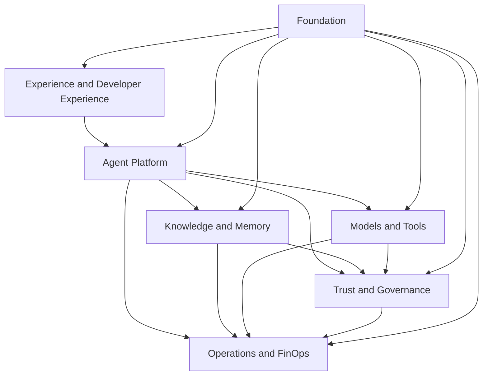

# 3. Capability Map

## Why start by capacity

A plate must not be defined initially by products or technologies. Capacitys describe **what the organisation needs to do** and remain useful even when frameworks, testers and services change.

The map below organizes the spreadsheet in seven complementary areas.

## Mapa consolidado

### 1. Experience and Developer Experience

| Capacidade | Responsabilidade |
|---|---|
| AI Portal | catalog, onboarding, evidence, status and operational documentation |
| SDKs e templates | golden paths for agents, RAG, tools and telemetry |
| Playground controlado | Identity, quotas and appropriate log |
| Channels | integration with web, mobile, contact center, APIs and message |
| Documentation | book, technical references, examples and runbooks |

### 2. Agent Platform

| Capacidade | Responsabilidade |
|---|---|
| Agent Registry | identity, owner, version, risk, dependencies and status |
| Agent Runtime | implementation, context, orchestration and application of limits |
| Agent Gateway | authentication, limit rate, roteament and entry/sale contracts |
| Prompt and Configuration Management | version, promotion and rollback of instructions and parsemaries |
| Session Management | correction, effect and continuity of communication |
| Human Approval | human decisions and decisions in critical actions |

### 3. Knowledge and Memory

| Capacidade | Responsabilidade |
|---|---|
| Knowledge Ingestion | extraction, classification, quarentene, chunking and indexation |
| Retrieval | syringe, lexical, hybrid, reranking and references |
| Knowledge Authorization | enforcement by tenant, base, document and chunk |
| Knowledge Lifecycle | version, expiry, reindexation and elimination |
| Session Memory | efamine context necessary for the current interaction |
| Long-term Memory | fats and preferentials with finality, consent and TTL |
| Data Provenance | origin, checksum, version and transformations applied |

### 4. Models and Tools

| Capacidade | Responsabilidade |
|---|---|
| Model Gateway | absorption of witnesses, policies and observation |
| Model Routing | selection by capacity, region, cost, quality and availability |
| Model Safety | limit, filters, redaction and exit validation |
| Embeddings | models and versions used for indexing and searching |
| MCP Registry | Regulatory and authorisation of corporative machinery |
| Tool Execution | validation of schema, timeout, idempotence and auditory |
| Compensation | rollback or compensation of effects when applicable |

### 5. Trust and Governance

| Capacidade | Responsabilidade |
|---|---|
| Identity | users, workloads and delegation |
| Authorization | RBAC, ABAC, scopes, purpose e deny by default |
| Policy Management | authorisation, distribution, decision and enforcement of policies |
| AI Risk Management | classification, controls and gates suitable for the risk |
| Evaluation | quality, stability, safety, retrieval, cost and consistency |
| Audit | mutable trilaxe of decisions, implementations and amendments |
| Model Lifecycle | approval, permitted use, revision and withdrawal of models |

### 6. Operations and FinOps

| Capacidade | Responsabilidade |
|---|---|
| Observability | logs, methods, trace and correlating events |
| SLO Management | objectives for the workload class and budget errors |
| Incident Management | detection, monitoring, diagnostic, communication and review |
| Capacity Management | competition, backlog, limits and loading tests |
| Cost Management | cost by agent, model, tenant, area and environment |
| Budget and Quotas | limites preventivos, alertas, showback e chargeback |
| Resilience | timeout, retry, circuit breaker, fallback, DR e rollback |

### 7. Foundation

| Capacidade | Responsabilidade |
|---|---|
| Cloud and Network | contas, VPCs, subnets, private endpoints e egress |
| Runtime Platform | Kubernetes, serverless ou compute gerenciado |
| Event Backbone | Canonic events and asymmetrical decomposition |
| Data Stores | armazenamento operacional, vetorial, cache e object storage |
| Secrets and Keys | KMS, secrets, rotation and identity workload |
| CI/CD | tests, policy checks, promotion and evidence of release |
| Software Supply Chain | - Dependencies, images, SMMO, signature and origin |

## Relationship with control plane and data plane

The capability map does not replace the architectural separation between plans.

- **Control plane:** cadastro, configuration, governance, policies, evaluation, catalog and promotion.
- **Data plane:** invoke, retrieval, memory, models, tools and telemetry in time of execution.

A capacity may be able to incorporate components into both plans. For example, Model Management defines policies in control plane while Model Gateway applies those policies in data plane.

Consult [Control plane and data plane](../architecture/control-plane-data-plane.md) for the details of separation.

## - ltd-stitch MVP

Not all the capabilities need to exist at the first release. A corporate MVP usually contains:

1. Agent Gateway e Agent Runtime;
2. Agent Registry;
3. Model Gateway;
4. identity and authorisation;
5. policy enforcement;
6. observation point to point;
7. minimum assessment;
8. CI/CD with gates;
9. a knowledge integration or a real tool;
10. ownership e suporte definidos.

## Capacitys that must not be centralised early enough

Some responsibility must remain in the product until the product is re-proved:

- specific business logic;
- prompts altamente especializados;
- UX and channel language;
- exclusive datasets of a product;
- workflows that will not be reused;
- transnational rules relating to the register system.

## Criteria for promoting a capacity at the plate

A comparable capacity must be addressed to most criteria:

- repurposed by a few products;
- requer controle uniforme;
- a operational scale economy;
- has a stable or versional contract;
- possui owner e SLO definidos;
- reduces risk or lead time in a reasonable manner;
- It can evolve without blocking all consumers.

## Reference articles

- (Dominates)(../domains/agent-platform.md)
- (Servers)(../services/agent-gateway.md)
- [Arcadia C4](../architecture/c4-complete.md)
- [Contratos](../contracts/apis.md)
- (Not working requirements)(../architecture/non-functional-requirements.md)

## Next chapter

The [Operating Model](03-operating-model.md) defines who can, govern, operate and consign those capacities.
