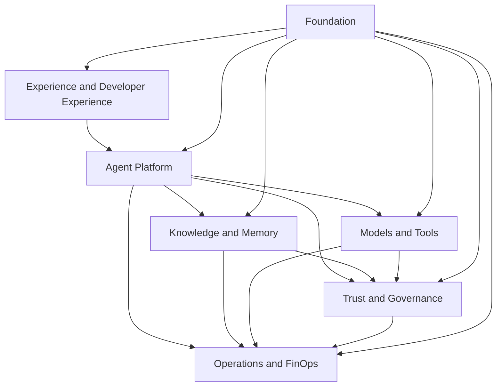

# 3. Capability Map

## Why Start With Skills

A platform should not be defined initially by products or technologies. Capabilities describe what an organization needs to be able to do and remain useful even when frameworks, providers and services change.

The map below organizes the platform into seven complementary domains.

## Mapa consolidado

### 1. Experience and Developer Experience

| Capacity | Responsabilidade |
|---|---|
| AI Portal | The Commission shall adopt delegated acts in accordance with Article 21 of Regulation (EU) No 182/2011 and in accordance with Article 21 thereof. |
| SDKs and templates | Golden paths for agents, RAG tools and telemetry |
| Playground controlado | Experimentation with identity, quotas and logging |
| Channels | integration with web, mobile, contact center, APIs and messaging |
| Documentation | book, technical references, examples and runbooks |

### 2. Agent Platform

| Capacity | Responsabilidade |
|---|---|
| Agent Registry | identity, owner, version, risk, dependencies and status |
| Agent Runtime | the implementation, context, orchestration and application of limits |
| Agent Gateway | Authentication, rate limit, routing and entry/exit contracts |
| Prompt and Configuration Management | versioning, promotion and rollback of instructions and parameters |
| Session Management | correlation, ephemeral state and continuity of conversation |
| Human Approval | Human pauses and decisions in critical actions |

### 3. Knowledge and Memory

| Capacity | Responsabilidade |
|---|---|
| Knowledge Ingestion | The Commission shall adopt delegated acts in accordance with Article 21 of Regulation (EU) No 1308/2013. |
| Retrieval | Semantic, lexical, hybrid, reranking and citation search |
| Knowledge Authorization | enforcement by tenant, base, document and chunk |
| Knowledge Lifecycle | The Commission shall adopt delegated acts in accordance with Article 21 of Regulation (EU) No 182/2011.'; |
| Session Memory | ephemeral context necessary for the current interaction |
| Long-term Memory | Facts and preferences with purpose, consent and TTL |
| Data Provenance | origin, checksum, version and transformations applied |

### 4. Models and Tools

| Capacity | Responsabilidade |
|---|---|
| Model Gateway | Abstraction of providers, policies and observability |
| Model Routing | selection by capacity, region, cost, quality and availability |
| Model Safety | the output limits, filters, wording and validation |
| Embeddings | Templates and versions used for indexing and searching |
| MCP Registry | Catalogue and authorisation of corporate tools |
| Tool Execution | Schedule validation, timeout, idempotence and audit |
| Compensation | rollback or effect offsetting where applicable |

### 5. Trust and Governance

| Capacity | Responsabilidade |
|---|---|
| Identity | Users, workloads and delegation |
| Authorization | RBAC, ABAC, scopes, purpose and deny by default |
| Policy Management | authorisation, distribution, decision-making and enforcement of policies |
| AI Risk Management | risk-proportionate classification, controls and gates |
| Evaluation | The Commission shall adopt delegated acts in accordance with Article 21 of Regulation (EU) No 182/2011 and in accordance with Article 21 thereof. |
| Audit | the unchanging path of decisions, executions and amendments |
| Model Lifecycle | approval, permitted use, review and withdrawal of samples |

### 6. Operations and FinOps

| Capacity | Responsabilidade |
|---|---|
| Observability | logs, metrics, traces and related events |
| SLO Management | Objectives by class of workload and error budgets |
| Incident Management | The Commission shall adopt delegated acts in accordance with Article 21 of Regulation (EU) No 182/2011 and in accordance with Article 21 thereof. |
| Capacity Management | Competition, backlog, limits and load tests |
| Cost Management | Cost per agent, model, tenant, area and environment |
| Budget and Quotas | Preventive limits, alerts, showback and chargeback |
| Resilience | the timeout, retry, circuit breaker, fallback, DR and rollback |

### 7. Foundation

| Capacity | Responsabilidade |
|---|---|
| Cloud and Network | The Commission shall adopt delegated acts in accordance with Article 21 of Regulation (EU) No 182/2011 and in accordance with Article 21 thereof. |
| Runtime Platform | Kubernetes, serverless ou compute gerenciado |
| Event Backbone | canonical events and asynchronous decoupling |
| Data Stores | Operational, vector, cache and object storage |
| Secrets and Keys | KMS, secrets, rotation and workload identity |
| CI/CD | Testing, policy checks, promotion and evidence of release |
| Software Supply Chain | Subsidies, images, SBOM, signature and provenance |

## Relationship with control plane and data plane

The capability map does not replace the architectural separation between planes.

- **Control plane:** register, configuration, governance, policies, evaluation, catalogue and promotion.
- **Data plane:** invocation, retrieval, memory, models, tools and telemetry at run time.

For example, Model Management defines policies in control plane, while Model Gateway applies these policies in data plane.

Consulte [Control planeand data plane](../architecture/control-plane-data-plane.md)for the separation details.

## Platform MVP

Not all capabilities need to exist on the first release.

1. Agent Gatewayand Agent Runtime;
2. Agent Registry;
3. Model Gateway;
4. identity and authorisation;
5. policy enforcement;
6. end-to-end observability;
7. the minimum assessment;
8. CI/CDwith cats;
9. a knowledge integration or a real tool;
10. defined ownership and support.

## Capacities not to be centralized too early

Some responsibilities should remain in the product until proven repetition:

- specific business logic;
- prompts altamente especializados;
- UX and channel language;
- exclusive datasets of a product;
- workflows that will not be reused;
- transactional rules relating to the registration system.

## Criteria for promoting capacity at the platform

A shared capacity shall meet most of the criteria:

- reused for multiple products;
- requer controle uniforme;
- has an operational economies of scale;
- has a stable or transferable contract;
- has defined owner and SLO;
- reduce risk or lead time in a measurable manner;
- It can evolve without blocking all consumers.

## Reference artifacts

- [The following is a list of the areas covered by this Regulation:](../domains/agent-platform.md)
- [Services](../services/agent-gateway.md)
- [Architecture .C4](../architecture/c4-complete.md)
- [Contract](../contracts/apis.md)
- [Non-functional requirements](../architecture/non-functional-requirements.md)

## Next chapter

The [Operating Model]03-operating-model.md defines who builds, governs, operates and consumes these capabilities.
