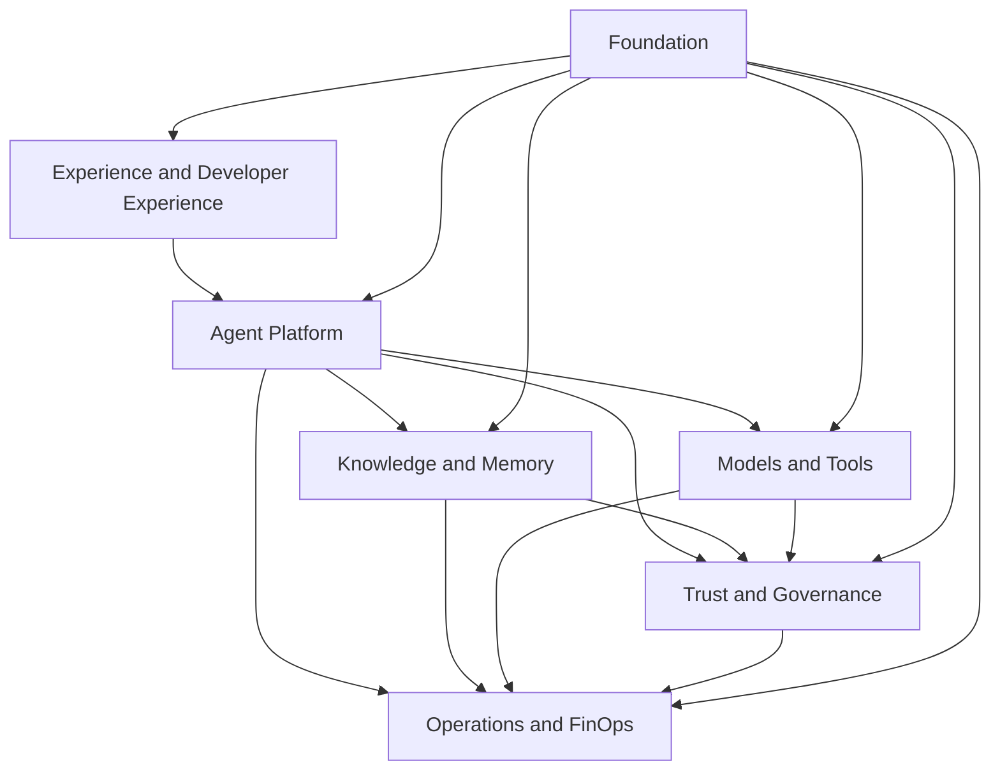

# 3. Capability Map

## Why start with capacities

A platform must not be initially defined by products or technologies. Capacities describe **what the organization needs to do** and remain useful even when frameworks, providers and services change.

The map below organizes the platform into seven complementary domains.

## Mapa consolidado

### 1. Experience and Developer Experience

| Capacity | Responsabilidade |
|---|---|
| AI Portal | catalog, onboarding, evidence, status and operational documentation |
| SDKs and templates | golden paths for agents, RAG, tools and telemetry |
| Playground controlado | experimentation with identity, quotas and appropriate logging |
| Channels | integration with web, mobile, contact center, APIs and measurement |
| Documentation | book, technical references, examples and runbooks |

### 2. Agent Platform

| Capacity | Responsabilidade |
|---|---|
| Agent Registry | identity, owner, version, risk, dependence and status |
| Agent Runtime | implementation, context, orchestration and application of limits |
| Agent Gateway | authentication, rate limit, routing and entry/output contracts |
| Prompt and Configuration Management | versioning, promotion and rollback of instructions and parameters |
| Session Management | correlation, ephemeral state and conversation continuity |
| Human Approval | pauses and human decisions in critical actions |

### 3. Knowledge and Memory

| Capacity | Responsabilidade |
|---|---|
| Knowledge Ingestion | extraction, classification, quarantine, chunking and indexing |
| Retrieval | semantic search, lexical, hybrid, reranking and citations |
| Knowledge Authorization | enforcement by tenant, base, document and chunk |
| Knowledge Lifecycle | versioning, expiration, re-indexing and elimination |
| Session Memory | ephemeral context necessary to the current interaction of the study. |
| Long-term Memory | facts and preferences for purpose, consent and TTL |
| Data Provenance | origin, checksum, version and applied transformations |

### 4. Models and Tools

| Capacity | Responsabilidade |
|---|---|
| Model Gateway | abstraction of providers, policies and observability |
| Model Routing | selection by capacity, region, cost, quality and availability |
| Model Safety | limits, filters, redaction and output validation |
| Embeddings | models and versions used for indexing and searching are: |
| MCP Registry | catalogue and authorisation of corporate tools |
| Tool Execution | validation of schema, timeout, inadequacy and audit |
| Compensation | rollback or effect compensation where applicable |

### 5. Trust and Governance

| Capacity | Responsabilidade |
|---|---|
| Identity | users, workloads and delegation |
| Authorization | RBAC, ABAC, scopes, purpose and deny by default |
| Policy Management | authorship, distribution, decision and enforcement of policies |
| AI Risk Management | classification, controls and risk-proportional gates |
| Evaluation | quality, groundedness, safety, retrieval, cost and latency |
| Audit | immutable path of decisions, executions and amendments |
| Model Lifecycle | approval, allowed use, review and removal of models |

### 6. Operations and FinOps

| Capacity | Responsabilidade |
|---|---|
| Observability | logs, metrics, traces and correlated events |
| SLO Management | objectives by class of workload and error budgets |
| Incident Management | detection, containment, diagnosis, communication and review |
| Capacity Management | competition, backlog, limits and load tests |
| Cost Management | cost per agent, model, tenant, area and environment |
| Budget and Quotas | preventive limits, alerts, showback and chargeback |
| Resilience | timeout, retry, circuit breaker, fallback, DR and rollback |

### 7. Foundation

| Capacity | Responsabilidade |
|---|---|
| Cloud and Network | accounts, VPCs, subnets, private endpoints and egress |
| Runtime Platform | Kubernetes, serverless or compute managed |
| Event Backbone | canonical events and asynchronous uncoupling |
| Date Stores | operational storage, vector, cache and object storage |
| Secrets and Keys | KMS, secrets, rotation and workload identity |
| IC/CD | tests, policy checks, promotion and evidence of release |
| Software Supply Chain | dependencies, images, SBOM, signature and provenance |

## Relationship with control plane and date plane

The capability map does not replace the architectural separation between planes.

- **Control plane:** registration, configuration, governance, policies, evaluation, catalogue and promotion.
- **Date planned:** invocation, retrieval, memory, models, tools and telemetry in execution time.

A capacity may have components in both planes, for example, Model Management defines policies in the control plane, while Model Gateway applies these policies in the data plane.

Consultation [Control plan and date plan](../architecture/control-plane-data-plane.md) for separation details.

## Platform MVP

Not all capacities need to exist in the first release. A corporate MVP normally contains:

1. Agent Gateway and Agent Runtime;
2. Agent Registry;
3. Model Gateway;
4. identity and authorisation;
5. policy enforcement;
6. tip-to-end observability;
7. minimum assessment;
8. IC/CD with gates;
9. an integration of knowledge or a real tool;
10. ownership and defined support.

## Capabilities that should not be centralized early

Some responsibilities shall remain in the product until there is proven repetition:

- specific business logic;
- highly expert prompts;
- UX and channel language;
- exclusive dates for a product;
- workflows that will not be reused;
- transactional rules belonging to the registration system.

## Criteria for promoting capacity for the platform

Shared capacity shall meet most of the following criteria:

- re-used for multiple products;
- requer controle uniforme;
- has an economy of operational scale;
- has a stable or verifiable contract;
- has owner and SLO defined;
- reduces risk or lead time in a measurable way;
- it can evolve without blocking all consumers.

## Reference artifacts

- [Domains](../domains/agent-platform.md)
- [Services](../services/agent-gateway.md)
- [Architecture C4](../architecture/c4-complete.md)
- [Contracts](../contracts/apis.md)
- [Non-functional requirements](../architecture/non-functional-requirements.md)

## Next chapter

O [Operating Model](03-operating-model.md) defines who builds, governs, operates and consumes these capacities.
