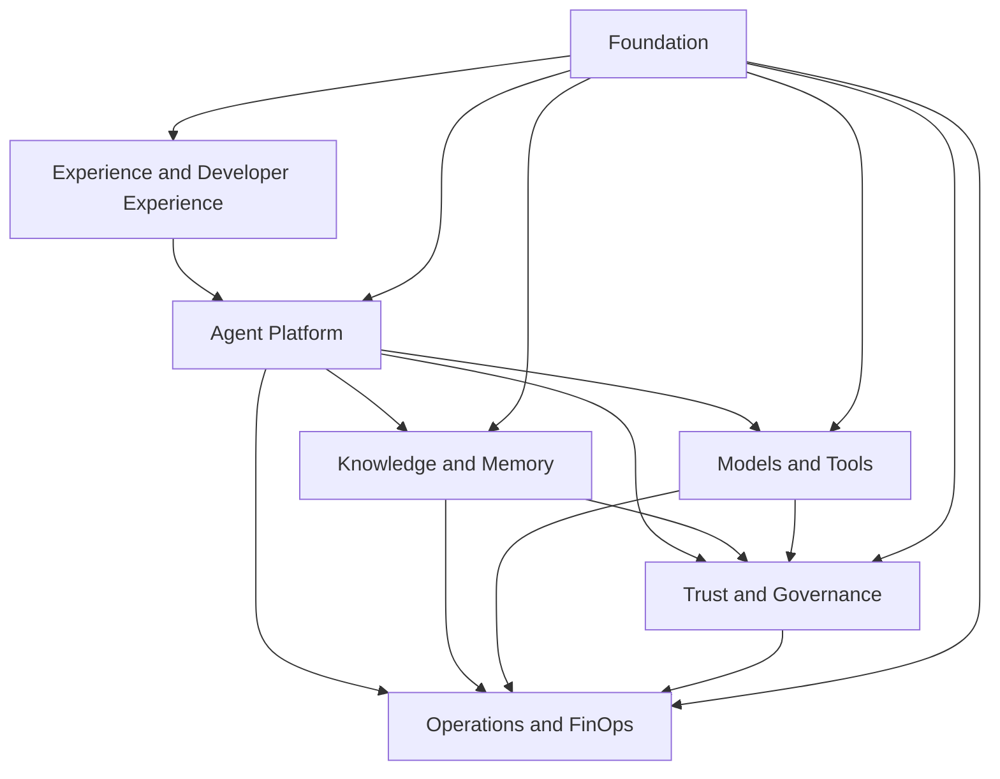

# 3. Capability Map

## Por que começar por capacidades

Uma plataforma não deve ser definida inicialmente por produtos ou tecnologias. Capacidades descrevem **o que a organização precisa conseguir fazer** e permanecem úteis mesmo quando frameworks, provedores e serviços mudam.

O mapa abaixo organiza a plataforma em sete domínios complementares.

## Mapa consolidado

### 1. Experience and Developer Experience

| Capacidade | Responsabilidade |
|---|---|
| AI Portal | catálogo, onboarding, evidências, status e documentação operacional |
| SDKs e templates | golden paths para agentes, RAG, tools e telemetria |
| Playground controlado | experimentação com identidade, quotas e logging adequado |
| Channels | integração com web, mobile, contact center, APIs e mensageria |
| Documentation | book, referências técnicas, exemplos e runbooks |

### 2. Agent Platform

| Capacidade | Responsabilidade |
|---|---|
| Agent Registry | identidade, owner, versão, risco, dependências e status |
| Agent Runtime | execução, contexto, orchestration e aplicação de limites |
| Agent Gateway | autenticação, rate limit, roteamento e contratos de entrada/saída |
| Prompt and Configuration Management | versionamento, promoção e rollback de instruções e parâmetros |
| Session Management | correlação, estado efêmero e continuidade de conversação |
| Human Approval | pausas e decisões humanas em ações críticas |

### 3. Knowledge and Memory

| Capacidade | Responsabilidade |
|---|---|
| Knowledge Ingestion | extração, classificação, quarentena, chunking e indexação |
| Retrieval | busca semântica, lexical, híbrida, reranking e citações |
| Knowledge Authorization | enforcement por tenant, base, documento e chunk |
| Knowledge Lifecycle | versionamento, expiração, reindexação e eliminação |
| Session Memory | contexto efêmero necessário à interação atual |
| Long-term Memory | fatos e preferências com finalidade, consentimento e TTL |
| Data Provenance | origem, checksum, versão e transformações aplicadas |

### 4. Models and Tools

| Capacidade | Responsabilidade |
|---|---|
| Model Gateway | abstração de provedores, políticas e observabilidade |
| Model Routing | seleção por capacidade, região, custo, qualidade e disponibilidade |
| Model Safety | limites, filtros, redaction e validação de saída |
| Embeddings | modelos e versões usados para indexação e busca |
| MCP Registry | catálogo e autorização de ferramentas corporativas |
| Tool Execution | validação de schema, timeout, idempotência e auditoria |
| Compensation | rollback ou compensação de efeitos quando aplicável |

### 5. Trust and Governance

| Capacidade | Responsabilidade |
|---|---|
| Identity | usuários, workloads e delegação |
| Authorization | RBAC, ABAC, scopes, purpose e deny by default |
| Policy Management | autoria, distribuição, decisão e enforcement de políticas |
| AI Risk Management | classificação, controles e gates proporcionais ao risco |
| Evaluation | qualidade, groundedness, segurança, retrieval, custo e latência |
| Audit | trilha imutável de decisões, execuções e alterações |
| Model Lifecycle | aprovação, uso permitido, revisão e retirada de modelos |

### 6. Operations and FinOps

| Capacidade | Responsabilidade |
|---|---|
| Observability | logs, métricas, traces e eventos correlacionados |
| SLO Management | objetivos por classe de workload e error budgets |
| Incident Management | detecção, contenção, diagnóstico, comunicação e revisão |
| Capacity Management | concorrência, backlog, limites e testes de carga |
| Cost Management | custo por agente, modelo, tenant, área e ambiente |
| Budget and Quotas | limites preventivos, alertas, showback e chargeback |
| Resilience | timeout, retry, circuit breaker, fallback, DR e rollback |

### 7. Foundation

| Capacidade | Responsabilidade |
|---|---|
| Cloud and Network | contas, VPCs, subnets, private endpoints e egress |
| Runtime Platform | Kubernetes, serverless ou compute gerenciado |
| Event Backbone | eventos canônicos e desacoplamento assíncrono |
| Data Stores | armazenamento operacional, vetorial, cache e object storage |
| Secrets and Keys | KMS, secrets, rotação e workload identity |
| CI/CD | testes, policy checks, promoção e evidências de release |
| Software Supply Chain | dependências, imagens, SBOM, assinatura e provenance |

## Relação com control plane e data plane

O capability map não substitui a separação arquitetural entre planos.

- **Control plane:** cadastro, configuração, governança, políticas, avaliação, catálogo e promoção.
- **Data plane:** invocação, retrieval, memória, modelos, tools e telemetria em tempo de execução.

Uma capacidade pode possuir componentes nos dois planos. Por exemplo, Model Management define políticas no control plane, enquanto Model Gateway aplica essas políticas no data plane.

Consulte [Control plane e data plane](../architecture/control-plane-data-plane.md) para os detalhes de separação.

## MVP de plataforma

Nem todas as capacidades precisam existir no primeiro release. Um MVP corporativo normalmente contém:

1. Agent Gateway e Agent Runtime;
2. Agent Registry;
3. Model Gateway;
4. identidade e autorização;
5. policy enforcement;
6. observabilidade ponta a ponta;
7. avaliação mínima;
8. CI/CD com gates;
9. uma integração de conhecimento ou uma tool real;
10. ownership e suporte definidos.

## Capacidades que não devem ser centralizadas cedo demais

Algumas responsabilidades devem permanecer no produto até que exista repetição comprovada:

- lógica de negócio específica;
- prompts altamente especializados;
- UX e linguagem do canal;
- datasets exclusivos de um produto;
- workflows que não serão reutilizados;
- regras transacionais pertencentes ao sistema de registro.

## Critérios para promover uma capacidade à plataforma

Uma capacidade compartilhada deve atender à maioria dos critérios:

- reutilizada por múltiplos produtos;
- requer controle uniforme;
- possui economia de escala operacional;
- tem contrato estável ou versionável;
- possui owner e SLO definidos;
- reduz risco ou lead time de forma mensurável;
- pode evoluir sem bloquear todos os consumidores.

## Artefatos de referência

- [Domínios](../domains/)
- [Serviços](../services/)
- [Arquitetura C4](../architecture/diagrams/)
- [Contratos](../contracts/)
- [Requisitos não funcionais](../architecture/non-functional-requirements.md)

## Próximo capítulo

O [Operating Model](03-operating-model.md) define quem constrói, governa, opera e consome essas capacidades.
