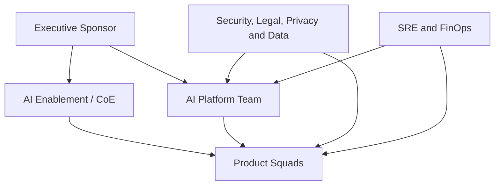

# 4. Operating Model

## The organizational challenge

A AI Platform fails when the architecture is clear, but ownership is not. The operating model defines who decides, who executes, who approves, who operates and who responds to the business outcome.

The recommendation is to adopt a model federated with central platform**:

- a time of a slut keeps a pair of sluts and golden paths;
- products squads keep ownership of the cases of use;
- trust functions define policies and participate in the risk;
- SRE and FinOps take operation and cost of the product;
- an AI Enablement or CoE that added without concentrating all delivery.

## - Main papers

### Executive Sponsor

Responsible for the mandate, funding, objectives and reimbursement of organisational obstacles.

### AI Platform Team

Responsible for the platelet product:

- runtime, gateways, registries, SDKs e templates;
- confidence, security of the platform and experience of the developer;
- contracts and comparable policies;
- roadmap of capacity;
- Support of second level and management of dependencies.

The time of the plate must be measured by adoption, lead time, confidentiality and reduction of duplication, not just by components delivered.

### AI Enablement / CoE

Responsible for:

- rules and references;
- capacity and practice community;
- initial assessment of cases;
- support assessment and threat modeling;
- a curricula of examples and learning;
- facilitation of government operations.

The EEC must not become a central factory of agents or a manual gate for all changes.

### Product Squad

Hold the agent or solution:

- business and methods;
- UX, domain and integration with register systems;
- prompts, datasets and acceptance criteria;
- first-level operation;
- corrections, evolution and deactivation;
- evidence necessary for publication.

### Security, Legal, Privacy and Data

Identify policies and participate appropriately to the risk:

- data classification and finality;
- threat model and controls;
- regulatory and contractual requirements;
- retention, consent and discharge;
- approval of exemptions;
- periodical review criteria.

### SRE and FinOps

Responsible for making operation and expenses:

- SLOs e error budgets;
- capacity, resilience and incidents;
- dashboards e alertas;
- budgets, quotas, showback e chargeback;
- cost analysis versus value analysis;
- readiness operacional.

## Reference RACI

Legend: **R** responsible for executing, **A** accountable for the final decision, **C** consultated, **I** informed.

| Atividade | Sponsor | Platform | CoE | Product Squad | Trust Functions | SRE/FinOps |
|---|---|---|---|---|---|---|
| define strategy and outcomes | A | C | R | C | C | C |
| Prioritize the platform roadmap | C | A/R | C | C | C | C |
| select the use case | I | C | C | A/R | C | C |
| classificar risco | I | C | R | R | A | C |
| develop agent | I | C | C | A/R | C | C |
| manter SDKs e runtime | I | A/R | C | I | C | C |
| produce sample analysis | I | C | C | A/R | C | C |
| define security policies | I | R | C | C | A | C |
| appropriate criteria | I | C | C | C | A/R | I |
| publish version | I | R | I | A/R | C conforme risco | C |
| operate in production | I | R plataforma | I | A/R product | I | R suporte |
| responder incidente | I | R plataforma | I | R produto | C | Coordination A/R |
| revisar custo e valor | C | R | I | A/R | I | R |
| deactivating agent | I | C | I | A/R | C | C |

## Intake of use cases

The intake must be short and orientated to the decision. A minimum form contains:

- problem and used;
- a result sprained and measured;
- necessary data and classification;
- actions that the agent may execute;
- impact of an incorrettuous response;
- criticidade e volume estimado;
- memory need;
- models or pretending witnesses;
- product owner and technical owner;
- fallback strategy.

The exit from the intake is not a final approval, it is an initial classification and a delivery route.

## Rotas proporcionais ao risco

| Risco | Exemplo | Rota recomendada |
|---|---|---|
| LOW | Internal summary without sensitive data | self-service with automatic controls |
| MEDIUM | RAG corporative with internal information | simplified assessment, safety and approval |
| HIGH | recommendation that the relevant client or decision adopts | Multidisciplinar review, HITL and additional evidence |
| CRITICAL | financial action, regulatory decision or physical risk | enhanced controls, formal approval and restricted scope |

Consult the [AI Risk Framework] (../governance/ai-risk-framework.md) for the canonical classification.

## Golden path

The golden path is the way to the production:

1. registrating the case and the owner;
2. classifying risk and data;
3. creating the solution from the approved template;
4. integrar identidade, policies e telemetria;
5. executing mandatory assessments;
6. annex evidence to the version;
7. to take the necessary decisions;
8. to publish by pipeline;
9. monitorar SLOs, qualidade e custo;
10. - Revision or re-removal of the version.

The squad can get out of the golden path, but the exception must be explended, be owner, time limit and compensate for controls.

## Fucking and tits

| Fruit | - Cadence | Objet |
|---|---|---|
| Platform Product Review | quinzenal | roadmap, adoption, capacity and experience |
| AI Risk Review | semanal ou sob demanda | HI/CRITICAL cases and exceptions |
| Architecture Clinic | semanal | Decisions and support to squads without formal gate |
| Model and Vendor Review | mensal | approved models, changes and supply risks |
| SRE and FinOps Review | mensal | SLOs, incidentes, capacidade, custo e quotas |
| Executive Outcome Review | trimestral | valor, risco agregado e investimento |

## Operating model devices

- lead time between intake and first controlled version;
- percentage of solutions on the golden path;
- time of decision by risk class;
- number of open and vengeable exceptions;
- adoption of SDKs and comparable services;
- incidents by category and product;
- costs for the outcome or unit of business;
- a return rate blocked before production;
- satisfaction of consumers' squads.

## Antipadrones

- CoE manually adopted all changes;
- a plate without product manager or a backlog for consumers;
- sending the agent and transferring all operations to the central time;
- safety only consultable at the end;
- lack of ownership for data and knowledge;
- approval without validity or periodic review;
- - based on technical availability.

## Next chapter

The [Life Cycle of Agents](04-agent-lifecycle.md) transforms that operating model into concrete elements, artefacts and evidence.
