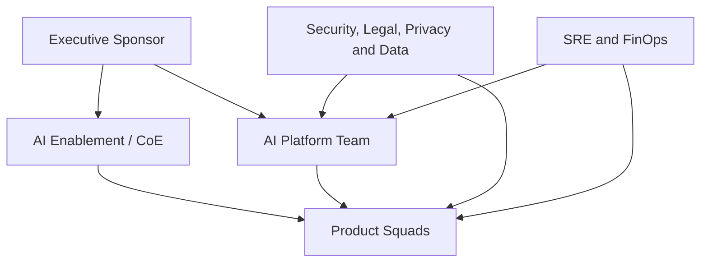

# 4. Operating Model

## The organizational challenge

A AI Platform fails when the architecture is clear, but the ownership is not.

The recommendation is to adopt a federated model with a central platform:

- a platform team maintains shared capabilities and golden paths;
- product squads maintain ownership of use cases;
- trust functions define policies and participate as a risk;
- SRE and FinOps make operation and cost part of the product;
- An AI Enablement or CoE speeds up adoption without focusing all delivery.

## Key roles

### Executive Sponsor

Responsible for mandate, funding, objectives and removal of organizational impediments.

### AI Platform Team

Responsible for the platform product:

- The following information shall be provided in accordance with the provisions of this Regulation:
- reliability, platform security and developer experience;
- Shared contracts and policies;
- the capacity roadmap;
- secondary support and dependence management.

The platform team should be measured by adoption, lead time, reliability and duplication reduction, not just by delivered components.

### AI Enablement / CoE

Responsible for:

- standards and references;
- training and community of practice;
- initial case assessment;
- support for evaluations and threat modelling;
- curating examples and learning;
- facilitating governance forums.

The CoE must not become a central agent factory or a manual gateway for any change.

### Product Squad

Maintains ownership of the agent or solution:

- business outcome and metrics;
- UX, domain and integration with registry systems;
- The following information shall be provided in accordance with the procedure referred to in paragraph 1 of this Article:
- the first-level operation;
- corrections, evolution and deactivation;
- the evidence necessary for publication.

### Security, Legal, Privacy and Data

They set policies and participate proportionately to the risk:

- data classification and purpose;
- threat model and controls;
- regulatory and contractual requirements;
- withholding, consent and discarding;
- the approval of exceptions;
- the criteria for periodic review.

### SRE and FinOps

Responsible for making operation and cost explicit:

- SLOsand error budgets;
- capacity, resilience and incidents;
- dashboards and alerts;
- the budget, quotas, showback and chargeback;
- the cost-to-value analysis;
- readiness operacional.

## RACI of reference

Title: **R** responsible for execution, **A** accountable for final decision, **C** consulted, **I** informed.

| Atividade | Sponsor | Platform | CoE | Product Squad | Trust Functions | SRE/FinOps |
|---|---|---|---|---|---|---|
| Defining strategy and outcomes | The | C | R | C | C | C |
| Prioritizing the platform roadmap | C | A/R | C | C | C | C |
| Select the use case | I | C | C | A/R | C | C |
| classificar risco | I | C | R | R | The | C |
| developing agent | I | C | C | A/R | C | C |
| maintaining SDKs and runtime | I | A/R | C | I | C | C |
| produce an evaluation dataset | I | C | C | A/R | C | C |
| define security policies | I | R | C | C | The | C |
| approve a critical exception | I | C | C | C | A/R | I |
| publish version | I | R | I | A/R | C conforme risco | C |
| operating in production | I | R platform | I | A/R product | I | R suporte |
| responder incidente | I | R platform | I | R produto | C | A/R coordination |
| Review cost and value | C | R | I | A/R | I | R |
| deactivate agent | I | C | I | A/R | C | C |

## Intake of use cases

The intake shall be short and decision-oriented.

- the problem and the affected user;
- expected outcome and metric;
- necessary data and classification;
- actions that the agent may take;
- the impact of an incorrect response;
- critical and estimated volume;
- the need for memory;
- intended models or suppliers;
- product owner and technical owner;
- I'm going to use a fallback strategy.

The intake output is not a final approval, it's an initial classification and a delivery route.

## Rotas proporcionais ao risco

| Risco | Example | Recommended route |
|---|---|---|
| LOW | Internal summary without sensitive data | Self-service with automatic controls |
| MEDIUM | RAG corporate with internal information | The Commission shall adopt delegated acts in accordance with Article 21 of Regulation (EU) No 1303/2013. |
| HIGH | Recommendation affecting client or relevant decision | The Commission shall adopt delegated acts in accordance with the opinion of the Standing Committee on Planning and Zoning in the European Union. |
| CRITICAL | financial action, regulated decision or physical risk | reinforced controls, formal approval and limited scope |

For the classification, please refer to the [AI Risk Framework](../governance/ai-risk-framework.md).

## Golden path

The golden path is the supported path to production:

1. record the case and the owner;
2. classify risk and data;
3. create the solution from an approved template;
4. integrate identity, policies and telemetry;
5. carry out mandatory assessments;
6. attach evidence to the version;
7. obtain the necessary decisions;
8. publish by pipeline;
9. monitor SLOs, quality and cost;
10. revise or withdraw the version.

The squad can get off the golden path, but the exception must be explicit, possess owner, deadline and compensating controls.

## Forums and meetings

| The European Parliament | Capacity | Objective |
|---|---|---|
| Platform Product Review | quinzenal | The Commission shall adopt delegated acts in accordance with Article 21 of Regulation (EU) No 1303/2013. |
| AI Risk Review | semanal ou sob demanda | HIGH/Critical cases and exceptions |
| Architecture Clinic | semanal | decisions and support for squads without a formal gate |
| Model and Vendor Review | mensal | approved models, changes and supplier risks |
| SRE and FinOps Review | mensal | SLOs, incidents, capacity, cost and quotas |
| Executive Outcome Review | trimestral | Value, aggregate risk and investment |

## Operating model metrics

- lead time between intake and first controlled release;
- percentage of solutions on the golden path;
- decision time by risk class;
- the number of exceptions opened and expired;
- the adoption of SDKs and shared services;
- incidents by category and product;
- cost per outcome or business unit;
- the pre-production blocked regression rate;
- the satisfaction of the consumer squads.

## Other, not further worked than hot-rolled

- CoE manually approving all changes;
- a platform without a product manager or a consumer-oriented backlog;
- squad handing over the agent and transferring all operations to the central team;
- security consulted only at the end;
- absence of owner for data and knowledge;
- approval without validity or periodic review;
- platform metrics based solely on technical availability.

## Next chapter

The [Agent Life Cycle](04-agent-lifecycle.md) transforms this operating model into gates, artifacts and concrete evidence.
