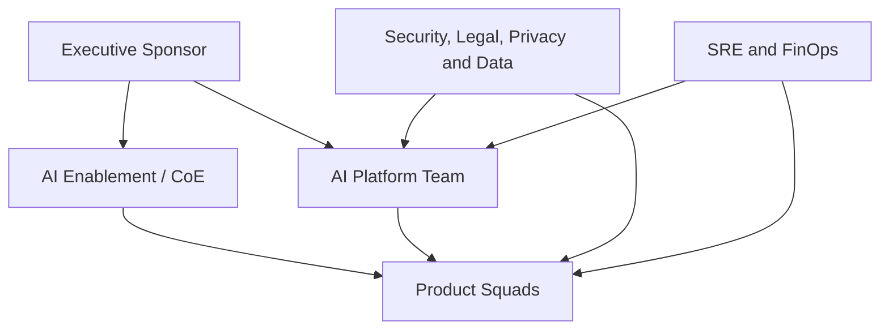

# 4. Operating Model

## O desafio organizacional

A Platform IA fails when the architecture is clear, but the ownership is not.The operating model defines who decides, who executes, who approves, who operates and who accounts for the business result.

The recommendation is to adopt a model **federado com plataforma central**:

- a platform team maintains shared capacities and golden paths;
- product squads maintain ownership of use cases;
- trust functions define policies and participate according to risk;
- SRE and FinOps make operation and cost part of the product;
- An IA Enablement or CoE accelerates adoption without concentrating every delivery.

## Main papers

### Executive Sponsor

Responsible for mandate, funding, objectives and removal of organizational impediments. It must not operate as the technical approval of each agent.

### AI Platform Team

Responsible for platform product:

- runtime, gateways, registries, SDKs e templates;
- reliability, platform security and developer experience;
- contracts and shared policies;
- capacity roadmap;
- second level support and dependency management.

The platform team should be measured by adoption, lead time, reliability and reduction of duplication, not only by components delivered.

### AI Enablement / CoE

Responsible for:

- standards and references
- training and community practice;
- assessment inicial de casos;
- supporting evaluations and threat modeling;
- curation of examples and learnings;
- facilitation of governance forums.

The EC should not become a central factory of agents or a manual gate for every change.

### Product Squad

Maintains the agent or solution's ownership:

- business results and metrics;
- UX, domain and integration with registration systems;
- prompts, datesets and acceptance criteria;
- first-level operation;
- corrections, evolution and deactivation;
- evidence needed for publication.

### Security, Legal, Privacy and Data

They define policies and participate proportionally to risk:

- Data classification and purpose;
- threat model and controls;
- regulatory and contractual requirements;
- retention, consent and discard;
- approval of exceptions;
- periodic review criteria.

### SRE and FinOps

Responsible for making operation and cost explicit:

- SLOs e error budgets;
- capacity, resilience and incidents;
- dashboards e alertas;
- budgets, quotas, showback e chargeback;
- cost versus value analysis;
- readiness operacional.

## Reference IACR

Legenda: **R** responsible for carrying out, **A** accountable for the final decision, **C** consultado, **I** informado.

| Atividade | Sponsor | Platform | CoE | Product Squad | Trust Functions | SRE/FinOps |
|---|---|---|---|---|---|---|
| define strategy and outcomes | A | C | R | C | C | C |
| priorizar roadmap da plataforma | C | A/R | C | C | C | C |
| selecionar caso de uso | I | C | C | A/R | C | C |
| risk classification | I | C | R | R | A | C |
| develop agent | I | C | C | A/R | C | C |
| manter SDKs e runtime | I | A/R | C | I | C | C |
| produce assessment dates | I | C | C | A/R | C | C |
| defining security policies | I | R | C | C | A | C |
| approve critical exception | I | C | C | C | A/R | I |
| publish version | I | R | I | A/R | C as risk | C |
| operating in production | I | R plataforma | I | A/R produto | I | R suporte |
| responder incidente | I | R plataforma | I | R produto | C | A/R coordination |
| review cost and value | C | R | I | A/R | I | R |
| deactivate agent | I | C | I | A/R | C | C |

## Intake de casos de uso

The intake must be short and decision-oriented. A minimum form contains:

- problem and affected user;
- expected result and metric;
- necessary data and classification;
- actions that the staff member may carry out;
- impacto de uma resposta incorreta;
- criticidade e volume estimado;
- need for memory;
- models or providers intended;
- product and technical owner;
- fallback strategy.

The output of the intake is not a final approval, it is an initial classification and a delivery route.

## Risk proportional routes

| Risk | Exemplo | Recommended route |
|---|---|---|
| LOW | Internal summarization without sensitive data | self-service with automatic controls |
| MEDIUM | Corporate RAG with internal information | evaluation, safety and simplified approval |
| HIGH | recommendation affecting customer or relevant decision | multidisciplinary review, HITL and additional evidence |
| CRITICAL | financial action, regulated decision or physical risk | reinforced controls, formal approval and restricted scope |

Consulte o [AI Risk Framework](../governance/ai-risk-framework.md) for canonical classification.

## Golden path

The golden path is the way to reach production:

1. register the case and the owner;
2. rating risk and data;
3. create the solution from approved template;
4. to integrate identity, policies and telemetry;
5. to carry out mandatory assessments;
6. attach evidence to the version;
7. obtaining necessary decisions;
8. publicar por pipeline;
9. Monitoring SLOs, quality and cost;
10. review or withdraw the version.

The squad can leave the golden path, but the exception must be explicit, have owner, deadline and compensating controls.

## Forums and cadence

| Forum | Cadence | Objective |
|---|---|---|
| Platform Product Review | quinzenal | roadmap, adoption, ability and experience |
| AI Risk Review | semanal ou sob demanda | HIGH/CRITICAL cases and exceptions |
| Architecture Clinic | semanal | decisions and support for squads without formal gate |
| Model and Vendor Review | mensal | approved models, changes and supplier risks |
| SRE and FinOps Review | mensal | SLOs, incidents, capacity, cost and quotas |
| Executive Outcome Review | trimestral | value, aggregate risk and investment |

## Operating model metrics

- lead time between intake and first controlled version;
- percentage of solutions in the golden path;
- decision time by risk class;
- number of exceptions opened and expired;
- adoption of SDKs and shared services;
- incidentes por categoria e produto;
- cost per outcome or business unit;
- blocked regression rate prior to production;
- satisfaction of consumer squads.

## Anti-standards

- EC manually approving all changes;
- plataforma sem product manager ou backlog orientado a consumidores;
- squad delivering the agent and transferring the entire operation to the central team;
- security consulted only at the end;
- absence of owner for data and knowledge;
- approval without validity or periodic review;
- platform metrics based only on technical availability.

## Next chapter

O [Life cycle of agents](04-agent-lifecycle.md) it transforms this operating model into gates, artifacts and concrete evidence.
