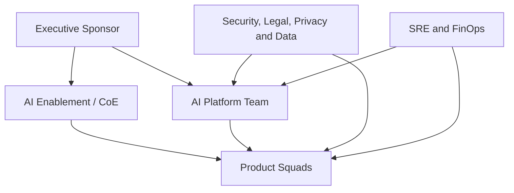

# 4. Operating Model

## O desafio organizacional

Uma AI Platform falha quando a arquitetura está clara, mas o ownership não está. O operating model define quem decide, quem executa, quem aprova, quem opera e quem responde pelo resultado de negócio.

A recomendação é adotar um modelo **federado com plataforma central**:

- um time de plataforma mantém capacidades compartilhadas e golden paths;
- squads de produto mantêm ownership dos casos de uso;
- funções de confiança definem políticas e participam conforme o risco;
- SRE e FinOps tornam operação e custo parte do produto;
- um AI Enablement ou CoE acelera adoção sem concentrar toda entrega.

## Papéis principais

### Executive Sponsor

Responsável por mandato, funding, objetivos e remoção de impedimentos organizacionais. Não deve operar como aprovador técnico de cada agente.

### AI Platform Team

Responsável pelo produto plataforma:

- runtime, gateways, registries, SDKs e templates;
- confiabilidade, segurança da plataforma e experiência do desenvolvedor;
- contratos e políticas compartilhadas;
- roadmap de capacidades;
- suporte de segundo nível e gestão de dependências.

O time de plataforma deve ser medido por adoção, lead time, confiabilidade e redução de duplicação, não apenas por componentes entregues.

### AI Enablement / CoE

Responsável por:

- padrões e referências;
- capacitação e comunidade de prática;
- assessment inicial de casos;
- apoio a avaliações e threat modeling;
- curadoria de exemplos e learnings;
- facilitação dos fóruns de governança.

O CoE não deve se tornar uma fábrica central de agentes nem um gate manual para toda mudança.

### Product Squad

Mantém ownership do agente ou solução:

- resultado de negócio e métricas;
- UX, domínio e integração com sistemas de registro;
- prompts, datasets e critérios de aceitação;
- operação de primeiro nível;
- correções, evolução e desativação;
- evidências necessárias à publicação.

### Security, Legal, Privacy and Data

Definem políticas e participam proporcionalmente ao risco:

- classificação de dados e finalidade;
- threat model e controles;
- requisitos regulatórios e contratuais;
- retenção, consentimento e descarte;
- aprovação de exceções;
- critérios de revisão periódica.

### SRE and FinOps

Responsáveis por tornar operação e custo explícitos:

- SLOs e error budgets;
- capacidade, resiliência e incidentes;
- dashboards e alertas;
- budgets, quotas, showback e chargeback;
- análise de custo versus valor;
- readiness operacional.

## RACI de referência

Legenda: **R** responsável por executar, **A** accountable pela decisão final, **C** consultado, **I** informado.

| Atividade | Sponsor | Platform | CoE | Product Squad | Trust Functions | SRE/FinOps |
|---|---|---|---|---|---|---|
| definir estratégia e outcomes | A | C | R | C | C | C |
| priorizar roadmap da plataforma | C | A/R | C | C | C | C |
| selecionar caso de uso | I | C | C | A/R | C | C |
| classificar risco | I | C | R | R | A | C |
| desenvolver agente | I | C | C | A/R | C | C |
| manter SDKs e runtime | I | A/R | C | I | C | C |
| produzir dataset de avaliação | I | C | C | A/R | C | C |
| definir políticas de segurança | I | R | C | C | A | C |
| aprovar exceção crítica | I | C | C | C | A/R | I |
| publicar versão | I | R | I | A/R | C conforme risco | C |
| operar em produção | I | R plataforma | I | A/R produto | I | R suporte |
| responder incidente | I | R plataforma | I | R produto | C | A/R coordenação |
| revisar custo e valor | C | R | I | A/R | I | R |
| desativar agente | I | C | I | A/R | C | C |

## Intake de casos de uso

O intake deve ser curto e orientado à decisão. Um formulário mínimo contém:

- problema e usuário afetado;
- resultado esperado e métrica;
- dados necessários e classificação;
- ações que o agente poderá executar;
- impacto de uma resposta incorreta;
- criticidade e volume estimado;
- necessidade de memória;
- modelos ou provedores pretendidos;
- owner de produto e owner técnico;
- estratégia de fallback.

A saída do intake não é uma aprovação final. É uma classificação inicial e uma rota de delivery.

## Rotas proporcionais ao risco

| Risco | Exemplo | Rota recomendada |
|---|---|---|
| LOW | sumarização interna sem dados sensíveis | self-service com controles automáticos |
| MEDIUM | RAG corporativo com informação interna | avaliação, segurança e aprovação simplificada |
| HIGH | recomendação que afeta cliente ou decisão relevante | revisão multidisciplinar, HITL e evidências adicionais |
| CRITICAL | ação financeira, decisão regulada ou risco físico | controles reforçados, aprovação formal e escopo restrito |

Consulte o [AI Risk Framework](../governance/ai-risk-framework.md) para a classificação canônica.

## Golden path

O golden path é o caminho suportado para chegar à produção:

1. registrar o caso e o owner;
2. classificar risco e dados;
3. criar a solução a partir de template aprovado;
4. integrar identidade, policies e telemetria;
5. executar avaliações obrigatórias;
6. anexar evidências à versão;
7. obter decisões necessárias;
8. publicar por pipeline;
9. monitorar SLOs, qualidade e custo;
10. revisar ou retirar a versão.

A squad pode sair do golden path, mas a exceção deve ser explícita, possuir owner, prazo e compensating controls.

## Fóruns e cadências

| Fórum | Cadência | Objetivo |
|---|---|---|
| Platform Product Review | quinzenal | roadmap, adoção, capacidade e experiência |
| AI Risk Review | semanal ou sob demanda | casos HIGH/CRITICAL e exceções |
| Architecture Clinic | semanal | decisões e apoio às squads sem gate formal |
| Model and Vendor Review | mensal | modelos aprovados, mudanças e riscos de fornecedor |
| SRE and FinOps Review | mensal | SLOs, incidentes, capacidade, custo e quotas |
| Executive Outcome Review | trimestral | valor, risco agregado e investimento |

## Métricas do operating model

- lead time entre intake e primeira versão controlada;
- percentual de soluções no golden path;
- tempo de decisão por classe de risco;
- número de exceções abertas e vencidas;
- adoção de SDKs e serviços compartilhados;
- incidentes por categoria e produto;
- custo por outcome ou unidade de negócio;
- taxa de regressão bloqueada antes da produção;
- satisfação das squads consumidoras.

## Antipadrões

- CoE aprovando manualmente todas as mudanças;
- plataforma sem product manager ou backlog orientado a consumidores;
- squad entregando o agente e transferindo toda operação ao time central;
- segurança consultada apenas no fim;
- ausência de owner para dados e conhecimento;
- aprovação sem validade ou revisão periódica;
- métricas de plataforma baseadas apenas em disponibilidade técnica.

## Próximo capítulo

O [Ciclo de vida de agentes](04-agent-lifecycle.md) transforma esse operating model em gates, artefatos e evidências concretas.
