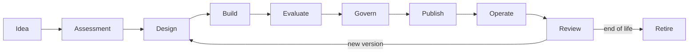

# 5. Life cycle of agents

## Objective

The life cycle ensures that each agent version has identity, owner, evidence, controls and an operating strategy.



## Canonical States

| State of origin | Significado |
|---|---|
| IDEA | the possibility of an implementation commitment not yet reached |
| ASSESSED | classified case with owner and risk route |
| DRAFT | version in development |
| SUBMITTED | evidence frozen and sent for decision |
| APPROVED | authorised version under explicit conditions |
| PUBLISHED | version available in the defined environment |
| SUSPENDED | temporarily blocked invocation |
| RETIRED | Closed and unused version |

Current contracts use the technical statements as defined in [`openapi.yaml`](../contracts/openapi.yaml). Editorial statements prior to `DRAFT` may remain in the catalogue or portfolio process.

## Etapa 1 — Idea

### Perguntas

- What problem will be solved?
- Who's the user?
- What decision or task will be improved?
- What metric will prove value?
- Why is AI needed?

### Minimum output

- problem statement;
- sponsor or business owner;
- the value hypothesis;
- the alternative not based on AI is considered.

### Gate

Don't move forward when the problem is just using AI or when there's no owner for the result.

## Etapa 2 — Assessment

### Atividades

- classificar risco;
- classify data;
- identify tools and side effects;
- define the need for RAG and memory;
- estimate volume, latency and cost;
- verify existing solutions;
- define the route of delivery.

### Artefatos

- the registration in the AI Catalogue;
- risk assessment inicial;
- data classification;
- technical and business owner;
- Golden path or exception.

### Gate

Cases without purpose, applicable legal basis, data owner or critical action strategy do not follow design.

## Etapa 3 — Design

### Compulsory decisions

- deterministic agent or workflow;
- synchronous or asynchronous;
- routing model and policy;
- boundaries between runtime, recording systems and tools;
- knowledge and memory authorisation;
- SLOand fallback;
- telemetry and events;
- the evaluation strategy;
- rollback and deactivation.

### Artefatos

- context diagram and containers;
- threat model;
- contracts for API, events and tools;
- NFRs;
- ADRs for relevant decisions;
- the evaluation plan.

### Gate

The architecture must demonstrate how policies are applied during implementation.

## Etapa 4 — Build

### Standard controls

- the identity of the workload;
- minimum scopes;
- non-code secrets;
- correlation ID;
- logs without unnecessary sensitive content;
- timeouts and limits;
- incompetence to command;
- versioned contracts;
- dependency and image scanning;
- unitary, contract and policy tests.

### Automatically generated evidence

- commit and build immutable;
- SBOM or inventory of dependencies;
- the result of the scanners;
- the prompt version and configuration;
- version of templates and embeddings;
- data sets used in the tests.

## Etapa 5 — Evaluate

The assessment shall separate different dimensions to avoid an aggregate note that conceals defects.

| Size | Examples of metrics |
|---|---|
| Task quality | exact match, rubric score, completion rate |
| Retrieval | recall@k, precision@k, MRR, nDCG |
| Groundedness | support rate, citation correctness, faithfulness |
| Safety | prompt injection resistance, leakage, harmful completion |
| Tool use | selection accuracy, argument validity, side-effect safety |
| Performance | p50, p95, timeout rate, queue time |
| Cost | Cost per invocation, completed task and user |
| Reliability | success rate, fallback rate, dependency errors |

### Baseline

Each version shall be compared to an appropriate baseline:

- the previous version;
- the current human process;
- deterministic workflow;
- simpler or cheaper model;
- approved minimum limit.

### Gate

Publication is blocked when mandatory thresholds are not met or when regression has no formal exception.

See the [Evaluation Service](../services/evaluation-service.md)and the [AI Risk Framework](../governance/ai-risk-framework.md).

## Etapa 6 — Govern

The submission must freeze a version and its evidence.

- the identity of the decision-maker;
- the version analysed;
- risco;
- the evidence considered;
- the decision;
- conditions;
- the period of validity;
- the reassessment triggers.

### Separation of functions

The same identity must not submit and approve the same version when the risk requires independent review.

### Conditional approval

Examples of conditions:

- the initial limit of users;
- canal interno apenas;
- HITL for a given action;
- the daily budget;
- a model restricted to a region;
- review after 30 days;
- feature flag required.

## Etapa 7 — Publish

The publication shall take place by pipeline and verify:

- a valid decision corresponding to the version;
- signed or identifiable artifacts;
- the policies available;
- ready migration and dependencies;
- dashboards and alerts;
- runbook and support contacts;
- rollback testado;
- setting quotas and budgets.

### Release strategies

- dark launch;
- allowlist;
- canary by users or tenants;
- shadow evaluation;
- feature flags;
- blue/green;
- ramp-up progressivo.

## Etapa 8 — Operate

Operar significa observar simultaneamente:

- technical health;
- the quality of the responses;
- retrieval and groundedness;
- use of tools;
- violations of policy;
- custo;
- behaviour by model and version;
- user feedback.

The correlation between `agentId`, `agentVersion`, `modelId`, `sessionId`, `tenantId` and `correlationId` is essential for diagnosis.

## Etapa 9 — Review

Revising triggers:

- change of model;
- change of main prompt;
- new data source or tool;
- change of purpose;
- incidente relevante;
- quality degradation;
- increased risk or volume;
- the expiry of the approval;
- regulatory or contractual change.

The revision may result in a new version, restriction, suspension or withdrawal.

## Etapa 10 — Retire

The withdrawal shall take into account:

- blocking new calls;
- the migration of consumers;
- revocation of credentials and scopes;
- removal or anonymisation of memory;
- the retention of audit evidence;
- removal of exclusive knowledge sources;
- closure of budgets and alerts;
- communication to users and owners.

## Evidence bundle

Each published version shall contain a reproducible evidence package:

```text
agent-card.json
risk-assessment.yaml
architecture/
contracts/
model-policy.yaml
prompt-version.json
evaluation-report.json
security-tests.json
sbom.json
approval-decision.json
release-manifest.json
runbook.md
```

Not all files need to use these formats, but the information needs to exist and be traceable.

## Quality gates at risk

| Gate | LOW | MEDIUM | HIGH | CRITICAL |
|---|---:|---:|---:|---:|
| owner and catalogue | compulsory | compulsory | compulsory | compulsory |
| Contract tests | compulsory | compulsory | compulsory | compulsory |
| quality assessment | amostra | dataset | dataset + baseline | Data set + independent review |
| threat model | simplificado | compulsory | detalhado | Detailed + formal review |
| HITL | opcional | by share | Generally compulsory | compulsory for permitted actions |
| independent approval | opcional | policy | compulsory | Multiple functions |
| canary | recommended | compulsory | compulsory | Restricted environment and population |
| periodic review | anual | semestral | trimestral | continuous or per event |

## Next chapter

The [documentary agent case study](05-case-study-document-agent.md) applies this problem cycle to the operation.
