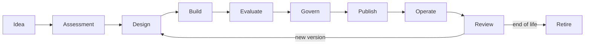

# 5. Life cycle of agents

## Objet

The life cycle ensures that each agent version has a corresponding identity, owner, evidence, checks and an operation strategy. The government unit shall be the **publicated version**, not just the name of the agent.



## Canopies

| Estado | Significado |
|---|---|
| IDEA | a possibility of still without implementing compromise |
| ASSESSED | a classified case, with owner and risk risk |
| DRAFT | development version |
| SUBMITTED | frosted evidence and sent to the decision |
| APPROVED | authorised version under explicit conditions |
| PUBLISHED | version available in the defined environment |
| SUSPENDED | temporarily blocked voice |
| RETIRED | slack and out of use |

The current contracts use the technical states defined in [`openapi.yaml`](../contracts/openapi.yaml). Previous editories of `DRAFT` may remain in the catalog or in the port process.

## Etapa 1 — Idea

### Perguntas

- - What problem will be solved?
- Who's the user?
- - What decision or task will be improved?
- - What method will it prove worth?
- Why is IA necessary?

### Minimum slack

- problem statement;
- sponsor or business owner;
- value hypothesis;
- alternative not based on the IA considered.

### Gate

Don't move when the problem is just “use AI” or when there's no owner for the result.

## Etapa 2 — Assessment

### Atividades

- classificar risco;
- quoting data;
- identificar tools e efeitos colaterais;
- define the need for RAG and memory;
- to estimate volume, length and cost;
- to check existing solutions;
- define delivery route.

### Artefatos

- registre in the AI Catalog;
- risk assessment inicial;
- data classification;
- technical and business owner;
- indication of golden path or exception.

### Gate

Where no finality, legal basis applicable, data owner or strategy for critical actions are not set out.

## Etapa 3 — Design

### Obligations

- agent or determined workflow;
- syncron or syncron;
- model and roteaing policy;
- border between runtime, register systems and tools;
- authorisation of knowledge and memory;
- SLO e fallback;
- telemetria e eventos;
- assessment strategy;
- rollback and deactivation.

### Artefatos

- diagram of context and containers;
- threat model;
- API, events and tools;
- NFRs;
- ADRs for relevant decisions;
- Assessment plan.

### Gate

The arquivalence must demonstrate how policies are applied during execution. Only documents are not sufficient for material risks.

## Etapa 4 — Build

### Controls by pattern

- a job identity;
- minimum scopes;
- secrets out of code;
- correlation ID;
- logs without a sensible unneeded account;
- timeouts e limites;
- idempotence for commands;
- contratos versionados;
- dependency e image scanning;
- Unitary tests, contracts and policies.

### - Automaticly regulated evidence

- commit and build imutable;
- SMMO or a dependency inventory;
- result of scanners;
- prompt and configurable version;
- version of models and embeddings;
- datasets used in tests.

## Etapa 5 — Evaluate

The assessment must separate different dimensions to avoid a slack note that hides.

| Dimensive | Methods |
|---|---|
| Task quality | exact match, rubric score, completion rate |
| Retrieval | recall@k, precision@k, MRR, nDCG |
| Groundedness | support rate, citation correctness, faithfulness |
| Safety | prompt injection resistance, leakage, harmful completion |
| Tool use | selection accuracy, argument validity, side-effect safety |
| Performance | p50, p95, timeout rate, queue time |
| Cost | cost for invocation, final task and user |
| Reliability | success rate, fallback rate, dependency errors |

### Baseline

The whole version must be compared to a suitable baseline:

- previous version;
- human procedure currently;
- deterministic workflow;
- more simple or a bitch;
- Minimum limit approved.

### Gate

The publication is blocked when mandatory thresholds are not reached or when the return cannot be formal.

Consult [Evaluation Service](../services/evaluation-service.md) and the [AI Risk Framework](../governance/ai-risk-framework.md).

## Etapa 6 — Govern

The submission must contain a version and its evidence.

- the identity of the decision-maker;
- analysated version;
- risco;
- evidence taken;
- decision;
- conditions;
- time of validity;
- reavailing cats.

### Segregation of functions

The same identity must not be submerged and approved as the same version when the risk requires independent revision.

### Condiţional amplification

Conditions examples:

- initial use limit;
- canal interno apenas;
- HITL for a given action;
- daily budget;
- restricted model to a region;
- revision after 30 days;
- It features a mandatory flag.

## Etapa 7 — Publish

The publication must take place on a pipeline and check:

- a valid decision and corresponding to the version;
- engraved or identified artefacts;
- available policies;
- migrations and ready dependency;
- dashboards e alertas;
- runbook and support accounts;
- rollback testado;
- quotas and budgets.

### Release strategies

- dark launch;
- allowlist;
- canary by users or tenants;
- shadow evaluation;
- feature flags;
- blue/green;
- ramp-up progressivo.

## Etapa 8 — Operate

Operar significa observar simultaneamente:

- technical health;
- quality of replies;
- retrieval e groundedness;
- use of tools;
- violences of policy;
- custo;
- behaviour by model and version;
- feedback from the user.

The correction between `agentId`, `agentVersion`, `modelId`, `sessionId`, `tenantId` and `correlationId` is essential for diagnostics.

## Etapa 9 — Review

Review tips:

- model change;
- a major prompt change;
- new source of data or tool;
- a final amendment;
- incidente relevante;
- degraded quality;
- risk increase or volume increase;
- expiry of approval;
- regulatory or contractual change.

The revision may result in a new version, restriction, suspension or withdrawal.

## Etapa 10 — Retire

The withdrawal must be considered:

- block of new voices;
- migration of consumers;
- revocation of certificates and scopes;
- elimination or anonimation of memory;
- retendance of auditory evidence;
- remuneration of exclusive sources of knowledge;
- budget and alerts;
- communication to users and owners.

## Evidence bundle

Each published version shall have a copy of evidence:

```text
agent-card.json
risk-assessment.yaml
architecture/
contracts/
model-policy.yaml
prompt-version.json
evaluation-report.json
security-tests.json
sbom.json
approval-decision.json
release-manifest.json
runbook.md
```

Not all files need to use these formats, but the information needs to exist and be rastered.

## Quality gates per risk

| Gate | LOW | MEDIUM | HIGH | CRITICAL |
|---|---:|---:|---:|---:|
| owner and catalog | obligation | obligation | obligation | obligation |
| Contract tests | obligation | obligation | obligation | obligation |
| quality assessment | amostra | dataset | dataset + baseline | dataset + independent review |
| threat model | simplificado | obligation | detalhado | detail + formal review |
| HITL | opcional | by action | generally compulsory | obligation for permitted actions |
| independent approval | opcional | in political conformity | obligence | marrows |
| canary | recomendado | obligation | obligation | environment and restricted population |
| periodical review | anual | semestral | trimestral | content or event |

## Next chapter

The [documentary agent case study](05-case-study-document-agent.md) applies the problem cycle to operation.
