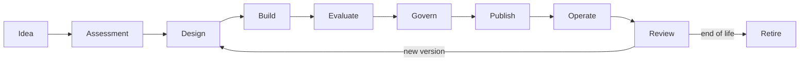

# 5. Life cycle of staff

## Objective

The life cycle ensures that each version of the agent has identity, owner, evidence, controls and an operational strategy.The governed unit should be the **published version**, not only the name of the staff member.



## Canonical States

| State | Meaning |
|---|---|
| IDEA | hypothesis without implementation commitment |
| ASSESSED | case classified, with owner and risk route |
| DRAFT | Development version |
| SUBMITTED | frozen evidence and sent for decision |
| APPROVED | authorised version under explicit conditions |
| PUBLISHED | Version available in the defined environment |
| SUSPENDED | temporarily blocked invocation |
| RETIRED | Version closed and out of use |

Current contracts use the technical states defined in [`openapi.yaml`](../contracts/openapi.yaml). Editorial states prior to `DRAFT` may remain in the catalogue or portfolio process.

## Stage 1 — Idea

### Questions

- what problem will be solved?
- who is the user?
- which decision or task will be improved?
- which metric will demonstrate value?
- Why IA is needed?

### Minimum output

- problem statement;
- business sponsor or owner;
- value hypothesis;
- alternative not based on AI.

### Gate

Do not advance when the problem is just “to use IA” or when there is no owner for the result.

## Stage 2 — Assessment

### Activities

- rating risk;
- classifying data;
- identificar tools e efeitos colaterais;
- defining the need for AGR and memory;
- estimate volume, latency and cost;
- check for existing solutions;
- definir rota de delivery.

### Articles

- registro no AI Catalog;
- risk assessment inicial;
- data classification;
- technical and business owner;
- golden path or exception.

### Gate

Non-purpose cases, applicable legal basis, data owner or strategy for critical actions do not follow for design.

## Stage 3 — Design

### Compulsory decisions

- deterministic agent or workflow;
- synchronous or asynchronous;
- model and routing policy;
- borders between runtime, registration systems and tools;
- authorisation of knowledge and memory;
- SLO e fallback;
- telemetry and events;
- assessment strategy;
- rollback and deactivation.

### Articles

- context diagram and containers;
- threat model;
- PPA contracts, events and tools;
- NFRs;
- ADRs for relevant decisions;
- evaluation plan.

### Gate

The architecture must demonstrate how policies are applied during the execution.Document-only controls are not sufficient for material risks.

## Stage 4 — Build

### Standard controls

- workload identity;
- minimum scopes;
- secrets outside the code;
- correlation ID;
- logs without unnecessary sensitive content;
- timeouts e limites;
- Impotence for commands;
- contratos versionados;
- dependency e image scanning;
- unit tests, contract tests and policies.

### Automatically generated evidence

- commit and build immutable;
- SBOM or inventory of premises;
- scanner results;
- prompt version and configuration;
- version of models and embeddings;
- datasets usados nos testes.

## Stage 5 — Evaluation

The assessment should separate different dimensions to avoid an aggregate note that misses failures.

| Dimension | Examples of metrics |
|---|---|
| Task quality | exact match, rubric score, completion rate |
| Retrieval | recall@k, precision@k, MRR, nDCG |
| Groundedness | support rate, citation correctness, faithfulness |
| Safety | prompt injection resistance, leakage, harmful completion |
| Tool use | selection accuracy, argument validity, side-effect safety |
| Performance | p50, p95, timeout rate, queue time |
| Cost | cost per invocation, task completed and user |
| Reliability | success rate, fallback rate, dependency errors |

### Baseline

Each version must be compared to an appropriate baseline:

- previous version
- current human process;
- deterministic workflow;
- simpler or cheaper model;
- approved minimum limit.

### Gate

Publication is blocked when mandatory thresholds are not reached or when the regression has no formal exception.

Consulte o [Evaluation Service](../services/evaluation-service.md) e o [AI Risk Framework](../governance/ai-risk-framework.md).

## Stage 6 — Government

Submission must freeze a version and its evidence. The decision must record:

- decision-maker identity;
- version analyzed;
- risk;
- evidence considered;
- decision;
- conditions;
- prazo de validade;
- triggers of reassessment.

### Segregation of functions

The same identity should not submit and approve the same version when the risk requires independent review. This rule has already been demonstrated in the vertical slice.

### Conditional approval

Examples of conditions:

- initial user limit;
- canal interno apenas;
- HITL for a given action;
- Daily budget;
- model restricted to one region;
- 30 days review;
- feature flag.

## Stage 7 — Publish

Publication shall take place by pipeline and shall check:

- valid decision corresponding to the version;
- signed or identifiable artifacts;
- available policies;
- migration and ready-to-use dependencies;
- dashboards e alertas;
- runbook e contatos de suporte;
- rollback testado;
- quota and budget configuration.

### Release strategies

- dark launch;
- allowlist;
- canary by users or tenants;
- shadow evaluation;
- feature flags;
- blue/green;
- ramp-up progressivo.

## Stage 8 — Operate

Operar significa observar simultaneamente:

- technical health;
- quality of responses;
- retrieval e groundedness;
- uso de tools;
- policy violations;
- cost;
- behavior by model and version;
- User feedback.

The correlation between `agentId`, `agentVersion`, `modelId`, `sessionId`, `tenantId` e `correlationId` it is essential for diagnosis.

## Stage 9 — Review

Review triggers:

- change of model;
- change of main prompt;
- new data source or tool;
- change of purpose;
- incidente relevante;
- quality degradation;
- increased risk or volume;
- expiry of approval;
- regulatory or contractual change.

The review may result in a new version, restriction, suspension or withdrawal.

## Stage 10 — Remove

Withdrawal must consider:

- blocking of new invocations;
- migration of consumers;
- withdrawal of credentials and scopes;
- elimination or anonymity of memory;
- retention of audit evidence;
- removal of exclusive knowledge sources;
- encerramento de budgets e alertas;
- communication to users and owners.

## Evidence bundle

Each published version shall have a reproducible evidence package:

```text
agent-card.json
risk-assessment.yaml
architecture/
contracts/
model-policy.yaml
prompt-version.json
evaluation-report.json
security-tests.json
sbom.json
approval-decision.json
release-manifest.json
runbook.md
```

Not all files need to use these formats, but the information needs to exist and be traceable.

## Quality gates for risk

| Gate | LOW | MEDIUM | HIGH | CRITICAL |
|---|---:|---:|---:|---:|
| owner and catalogue | Compulsory | Compulsory | Compulsory | Compulsory |
| testes de contrato | Compulsory | Compulsory | Compulsory | Compulsory |
| quality assessment | amostra | dataset | dataset + baseline | dateset + independent review |
| threat model | simplificado | Compulsory | detalhado | detailed + formal review |
| HITL | optional | by action | Generally mandatory | obligatory for permitted actions |
| Independent approval | optional | as policy | Compulsory | multiple functions |
| canary | recommended | Compulsory | Compulsory | environment and population restricted |
| periodic review | anual | semestral | trimestral | events |

## Next chapter

O [case study of document agent](05-case-study-document-agent.md) it applies this problem cycle to the operation.
