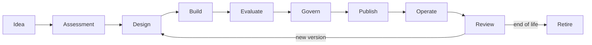

# 4. Ciclo de vida de agentes

## Objetivo

O ciclo de vida garante que cada versão de agente possua identidade, owner, evidências, controles e uma estratégia de operação. A unidade governada deve ser a **versão publicada**, não apenas o nome do agente.



## Estados canônicos

| Estado | Significado |
|---|---|
| IDEA | hipótese ainda sem compromisso de implementação |
| ASSESSED | caso classificado, com owner e rota de risco |
| DRAFT | versão em desenvolvimento |
| SUBMITTED | evidências congeladas e enviadas para decisão |
| APPROVED | versão autorizada sob condições explícitas |
| PUBLISHED | versão disponível no ambiente definido |
| SUSPENDED | invocação temporariamente bloqueada |
| RETIRED | versão encerrada e fora de uso |

Os contratos atuais usam os estados técnicos definidos em [`openapi.yaml`](../contracts/openapi.yaml). Estados editoriais anteriores a `DRAFT` podem permanecer no catálogo ou no processo de portfólio.

## Etapa 1 — Idea

### Perguntas

- qual problema será resolvido?
- quem é o usuário?
- qual decisão ou tarefa será melhorada?
- qual métrica demonstrará valor?
- por que IA é necessária?

### Saída mínima

- problem statement;
- sponsor ou owner de negócio;
- hipótese de valor;
- alternativa não baseada em IA considerada.

### Gate

Não avançar quando o problema é apenas “usar IA” ou quando não existe owner para o resultado.

## Etapa 2 — Assessment

### Atividades

- classificar risco;
- classificar dados;
- identificar tools e efeitos colaterais;
- definir necessidade de RAG e memória;
- estimar volume, latência e custo;
- verificar soluções existentes;
- definir rota de delivery.

### Artefatos

- registro no AI Catalog;
- risk assessment inicial;
- data classification;
- owner técnico e de negócio;
- indicação de golden path ou exceção.

### Gate

Casos sem finalidade, base legal aplicável, owner de dados ou estratégia para ações críticas não seguem para design.

## Etapa 3 — Design

### Decisões obrigatórias

- agente ou workflow determinístico;
- síncrono ou assíncrono;
- modelo e política de roteamento;
- fronteiras entre runtime, sistemas de registro e tools;
- autorização de conhecimento e memória;
- SLO e fallback;
- telemetria e eventos;
- estratégia de avaliação;
- rollback e desativação.

### Artefatos

- diagrama de contexto e containers;
- threat model;
- contratos de API, eventos e tools;
- NFRs;
- ADRs para decisões relevantes;
- plano de avaliação.

### Gate

A arquitetura deve demonstrar como políticas são aplicadas durante a execução. Controles apenas documentais não são suficientes para riscos materiais.

## Etapa 4 — Build

### Controles por padrão

- identidade de workload;
- scopes mínimos;
- secrets fora do código;
- correlation ID;
- logs sem conteúdo sensível desnecessário;
- timeouts e limites;
- idempotência para comandos;
- contratos versionados;
- dependency e image scanning;
- testes unitários, de contrato e de políticas.

### Evidências geradas automaticamente

- commit e build imutáveis;
- SBOM ou inventário de dependências;
- resultado de scanners;
- versão de prompt e configuração;
- versão de modelos e embeddings;
- datasets usados nos testes.

## Etapa 5 — Evaluate

A avaliação deve separar dimensões diferentes para evitar uma nota agregada que esconda falhas.

| Dimensão | Exemplos de métricas |
|---|---|
| Task quality | exact match, rubric score, completion rate |
| Retrieval | recall@k, precision@k, MRR, nDCG |
| Groundedness | support rate, citation correctness, faithfulness |
| Safety | prompt injection resistance, leakage, harmful completion |
| Tool use | selection accuracy, argument validity, side-effect safety |
| Performance | p50, p95, timeout rate, queue time |
| Cost | custo por invocação, tarefa concluída e usuário |
| Reliability | success rate, fallback rate, dependency errors |

### Baseline

Toda versão deve ser comparada a uma baseline apropriada:

- versão anterior;
- processo humano atual;
- workflow determinístico;
- modelo mais simples ou barato;
- limite mínimo aprovado.

### Gate

A publicação é bloqueada quando thresholds obrigatórios não são atingidos ou quando a regressão não possui exceção formal.

Consulte o [Evaluation Service](../services/evaluation-service.md) e o [AI Risk Framework](../governance/ai-risk-framework.md).

## Etapa 6 — Govern

A submissão deve congelar uma versão e suas evidências. A decisão precisa registrar:

- identidade do decisor;
- versão analisada;
- risco;
- evidências consideradas;
- decisão;
- condições;
- prazo de validade;
- gatilhos de reavaliação.

### Segregação de funções

A mesma identidade não deve submeter e aprovar a mesma versão quando o risco exigir revisão independente. Essa regra já é demonstrada na vertical slice.

### Aprovação condicional

Exemplos de condições:

- limite inicial de usuários;
- canal interno apenas;
- HITL para determinada ação;
- budget diário;
- modelo restrito a uma região;
- revisão após 30 dias;
- feature flag obrigatória.

## Etapa 7 — Publish

A publicação deve ocorrer por pipeline e verificar:

- decisão válida e correspondente à versão;
- artefatos assinados ou identificáveis;
- políticas disponíveis;
- migrações e dependências prontas;
- dashboards e alertas;
- runbook e contatos de suporte;
- rollback testado;
- configuração de quotas e budgets.

### Estratégias de release

- dark launch;
- allowlist;
- canary por usuários ou tenants;
- shadow evaluation;
- feature flags;
- blue/green;
- ramp-up progressivo.

## Etapa 8 — Operate

Operar significa observar simultaneamente:

- saúde técnica;
- qualidade das respostas;
- retrieval e groundedness;
- uso de tools;
- violações de política;
- custo;
- comportamento por modelo e versão;
- feedback do usuário.

A correlação entre `agentId`, `agentVersion`, `modelId`, `sessionId`, `tenantId` e `correlationId` é essencial para diagnóstico.

## Etapa 9 — Review

Gatilhos de revisão:

- mudança de modelo;
- mudança de prompt principal;
- nova fonte de dados ou tool;
- alteração de finalidade;
- incidente relevante;
- degradação de qualidade;
- aumento de risco ou volume;
- expiração da aprovação;
- mudança regulatória ou contratual.

A revisão pode resultar em nova versão, restrição, suspensão ou retirada.

## Etapa 10 — Retire

A retirada deve considerar:

- bloqueio de novas invocações;
- migração de consumidores;
- revogação de credenciais e scopes;
- eliminação ou anonimização de memória;
- retenção das evidências de auditoria;
- remoção de knowledge sources exclusivas;
- encerramento de budgets e alertas;
- comunicação a usuários e owners.

## Evidence bundle

Cada versão publicada deve possuir um pacote de evidências reproduzível:

```text
agent-card.json
risk-assessment.yaml
architecture/
contracts/
model-policy.yaml
prompt-version.json
evaluation-report.json
security-tests.json
sbom.json
approval-decision.json
release-manifest.json
runbook.md
```

Nem todos os arquivos precisam usar esses formatos, mas as informações precisam existir e ser rastreáveis.

## Quality gates por risco

| Gate | LOW | MEDIUM | HIGH | CRITICAL |
|---|---:|---:|---:|---:|
| owner e catálogo | obrigatório | obrigatório | obrigatório | obrigatório |
| testes de contrato | obrigatório | obrigatório | obrigatório | obrigatório |
| avaliação de qualidade | amostra | dataset | dataset + baseline | dataset + revisão independente |
| threat model | simplificado | obrigatório | detalhado | detalhado + revisão formal |
| HITL | opcional | por ação | geralmente obrigatório | obrigatório para ações permitidas |
| aprovação independente | opcional | conforme política | obrigatória | múltiplas funções |
| canary | recomendado | obrigatório | obrigatório | ambiente e população restritos |
| revisão periódica | anual | semestral | trimestral | contínua ou por evento |

## Próximo capítulo

O [estudo de caso de agente documental](05-case-study-document-agent.md) aplica esse ciclo do problema à operação.
