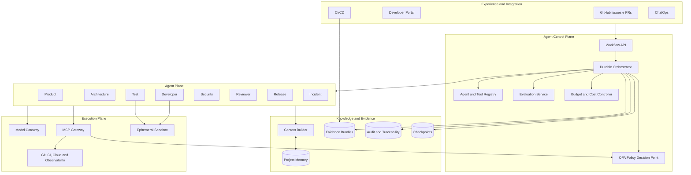
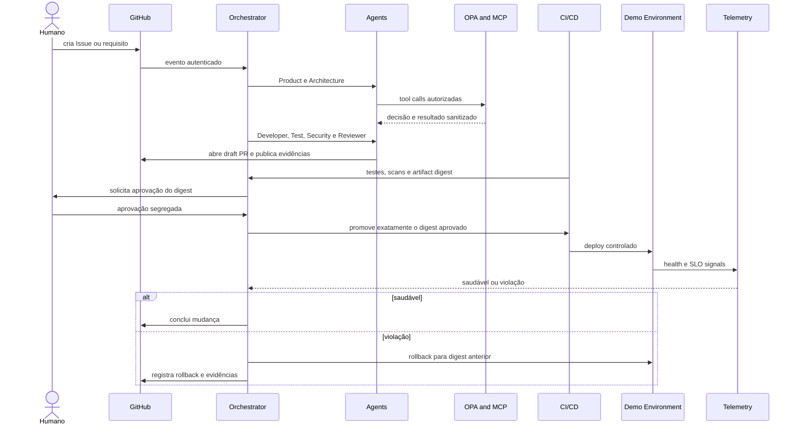

# Case aplicado — Agentic SDLC governado

[📘 Abrir documentação publicada da Agentic SDLC Reference Architecture](https://leandrosflora.github.io/agentic-sdlc-reference-architecture/){ .md-button .md-button--primary target="_blank" }

Este caso demonstra como as capacidades da Enterprise AI Platform Reference Architecture podem ser aplicadas à engenharia de software orientada por agentes, cobrindo o fluxo entre demanda, arquitetura, implementação, verificação, aprovação, release, observação e recuperação.

O objetivo não é construir apenas um agente que escreve código. A proposta materializa um **sistema sociotécnico governado**, no qual agentes especializados produzem propostas e evidências, enquanto workflow, policies, quality gates, aprovação humana e serviços de execução mantêm a autoridade sobre efeitos reais.

!!! info "Estado atual"
    A solução possui arquitetura, contratos, golden paths e um runtime compartilhado funcional. O ambiente demonstra o ciclo ponta a ponta com adapters locais, integração controlada com GitHub e suporte a Model Gateway e MCP reais. Os controles P7 representam uma base implantável e adapters substituíveis, mas não comprovam operação produtiva corporativa.

## Problema

Ferramentas de geração de código aceleram apenas uma parte do Software Development Lifecycle. Os principais atrasos e riscos continuam distribuídos por:

- requisitos incompletos;
- refinamentos e handoffs;
- decisões arquiteturais sem rastreabilidade;
- implementação fora do escopo aprovado;
- cobertura e testes insuficientes;
- vulnerabilidades e dependências inseguras;
- revisão sem contexto consolidado;
- aprovações desacopladas do artefato final;
- releases sem evidência de observação;
- rollback manual e tardio;
- dificuldade para relacionar requisito, código, teste, aprovação e deploy.

A arquitetura transforma esse fluxo em uma jornada durável, governada e auditável.

## Jornada aplicada

```text
Epic, requisito ou GitHub Issue
        ↓
Product Agent
        ↓
Architecture Agent
        ↓
Developer Agent
        ↓
Test Agent
        ↓
Security Agent
        ↓
Reviewer Agent
        ↓
Aprovação humana vinculada ao digest
        ↓
Release Agent
        ↓
Deploy em ambiente controlado
        ↓
Observação por SLO e health checks
        ↓
Concluído ou rollback
        ↓
Incident Agent e feedback governado
```

Cada etapa produz resultados estruturados, eventos, checkpoints e um **evidence bundle**. O orquestrador somente avança quando contratos, policies e gates da etapa são satisfeitos.

## Agentes especializados

| Agente | Responsabilidade principal | Efeito permitido | Limite de autoridade |
|---|---|---|---|
| Product | estruturar objetivo, escopo e critérios de aceite | backlog e requisitos | não altera código nem aprova release |
| Architecture | produzir abordagem, C4, ADRs, contratos e impacto | artefatos arquiteturais | não implementa nem publica |
| Developer | propor e implementar mudança delimitada | branch e draft PR | não faz merge nem acessa produção |
| Test | criar e executar verificações | testes e evidências | não reduz gates |
| Security | executar scans e threat analysis | findings e evidências | não altera silenciosamente a implementação |
| Reviewer | revisar qualidade, escopo e evidências | parecer independente | não implementa nem publica |
| Release | promover digest autorizado e operar rollback | ambiente controlado | não ignora aprovação ou policy |
| Incident | correlacionar mudança e telemetria | timeline e proposta de remediação | não executa ação destrutiva sem autorização |

Os agentes representam papéis lógicos executados por um runtime compartilhado. Eles não precisam ser oito serviços persistentes.

## Onde a IA participa

A IA entra nas atividades que exigem interpretação, síntese, geração e avaliação contextual:

### Product Agent

- interpreta requisitos e Issues;
- identifica lacunas;
- propõe critérios de aceite estruturados;
- registra riscos e dúvidas para refinamento.

### Architecture Agent

- analisa contexto e restrições;
- propõe decisões e alternativas;
- produz contratos e análise de impacto;
- relaciona a mudança com ADRs e padrões existentes.

### Developer Agent

- gera uma proposta estruturada de alteração;
- seleciona arquivos permitidos;
- produz código e testes dentro do escopo;
- abre somente draft PR.

### Test e Security Agents

- propõem cenários e verificações;
- analisam falhas, cobertura e regressões;
- sintetizam findings de segurança;
- não podem reduzir thresholds ou remover controles.

### Reviewer e Incident Agents

- consolidam evidências de múltiplas etapas;
- verificam aderência ao requisito e arquitetura;
- correlacionam deploys, logs, traces e incidentes;
- recomendam rework, recuperação ou investigação adicional.

A resposta de um modelo **não possui autoridade direta**. Todo efeito colateral passa pelo MCP Gateway, por policy enforcement e pelos contratos do workflow.

## O que permanece determinístico

| Responsabilidade | Por que não deve depender de decisão probabilística |
|---|---|
| máquina de estados | progressão, timeout, retry e compensação precisam ser reproduzíveis |
| policy enforcement | autorização deve ser explícita e fail-closed |
| segregação de funções | autor, aprovador e executor precisam ser verificáveis |
| aprovação humana | deve referenciar identidade, decisão e digest exato |
| execução de tools | schemas, grants, paths e ambientes devem ser controlados |
| CI quality gates | testes, scans e thresholds precisam produzir resultado objetivo |
| release | somente o digest aprovado pode ser promovido |
| idempotência | retries não podem duplicar efeitos |
| observação e rollback | decisões devem usar health checks e SLOs versionados |
| evidence store | hashes, cadeia de integridade e retenção não dependem do modelo |

## Mapeamento para a Enterprise AI Platform

| Capacidade da plataforma | Materialização no Agentic SDLC | Estado atual |
|---|---|---|
| Agent Gateway | GitHub Issues, PRs, Developer Portal, CI/CD e ChatOps como canais | arquitetura definida; integrações GitHub demonstradas |
| Agent Runtime | runtime compartilhado com oito definições declarativas | implementado e testado |
| Agent Registry | definições versionadas com prompt, tools, limites e schemas | implementado no runtime e contratos |
| Model Gateway | provider fake determinístico e gateway HTTP OpenAI-compatible | implementado; seleção corporativa e governança central ainda evolutivas |
| MCP Gateway | MCP fake para testes e transporte stdio JSON-RPC para servidores reais | implementado; HTTP/SSE permanece evolução |
| Policy Enforcement | grants por papel e OPA no tool loop, remoto ou CLI | implementado; produção requer OPA HA e bundles assinados |
| Knowledge Service | Context Builder, documentos, ADRs, contratos e memória de projeto | baseline implementada; knowledge lifecycle corporativo pendente |
| Memory Service | checkpoints, contexto aprovado e histórico por mudança | baseline implementada |
| Evaluation Service | testes, scans, schemas, groundedness e quality gates | baseline implementada; evals contínuos com modelos reais ainda evolutivos |
| Governance Service | workflow durável, segregação, aprovação por digest e policy-as-code | demonstrado localmente |
| Evidence and Audit | evidence bundles write-once, SHA-256 e manifest com hash chain | implementado localmente; storage WORM corporativo pendente |
| Workload Identity | suporte a GitHub OIDC nos adapters P7 | implementado como adapter; trust policies reais pendentes |
| Observability | eventos correlacionados e exportador OTLP HTTP | adapter implementado; backend corporativo e SLOs reais pendentes |
| FinOps | limites por agente e Budget Ledger | implementado como controle; backend compartilhado pendente |
| Supply Chain | Syft, Cosign, digest e manifesto Kubernetes | adapters implementados; registry e admission verification pendentes |
| Sandbox | Docker restrito, sem rede, read-only e limites | demonstrado; isolamento de produção pendente |
| Event Backbone | eventos por `change_id`, `project_id` e `agent_run_id` | baseline baseada em arquivos; mensageria gerenciada é evolução |

## Arquitetura implementada



A arquitetura separa cinco planos:

1. **Experience and Integration:** pontos de entrada e sistemas de registro;
2. **Agent Control Plane:** workflow, catálogo, policies, avaliações e budgets;
3. **Agent Plane:** papéis especializados com identidades e permissões próprias;
4. **Knowledge and Evidence:** contexto, memória, checkpoints e rastreabilidade;
5. **Execution Plane:** modelos, MCP, sandboxes e ferramentas com efeito real.

## Fluxo ponta a ponta



## Garantias demonstradas

| Aspecto | Garantia atual |
|---|---|
| Workflow | ordem explícita, estados persistidos e checkpoints por etapa |
| Retomada | resposta de modelo concluída pode ser reutilizada sem nova cobrança ou efeito |
| Tool use | grants por agente, schemas e policy antes da execução |
| Contexto | classificação, proveniência, redaction, limites e hashes |
| Evidência | arquivos write-once, SHA-256 e manifest append-only com hash chain |
| Aprovação | independente do autor e vinculada ao digest exato |
| Developer Agent | paths permitidos, arquivos sensíveis bloqueados e somente draft PR |
| Release | promoção somente após gate humano e com o digest aprovado |
| Observação | health check e decisão explícita após deployment |
| Recuperação | rollback restaura o digest estável anterior e mantém histórico |
| Budgets | reserva e bloqueio antes de ultrapassar limite configurado |
| Segurança | OPA fail-closed, sandbox restrito e supply-chain adapters |

## Runtime compartilhado

O [agentic-sdlc-runtime](https://github.com/leandrosflora/agentic-sdlc-runtime) concentra a execução dos agentes e fornece:

- registry JSON de agentes;
- Context Builder com proveniência e minimização;
- Model Gateway fake e OpenAI-compatible;
- MCP fake e MCP real via stdio;
- tool loop limitado;
- autorização OPA;
- eventos e evidence bundles;
- checkpoints e retomada;
- CLI, demos e testes;
- integração com Issues, comentários, Checks e draft PRs;
- adapters P7 para OIDC, S3, OTLP, budgets, filas, sandbox e supply chain.

## Repositórios do caso

| Repositório | Responsabilidade |
|---|---|
| [agentic-sdlc-reference-architecture](https://github.com/leandrosflora/agentic-sdlc-reference-architecture) | arquitetura, contratos, policies, documentação, golden path e governança |
| [agentic-sdlc-runtime](https://github.com/leandrosflora/agentic-sdlc-runtime) | runtime compartilhado, agentes declarativos, gateways, workflow e adapters |
| [agentic-sdlc-demo-app](https://github.com/leandrosflora/agentic-sdlc-demo-app) | aplicação alvo usada para validar branch, alteração, PR, release e rollback |
| `sdlc-<role>-agent` | adapters e scaffolds específicos dos oito papéis; definições canônicas ficam no runtime |

## Relação com o ciclo de vida de agentes

O caso aplica o lifecycle da Enterprise AI Platform aos próprios agentes de engenharia:

```text
Definir finalidade e owner
        ↓
Versionar prompt, modelo, tools e schemas
        ↓
Avaliar offline e testar policies
        ↓
Publicar no Agent Registry
        ↓
Executar com identidade, budget e contexto governado
        ↓
Coletar qualidade, custo, traces e evidências
        ↓
Promover, limitar, suspender ou retirar a versão
```

Nenhum agente pode modificar seus próprios prompts, policies, thresholds ou grants e promovê-los automaticamente.

## Segurança e threat boundaries

Os principais limites de confiança são:

- conteúdo de Issue, PR e repositório é entrada não confiável;
- output do modelo é proposta não autorizada;
- MCP Gateway é a única saída para tools corporativas;
- execução de código ocorre em sandbox efêmero;
- segredos são obtidos just-in-time e não entram no contexto;
- runners de desenvolvimento e produção não devem compartilhar trust zone;
- indisponibilidade de policy, identidade ou auditoria bloqueia escrita;
- telemetria insuficiente impede promoção, mas não deve impedir rollback manual.

## Estado atual

| Camada | Classificação | Evidência |
|---|---|---|
| Arquitetura, contratos e policies | `CONTRACT_DEFINED` | documentação, schemas, ADRs e Rego versionados |
| Golden path | `DEMONSTRATED_LOCAL` | fluxo determinístico e evidence bundle |
| Runtime compartilhado | `DEMONSTRATED_LOCAL` | testes, CLI, gateways, checkpoints e workflow E2E |
| Model Gateway real | `IMPLEMENTATION_STARTED` | integração OpenAI-compatible disponível e opcional |
| MCP real | `IMPLEMENTATION_STARTED` | transporte stdio disponível |
| Integração GitHub | `DEMONSTRATED_LOCAL` | Issue, comentário, Checks, branch e draft PR |
| Release e rollback demo | `DEMONSTRATED_LOCAL` | caminho saudável e caminho de rollback |
| Adapters P7 | `IMPLEMENTATION_STARTED` | OIDC, S3, OTLP, SQS, Syft, Cosign e Kubernetes |
| Operação corporativa | Pendente | providers, ambientes e controles reais ainda não homologados |
| Production readiness | `NOT_PRODUCTION_READY` | faltam evidências operacionais e aprovação formal |

## Limites declarados

- Model Gateway fake é o padrão das demos determinísticas;
- provider real depende de endpoint e credenciais configurados externamente;
- MCP real suporta stdio; outros transportes ainda são evolução;
- evidence store local é tamper-evident, não storage WORM corporativo;
- ambiente demo persiste estado localmente;
- adapters P7 precisam ser configurados contra providers reais;
- manifesto Kubernetes possui placeholders;
- integração, performance, segurança e recuperação ainda precisam ser validadas em ambiente representativo;
- agentes não possuem autorização para merge ou publicação produtiva autônoma.

## Próximos gates

1. executar o workflow completo contra um Model Gateway corporativo;
2. conectar servidores MCP reais por ferramenta e trust zone;
3. implantar OPA HA com bundles assinados;
4. usar workload identity e credenciais just-in-time;
5. mover evidências para storage WORM com KMS e retenção;
6. publicar artefatos por digest com SBOM e assinatura verificada;
7. executar workers em filas gerenciadas com DLQ e autoscaling;
8. validar sandbox isolado, egress allowlist e limites de recursos;
9. integrar métricas, traces, custo e SLOs à operação corporativa;
10. executar game days de rollback, indisponibilidade do PDP e recuperação de checkpoints.

## Valor demonstrado para a Enterprise AI Platform

O Agentic SDLC mostra que a Enterprise AI Platform pode governar não apenas agentes de atendimento ou backoffice, mas também agentes que participam da própria produção de software.

O caso evidencia que autonomia útil depende de:

- workflow durável;
- contexto com proveniência;
- tools governadas;
- segregação de funções;
- aprovação vinculada ao artefato;
- evidências verificáveis;
- observação e rollback;
- identidade, budget e policy por workload.

A produtividade não vem apenas de gerar código mais rápido. Ela vem de reduzir handoffs e retrabalho **sem remover os controles que tornam uma mudança segura, auditável e recuperável**.

## Referências

- [Documentação publicada](https://leandrosflora.github.io/agentic-sdlc-reference-architecture/)
- [Repositório de arquitetura](https://github.com/leandrosflora/agentic-sdlc-reference-architecture)
- [Runtime funcional](https://github.com/leandrosflora/agentic-sdlc-runtime)
- [Aplicação demo](https://github.com/leandrosflora/agentic-sdlc-demo-app)
- [Integração ponta a ponta](https://leandrosflora.github.io/agentic-sdlc-reference-architecture/end-to-end-workflow/)
- [P7 — Produção e governança](https://leandrosflora.github.io/agentic-sdlc-reference-architecture/p7-production-governance/)
