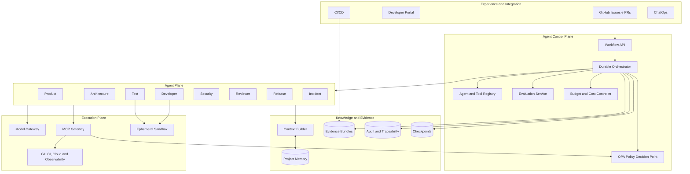
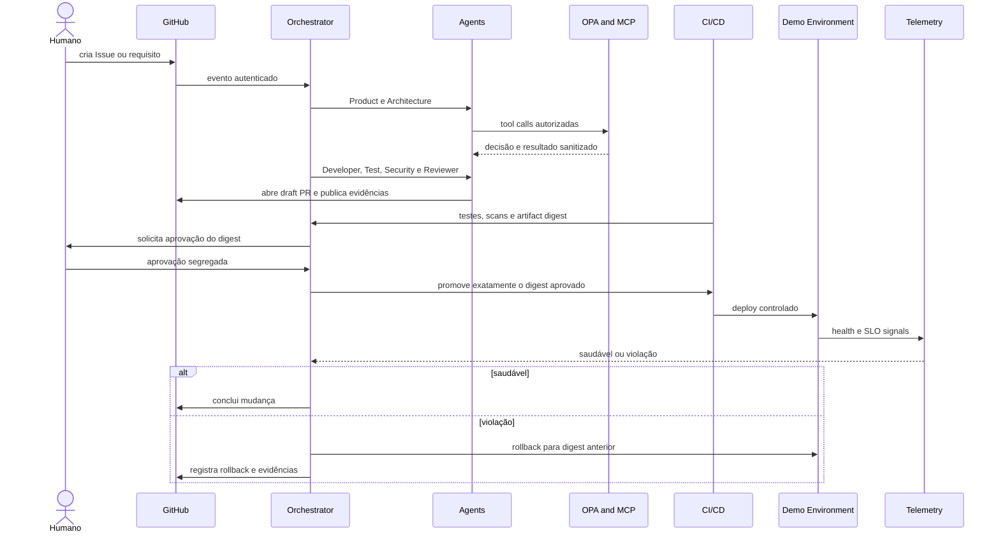

# Applied case  Agentic SDLC governed

[ Open published documentation from Agentic SDLC Reference Architecture](https://leandrosflora.github.io/agentic-sdlc-reference-architecture/){ .md-button .md-button--primary target="_blank" }

This case demonstrates how the capabilities of Enterprise AI Platform Reference Architecture can be applied to agent-driven software engineering, covering the flow between demand, architecture, implementation, verification, approval, release, observation and recovery.

The aim is not just to build an agent that writes code, the proposal materializes a governed socio-technical system in which specialized agents produce proposals and evidence, while workflow, policies, quality gates, human approval and enforcement services maintain authority over real effects.

The Commission shall adopt implementing acts in accordance with the opinion of the European Parliament and of the Council.
    The solution features architecture, contracts, golden paths, and a functional shared runtime. The environment demonstrates end-to-end cycle with local adapters, controlled integration with GitHub, and support for real Model Gateway and MCP. The P7 controls represent an implantable base and replaceable adapters, but do not prove corporate productive operation.

## Problema

Code generation tools accelerate only one part of the Software Development Lifecycle.

- incomplete requirements;
- refinements and handoffs;
- architectural decisions without traceability;
- implementation outside the approved scope;
- insufficient coverage and testing;
- vulnerabilities and insecure dependencies;
- review without a consolidated context;
- Uncoupled approvals of the final device;
- releases without evidence of observation;
- manual and late rollback;
- difficulty relating requirement, code, test, approval and deployment.

Architecture transforms this flow into a sustainable, governed and auditable journey.

## Jornada aplicada

```text
Epic, requisito ou GitHub Issue
        ↓
Product Agent
        ↓
Architecture Agent
        ↓
Developer Agent
        ↓
Test Agent
        ↓
Security Agent
        ↓
Reviewer Agent
        ↓
Aprovação humana vinculada ao digest
        ↓
Release Agent
        ↓
Deploy em ambiente controlado
        ↓
Observação por SLO e health checks
        ↓
Concluído ou rollback
        ↓
Incident Agent e feedback governado
```

Each stage produces structured results, events, checkpoints and an evidence bundle. The orchestrator only advances when stage contracts, policies and gates are satisfied.

## Specialised agents

| Agent | Responsabilidade principal | Efeito permitido | Limit of authority |
|---|---|---|---|
| Product | structure the objective, scope and acceptance criteria | Backlog and requirements | Does not change code or approve release |
| Architecture | to produce approach, C4, ADRs, contracts and impact | artefatos arquiteturais | does not implement or publish |
| Developer | Propose and implement a delimited change | branch and draft PR | does not merge or access production |
| Test | create and execute checks | Tests and evidence | Do not reduce gates |
| Security | Run scans and threat analysis | findings and evidence | does not silently alter the implementation |
| Reviewer | review the quality, scope and evidence | parecer independente | does not implement or publish |
| Release | promoting authorised digest and rollback operation | ambiente controlado | does not ignore approval or policy |
| Incident | correlate change and telemetry | timeline and proposed remedy | does not perform destructive action without authorisation |

Agents represent logical roles performed by a shared runtime. They don't have to be eight persistent services.

## Where AI is involved

AI is involved in activities that require interpretation, synthesis, generation and contextual evaluation:

### Product Agent

- interpret requirements and Issues;
- identifica lacunas;
- It proposes structured acceptance criteria;
- It shall record risks and doubts for refining.

### Architecture Agent

- analyses context and restrictions;
- propose decisions and alternatives;
- produce contracts and impact analyses;
- the change relates to existing ADRs and standards.

### Developer Agent

- generate a structured proposal for amendment;
- seleciona arquivos permitidos;
- produce code and tests within the scope;
- abre somente draft PR.

### Test and Security Agents

- propose scenarios and verifications;
- they analyse failures, coverage and regressions;
- synthesize safety findings;
- they cannot reduce thresholds or remove controls.

### Reviewer and incident agents

- consolidate multi-stage evidence;
- verify compliance with the requirement and architecture;
- correlate deployments, logs, traces and incidents;
- recommend rework, recovery or further research.

All side effects go through the MCP Gateway, through policy enforcement and workflow contracts.

## What remains deterministic

| Responsabilidade | Why it shouldn't depend on a probabilistic decision |
|---|---|
| State machine | Progression, timeout, retry and compensation need to be reproducible |
| policy enforcement | authorisation must be explicit and fail-closed |
| segregation of functions | the author, authorising officer and executor must be verifiable |
| human approval | must refer to identity, decision and exact digest |
| Implementation of tools | schemes, grants, paths and environments must be controlled |
| CI quality gates | Tests, scans and thresholds must produce an objective result |
| release | Only approved digest may be promoted |
| Impotence | Retries cannot duplicate effects |
| Observation and rollback | Decisions should use health checks and SLOs versions |
| evidence store | hashes, chain integrity and retention are not dependent on the model |

## Mapping for the Enterprise AI Platform

| Platform capacity | Materialisation in the Agentic SDLC | Current status |
|---|---|---|
| Agent Gateway | GitHub Issues, PRs, Developer Portal, CI/CDand ChatOps as channels | defined architecture; demonstrated GitHub integrations |
| Agent Runtime | shared runtime with eight declarative definitions | Implemented and tested |
| Agent Registry | Definitions rendered with prompt, tools, limits and schemes | implemented in runtime and contracts |
| Model Gateway | Deterministic fake provider and gateway HTTP OpenAI-compatible | Implemented; still evolving corporate selection and central governance |
| MCP Gateway | MCP fake for testing and transporting JSON-RPC studio to real servers | implementado; HTTP/SSE remains evolving |
| Policy Enforcement | Grants per paper and OPA in the tool loop, remote or CLI | implemented; production requires OPA HA and signed bundles |
| Knowledge Service | Context Builder, documents, ADRs, contracts and project memory | baseline implementada; knowledge lifecycle corporativo pendente |
| Memory Service | Checkpoints, approved context and historical change | baseline implementada |
| Evaluation Service | Tests, scans, schemes, groundedness and quality gates | Baseline implemented; ongoing evals with real models still evolving |
| Governance Service | Sustainable workflow, segregation, digest approval and policy-as-code | demonstrado localmente |
| Evidence and Audit | evidence bundles write-once, SHA-256 and manifest with hash chain | implementado localmente; storage WORM corporativo pendente |
| Workload Identity | support for GitHub OIDC in the P7 adapters | implemented as an adapter; actual trust policies pending |
| Observability | correlated events and exporter OTLP HTTP | the adapter implemented; corporate backend and SLOs actual pending |
| FinOps | limits per agent and Budget Ledger | Implemented as control; pending shared backend |
| Supply Chain | Syft, Cosign, digest and manifest Kubernetes | Adapters implemented; pending registration and admission verification |
| Sandbox | Restricted docker, no network, read-only and limits | demonstrated; outstanding production insulation |
| Event Backbone | Events by `change_id`, `project_id`and `agent_run_id` | File-based baseline; managed messaging is evolution |

## Implemented architecture



The architecture separates five planes:

1. ** Experience and Integration:** entry points and registration systems;
2. **Agent Control Plane:** workflow, catalogue, policies, assessments and budgets;
3. **Agent Plane:** specialised roles with their own identities and permissions;
4. **Knowledge and Evidence:** context, memory, checkpoints and traceability;
5. **Execution Plane:** models, MCP, sandboxes and tools with real effect.

## End to end flow



## Provided guarantees

| Aspecto | Garantia atual |
|---|---|
| Workflow | explicit order, persistent states and checkpoints per step |
| Retomada | completed model response can be reused without new charge or effect |
| Tool use | Grants per agent, schemes and policy before execution |
| Contexto | Classification, origin, wording, limits and hashes |
| Evidence | write-once, SHA-256 and manifest append-only files with hash chain |
| Approval | independent of the author and linked to the exact digest |
| Developer Agent | Paths allowed, sensitive files blocked and only draft PR |
| Release | Promotion only after human gate and with approved digest |
| The Commission shall adopt implementing acts. | Health check and explicit decision after deployment |
| Recycling | rollback restores the previous stable digest and keeps historical |
| Budgets | reservation and lock before exceeding the set limit |
| Security | OPA fail-closed, restricted sandbox and supply chain adapters |

## Runtime compartilhado

The [agentic-sdlc-runtime](https://github.com/leandrosflora/agentic-sdlc-runtime) focuses on the execution of agents and provides:

- the JSON registry of agents;
- Context Builder with provenance and minimization;
- Model Gatewaythe manufacturer shall provide the manufacturer with the following information:
- MCP fake and MCP real by studio;
- tool loop limitado;
- the authorisation OPA;
- events and evidence bundles;
- checkpoints and resumed;
- CLI, demos and tests;
- integration with issues, comments, checks and draft PRs;
- P7 adapters for OIDC, S3, OTLP, budgets, rows, sandbox and supply chain.

## Repositories of the case

| Repository | Responsabilidade |
|---|---|
| [agentic-sdlc-reference-architecture](https://github.com/leandrosflora/agentic-sdlc-reference-architecture) | The Commission will examine the following aspects of the implementation of this Regulation: |
| [agentic-sdlc-runtime](https://github.com/leandrosflora/agentic-sdlc-runtime) | The Commission shall adopt delegated acts in accordance with Article 21 of Regulation (EU) No 182/2011 and in accordance with Article 21 thereof. |
| [agentic-sdlc-demo-app](https://github.com/leandrosflora/agentic-sdlc-demo-app) | Target application used to validate branch, change, PR, release and rollback |
| `sdlc-<role>-agent` | adapters and scaffolds specific to the eight roles; canonical definitions remain in runtime |

## Relationship to the life cycle of agents

The case applies the lifecycle of Enterprise AI Platform to the engineering agents themselves:

```text
Definir finalidade e owner
        ↓
Versionar prompt, modelo, tools e schemas
        ↓
Avaliar offline e testar policies
        ↓
Publicar no Agent Registry
        ↓
Executar com identidade, budget e contexto governado
        ↓
Coletar qualidade, custo, traces e evidências
        ↓
Promover, limitar, suspender ou retirar a versão
```

No agent can modify its own prompts, policies, thresholds or grants and automatically promote them.

## Security and threat boundaries

The main confidence limits are:

- Content of the Issue, PR and repository is unreliable input;
- the model output is an unauthorised proposal;
- MCP Gateway is the only exit for corporate tools;
- code execution occurs in ephemeral sandbox;
- Secrets are obtained just-in-time and do not fall into context;
- development and production runners shall not share a trust zone;
- unavailability of policy, identity or written blocking audit;
- insufficient telemetry prevents promotion but should not prevent manual rollback.

## Current status

| Layer | Classification | Evidence |
|---|---|---|
| Architecture, contracts and policies | `CONTRACT_DEFINED` | the documentation, schemes, ADRs and Rego versions |
| Golden path | `DEMONSTRATED_LOCAL` | Deterministic flow and evidence bundle |
| Runtime compartilhado | `DEMONSTRATED_LOCAL` | testes, CLI, gateways, checkpoints and E2E workflow |
| Model Gateway real | `IMPLEMENTATION_STARTED` | Available and optional OpenAI-compatible integration |
| MCP real | `IMPLEMENTATION_STARTED` | studio transportation available |
| It's a bit of a mess. | `DEMONSTRATED_LOCAL` | Issue, comment, checks, branch and draft PR |
| Release and rollback demo | `DEMONSTRATED_LOCAL` | Healthy path and rollback path |
| Adapters P7 | `IMPLEMENTATION_STARTED` | OIDC, S3, OTLP, SQS, Syft, Cosign and Kubernetes |
| Corporate operations | Pendente | Providers, environments and controls not yet approved |
| Production readiness | `NOT_PRODUCTION_READY` | lack of operational evidence and formal approval |

## Limites declarados

- Model Gateway fake is the standard for deterministic demos;
- Real provider relies on externally configured endpoints and credentials;
- Real MCP supports studio; other transport is still evolving;
- the local evidence store is tamper-evident, not corporate WORM storage;
- the demo environment persists locally;
- adapters P7 precisam ser configurados contra providers reais;
- manifesto Kubernetes possui placeholders;
- integration, performance, safety and recovery still need to be validated in a representative environment;
- agents are not authorised to merge or self-publish.

## Next gates

1. execute the full workflow against a corporate Model Gateway;
2. connect real MCP servers by tool and trust zone;
3. to deploy OPA HA with signed bundles;
4. use workload identity and just-in-time credentials;
5. move evidence to WORM storage with KMS and retention;
6. publish digested artefacts with SBOM and verified signature;
7. run workers in rows managed with DLQ and autoscaling;
8. validate isolated sandbox, allowlist and resource limits;
9. integrate metrics, traces, cost and SLOs into the business operation;
10. Run game days of rollback, PDP unavailability and checkpoint recovery.

## Value demonstrated for Enterprise AI Platform

The Agentic SDLC shows that Enterprise AI Platform can govern not only service agents or backoffice, but also agents involved in software production itself.

The case shows that useful autonomy depends on:

- sustainable workflow;
- the context from which it originates;
- tools governadas;
- the segregation of functions;
- approval linked to the device;
- verifiable evidence;
- observation and rollback;
- Identity, budget and policy by workload.

Productivity doesn't just come from generating faster code, it comes from reducing handoffs and rework without removing the controls that make change safe, auditable and recoverable.

## References

- [Documentation published](https://leandrosflora.github.io/agentic-sdlc-reference-architecture/)
- [Architecture repository](https://github.com/leandrosflora/agentic-sdlc-reference-architecture)
- [Runtime funcional](https://github.com/leandrosflora/agentic-sdlc-runtime)
- [Demo app](https://github.com/leandrosflora/agentic-sdlc-demo-app)
- [End to end integration](https://leandrosflora.github.io/agentic-sdlc-reference-architecture/end-to-end-workflow/)
- [P7  Production and governance](https://leandrosflora.github.io/agentic-sdlc-reference-architecture/p7-production-governance/)
