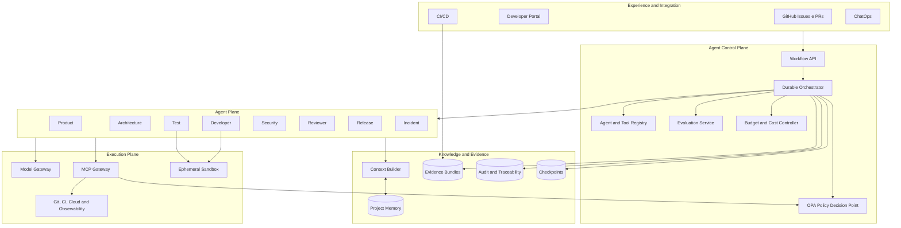
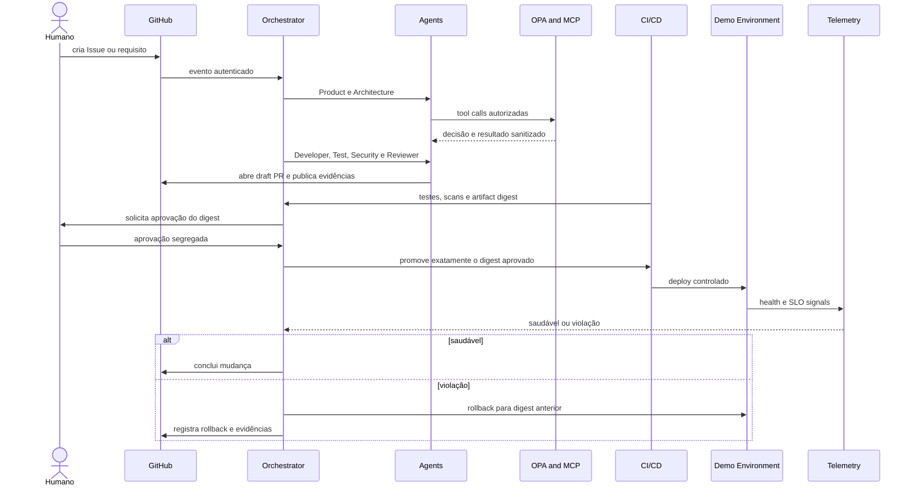

# Case aplicado — Agentic SDLC governado

[ Opening published documentation of Agentic SDLC Reference Architecture](https://leandrosflora.github.io/agentic-sdlc-reference-architecture/){ .md-button .md-button--primary target="_blank" }

This case demonstrates how the capabilities of the Enterprise AI Platform Reference Architecture can be applied to agent-oriented software engineering, covering the flow between demand, architecture, implementation, verification, approval, release, observation and recovery.

The objective is not to build only one agent who writes a code, but the proposal materializes a **sociotechnical system governed**, in which specialist agents produce proposals and evidence, while workflow, policies, quality gates, human approval and execution services keep the authority over real effects.

!!! info "State current"
    The solution has architecture, contracts, golden paths and a shared functional runtime. The environment demonstrates the point-to-point cycle with local adapters, controlled integration with GitHub and supports real Model Gateway and MCP. The P7 controls represent an implantable basis and substitutable adapters, but do not prove corporate productive operation.

## Problema

Code generation tools accelerate only part of the software Development Lifecycle. The main delays and risks remain distributed by:

- incomplete requirements;
- refinements and handoffs;
- architectural decisions without traceability;
- implementation outside the approved scope;
- insufficient coverage and testing;
- vulnerabilities and unsafe dependencies;
- review without consolidated context;
- uncoupled approvals of the final artifact;
- releases without evidence of observation;
- manual and late rollback;
- difficulty to relate requirement, code, test, approval and deploy.

Architecture transforms this flow into a durable, governed and audible journey.

## journey aplicada

```text
Epic, requisito ou GitHub Issue
        ↓
Product Agent
        ↓
Architecture Agent
        ↓
Developer Agent
        ↓
Test Agent
        ↓
Security Agent
        ↓
Reviewer Agent
        ↓
Aprovação humana vinculada ao digest
        ↓
Release Agent
        ↓
Deploy em ambiente controlado
        ↓
Observação por SLO e health checks
        ↓
Concluído ou rollback
        ↓
Incident Agent e feedback governado
```

Each step produces structured results, events, checkpoints and one **evidence bundle**. The orchestrator only advances when contracts, policies and gates of the stage are met.

## Specialised agents

| Agent | Main liability | Effect permitted | Limit of authority |
|---|---|---|---|
| Product | structuring objective, scope and acceptance criteria | Backlog and requirements | does not alter the code or approve release |
| Architecture | produce approach, C4, ADRs, contracts and impact | architectural artifacts | does not implement or publish |
| Developer | propose and implement delimited change | branch and draft PR | does not make merge or access production |
| Test | create and carry out verifications | tests and evidence | does not reduce stuttering |
| Security | perform scans and threat analysis | Findings and Evidence | does not silently alter the implementation |
| Reviewer | review quality, scope and evidence | opinion | does not implement or publish |
| Release | Promote authorised digest and operate rollback | controlled setting | does not ignore approval or policy |
| Incident | correlating change and telemetry | timeline and remediation proposal | does not perform destructive action without authorisation |

The agents represent logical roles executed by a shared runtime, and they do not need to be eight persistent services.

## Where AI participates

AI enters the activities that require interpretation, synthesis, generation and contextual assessment:

### Product Agent

- interprets requirements and Issues;
- identifica lacunas;
- proposes structured acceptance criteria;
- it registers risks and doubts for refinement.

### Architecture Agent

- analyzes context and restrictions;
- proposes decisions and alternatives;
- produces contracts and impact analysis;
- it relates the change with ADRs and existing patterns.

### Developer Agent

- generates a structured proposal for amendment;
- seleciona arquivos permitidos;
- produces code and tests within the scope;
- abre only draft PR.

### Test and Security Agents

- proposing scenarios and verifications;
- analyze failures, coverage and regressions;
- synthesize security findings;
- they cannot reduce thresholds or remove controls.

### Reviewer and Incident Agents

- consolidate evidence of multiple steps;
- verify adherence to the requirement and architecture;
- correlate deploys, logs, traces and incidents;
- recommend rework, recovery or further investigation.

The response of a model **has no direct authority**. All side effects go through the MCP Gateway, policy enforcement and workflow contracts.

## What remains deterministic

| responsibility | Why should not depend on probabilistic decision |
|---|---|
| state machine | progression, timeout, retry and compensation need to be reproducible |
| policy enforcement | authorisation must be explicit and fail-closed |
| Segregation of functions | author, approver and executor need to be verifiable |
| Human approval | it must refer to identity, decision and exact digest |
| execution of tools | schemas, grants, paths and environments should be controlled. |
| CI quality gates | tests, scans and thresholds need to produce objective results for the study of the study. |
| release | only the digest approved can ser promoted |
| idempotency | retries cannot double effects |
| observation and rollback | decisions should use health checks and versioned SLOs |
| evidence store | hashes, integrity chain and retention do not depend on the model. |

## Mapping for Enterprise AI Platform

| Platform capacity | Materialisation in Agentic SDLC | Current status |
|---|---|---|
| Agent Gateway | GitHub Issues, PRs, Developer Portal, IC/CD and ChatOps as channels | defined architecture; demonstrated GitHub integrations |
| Agent Runtime | shared runtime with eight declarative definitions | implemented and tested |
| Agent Registry | definitions versioned with prompt, tools, limits and schemes | implemented in runtime and contracts |
| Model Gateway | provider fake deterministic and gateway HTTP OpenAI-compatible | implemented; corporate selection and central governance still evolving |
| MCP Gateway | MCP fake for tests and stdio transport JSON-RPC for real servers | implemented; HTTP/SSE remains evolving |
| Policy Enforcement | grants per paper and OPA in tool loop, remote or CLI | implemented; production requires OPA HA and signed bundles |
| Knowledge Service | Context Builder, documents, ADRs, contracts and project memory | baseline implemented; knowledge lifecycle corporate pending |
| Memory Service | checkpoints, approved context and historical change | baseline implemented |
| Evaluation Service | tests, scans, schemas, groundedness and quality gates | baseline implemented; continuous evaluation with real models still evolving |
| Governance Service | durable workflow, segregation, approval by digest and policy-as-code | demonstrado localmente |
| Evidence and Audit | evidence bundles write-once, SHA-256 and manifest with hash chain | implemented locally; outstanding corporate WORM |
| Workload Identity | support for GitHub OIDC in the adapters P7 | implemented as adapter; trust policies actual pending |
| Observability | Correlated events and exporter OTLP HTTP | implemented adapter; corporate backend and outstanding real SLOs |
| FinOps | limits per agent and Budget Ledger | implemented as control; shared backend pending |
| Supply Chain | Syft, Cosign, digest and manifest Kubernetes | implemented adapters; registry and admission verification pending |
| Sandbox | Restricted Docker, without network, read-only and limits | demonstrated; outstanding production isolation |
| Event Backbone | events du `change_id`, `project_id` and `agent_run_id`  | database based on archives; managed measurement is evolution |

## Implemented architecture



The architecture separates five planes:

1. **Experience and Integration:** entry points and registration systems;
2. **Agent Control Plane:** workflow, catalogue, policies, evaluations and budgets;
3. **Agent Plane:** specialized roles with own identities and permissions;
4. **Knowledge and Evidence:** context, memory, checkpoints and traceability;
5. **Execution Plane:** models, MCP, sandboxes and tools with real effect.

## Point to point flow



## Declared guarantees

| Aspect | Current guarantee |
|---|---|
| Workflow | explicit order, persisted states and checkpoints per stage |
| Retomada | completed model response can be reused without further charge or effect |
| Tool use | grants per agent, schemas and policy before execution |
| Context | classification, provenance, redaction, limits and hashes |
| Evidence | write-once, SHA-256 and manifest append-only files with hash chain |
| Approval | independent of the author and linked to the exact digest |
| Developer Agent | allowed paths, blocked sensitive files and only draft PR |
| Release | promotion only after human gate and with the approved digest |
| Remark | health check and explicit decision after deployment |
| Recovery | rollback restores the previous stable digest and maintains history of the digest. |
| Budgets | reserve and block before exceeding the set limit |
| Security | OPA fail-closed, sandbox restricted and supply-chain adapters |

## Runtime shared

The [agentic-sdlc-runtime](https://github.com/leandrosflora/agentic-sdlc-runtime) concentrates the execution of agents and provides:

- agent registry JSON;
- Context Builder with provenance and minimization;
- Model Gateway fake and OpenAI-compatible;
- MCP fake and real MCP via stdio;
- tool loop limitado;
- PAO authorisation;
- evidence bundles;
- checkpoints and resumption;
- IAC, demos and tests;
- Integration with Issues, comments, Checks and draft PRs;
- adapters P7 for OIDC, S3, OTLP, budgets, queues, sandbox and supply chain.

## Case repositories

| Repository | responsibility |
|---|---|
|  [agentic-sdlc-reference-architecture](https://github.com/leandrosflora/agentic-sdlc-reference-architecture)  | architecture, contracts, policies, documentation, golden path and governance |
|  [agentic-sdlc-runtime](https://github.com/leandrosflora/agentic-sdlc-runtime)  | shared runtime, declarative agents, gateways, workflow and adapters |
|  [agentic-sdlc-demo-app](https://github.com/leandrosflora/agentic-sdlc-demo-app)  | target application used to validate branch, alteration, PR, release and rollback |
|  `sdlc-<role>-agent`  | adapters and scaffolds specific to the eight roles; canonical definitions are in the runtime. |

## Relationship with the life cycle of agents

The case applies the lifecycle of Enterprise AI Platform to the engineering agents themselves:

```text
Definir finalidade e owner
        ↓
Versionar prompt, modelo, tools e schemas
        ↓
Avaliar offline e testar policies
        ↓
Publicar no Agent Registry
        ↓
Executar com identidade, budget e contexto governado
        ↓
Coletar qualidade, custo, traces e evidências
        ↓
Promover, limitar, suspender ou retirar a versão
```

No agent can modify its own prompts, policies, thresholds or grants and promote them automatically.

## Security and threat boundaries

The main confidence limits are:

- Issue content, PR and repository is non-reliable entry;
- output of the model is not authorised;
- MCP Gateway is the only way out to corporate tools;
- code execution occurs in ephemeral sandbox;
- secrets are obtained just-in-time and do not enter the context;
- development and production runners should not share trust zone;
- unavailability of policy, identity or written audit blocks;
- insufficient telemetry prevents promotion, but should not prevent manual rollback.

## Current status

| Layer | Classification | Evidence |
|---|---|---|
| Architecture, contracts and policies |  `CONTRACT_DEFINED`  | Documentation, schemes, ADRs and Rego versioned |
| Golden path |  `DEMONSTRATED_LOCAL`  | deterministic flow and evidence bundle |
| Shared Runtime |  `DEMONSTRATED_LOCAL`  | Tests, IAC, gateways, checkpoints and workflow E2E |
| Model Gateway real |  `IMPLEMENTATION_STARTED`  | OpenAI-compatible integration available and optional |
| MCP real |  `IMPLEMENTATION_STARTED`  | transport stdio available |
| GitHub integration |  `DEMONSTRATED_LOCAL`  | Issue, comment, Checks, branch and draft PR |
| Release and rollback demo |  `DEMONSTRATED_LOCAL`  | healthy path and rollback path |
| Adapters P7 |  `IMPLEMENTATION_STARTED`  | OIDC, S3, OTLP, SQS, Syft, Cosign and Kubernetes |
| Corporate operation | pending | providers, environments and real controls not yet approved |
| Production readiness |  `NOT_PRODUCTION_READY`  | lack of operational evidence and formal approval |

## Limits declared

- Model Gateway fake is the standard of deterministic demos;
- real provider depends on endpoint and externally configured credentials;
- Real MCP supports stdio; other transports are still evolving;
- evidence store local is tamper-evident, no storage corporate WORM;
- demo environment persists locally;
- adapters P7 need ser configured contra providers actual;
- manifest Kubernetes has placeholders;
- integration, performance, safety and recovery still need to be validated in a representative environment;
- agents do not have authorization to merge or autonomous productive publication.

## Next slats

1. execute The workflow complete contra a Model Gateway corporativo;
2. connecting real MCP servers by tool and trust zone;
3. Implement OPA HA with signed bundles;
4. using workload identity and just-in-time credentials;
5. Moving evidence to storage WORM with KMS and retention;
6. publish digest artifacts with SBOM and verified signature;
7. perform workers in queues managed with DLQ and autoscaling;
8. validate sandbox alone, egress allowlist and resource limits;
9. to integrate metrics, traces, cost and SLOs to corporate operation;
10. perform game days rollback, unavailability of PDP and checkpoint recovery.

## Value demonstrated for Enterprise AI Platform

The Agentic SDLC shows that the Enterprise AI Platform can govern not only service agents or backoffice, but also agents that participate in the very software production.

The case shows that useful autonomy depends on:

- durable workflow;
- context with origin;
- tools governadas;
- segregation of functions;
- approval linked to the artifact;
- verifiable evidence;
- observation and rollback;
- identity, budget and policy by workload.

Productivity not only comes to generate faster code, but also comes to reduce handoffs and rework. **without removing the controls that make a secure, auditable and recoverable change**.

## References

- [Published documentation](https://leandrosflora.github.io/agentic-sdlc-reference-architecture/)
- [Architectural repository](https://github.com/leandrosflora/agentic-sdlc-reference-architecture)
- [Runtime funcional](https://github.com/leandrosflora/agentic-sdlc-runtime)
- [Implementation demo](https://github.com/leandrosflora/agentic-sdlc-demo-app)
- [Start-to-end integration](https://leandrosflora.github.io/agentic-sdlc-reference-architecture/end-to-end-workflow/)
- [P7 — Production and governance](https://leandrosflora.github.io/agentic-sdlc-reference-architecture/p7-production-governance/)
