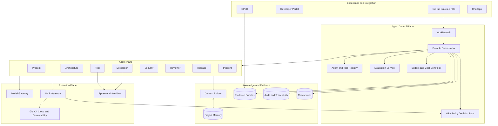
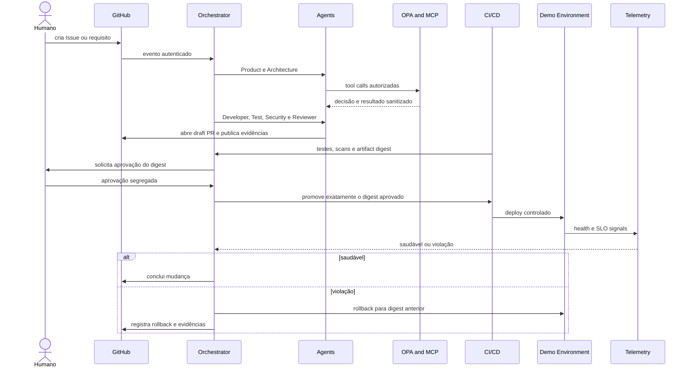

# Case aplicado — Agentic SDLC governado

[                                                                                                                                                                                               https://leandrosflora.github.io/agentic-sdlc-reference-architecture/){ .md-button .md-button--primary target="_blank" }

This case shows how the capabilities of the Enterprise AI Platform Reference Architecture can be applied to software engineering geared by agents, reducing the flow between demand, architecture, implementation, verification, approval, release, observation and recovery.

The aim is not to build only an agent who writes code. The proposal materialises a ‘government socio-economic system’, in which special agents produce proposals and evidence, while workflow, policies, quality gates, human adoption and implementation services maintain the authority on real effects.

!!! info "Estado atual"
    The solution may be arquiteture, contracts, golden paths and a functional runtime. The environment shows the cross-section of the cross-section with local adapters, logged integration with GitHub and supports the real Model Gateway and MCP. P7 controls represent a stable and replacement adapter base, but do not comprove corporative production operations.

## Problema

Code generation methods only a part of the Lifecycle Software Development. The main delays and risks are still distributed by:

- incompletive requirements;
- refinamentos e handoffs;
- arbitrary decisions without resolvability;
- implementation outside the approved scope;
- cobertura e testes insuficientes;
- vulnerability and unsafe dependencies;
- revision without consolidated context;
- admitted approvals of the final artefact;
- releases without evidence of observation;
- rollback manual e tardio;
- difficulty to replace requirements, code, test, approval and deployment.

The architecture transforms this flux into a durable, governance and auditable newspaper.

## Jornada aplicada

```text
Epic, requisito ou GitHub Issue
        ↓
Product Agent
        ↓
Architecture Agent
        ↓
Developer Agent
        ↓
Test Agent
        ↓
Security Agent
        ↓
Reviewer Agent
        ↓
Aprovação humana vinculada ao digest
        ↓
Release Agent
        ↓
Deploy em ambiente controlado
        ↓
Observação por SLO e health checks
        ↓
Concluído ou rollback
        ↓
Incident Agent e feedback governado
```

Each phase produces structured results, events, checkpoints and a **evidence bundle**. The winner only progresses when contracts, policies and gates of the phase are satisfied.

## Specialized agents

| Agent | Responsabilidade principal | Efeito permitido | Authorisation limit |
|---|---|---|---|
| Product | establishing objective, scope and acceptance criteria | backlog and requirements | does not change code or approve release |
| Architecture | produzir abordagem, C4, ADRs, contratos e impacto | artefatos arquiteturais | does not implement or publish |
| Developer | propose and implement a delimitated change | branch e draft PR | it does not merge or access production |
| Test | to create and execute verifications | Tests and evidence |  not shut doors |
| Security | executar scans e threat analysis | findings and evidence | does not merely change the implementation |
| Reviewer | Review quality, scope and evidence | parecer independente | does not implement or publish |
| Release | promover digest autorizado e operar rollback | ambiente controlado | not ignore approval or policy |
| Incident | relacing change and telemetry | time and proposal for remediation | does not execute destructive action without authorisation |

The agents represent legal documents executed by a shared runtime, they do not need to be ooh-ooh-ooh-ooh-ooh-ooh-ooh-ooh-ooh-ooh-ooh-ooh-ooh-ooh-ooh-ooh-ooh-ooh-ooh-ooh-ooh-ooh-ooh-o.

## Where the AI participates

The AI enters the activities that require interpretation, consistency, generation and contextual evaluation:

### Product Agent

- interpret requirements and issues;
- identifica lacunas;
- a proposed criteria for ruthless acceptance;
- records risk and doubts for refinancing.

### Architecture Agent

- analyse context and restrictions;
- propose decisions and alternatives;
- produce contracts and impact analysis;
- relating to changes in the existing DRAs and rules.

### Developer Agent

- to make a proposed amendment scheme;
- seleciona arquivos permitidos;
- produce code and tests within the scope;
- abre somente draft PR.

### Test e Security Agents

- propose scenarios and checks;
- analyzed gaps, coverage and return;
- to understand safety findings;
- can't reduce thresholds or remove controls.

### Reviewer e Incident Agents

- consolidate evidence of a few steps;
- verify compliance with the requirements and architecture;
- correlacionam deploys, logs, traces e incidentes;
- recommending work, recovery or additional research.

The answer of a model **can't be directed**. All collateral effect passes by the MCP Gateway, by policy enforcement and by workflow contracts.

## What remains determined

| Responsabilidade | Because it must not depend on probabilistic decision |
|---|---|
| a styl machine | progress, timeout, retry and compensation must be reproduzable |
| policy enforcement | Authorisation must be expelled and failed |
| separation of functions | author, producer and executor must be checked |
| human adoption | must refer to identity, decision and digest exacerbation |
| implementation of tools | schemas, grants, paths and environments must be monitored |
| CI quality gates | tests, scans and thresholds need to produce a result of objective |
| release | Only the approved digest may be promoted |
| idempotence | retries can't double effects |
| observation and rollback | Decisions should be used for health checks and SLOs versioned |
| evidence store | Hashes, integrity chain and retention do not depend on the model |

## Map for Enterprise AI Platform

| - Capacity of the plate | Materialisation in Agentic SDLC | Estado atual |
|---|---|---|
| Agent Gateway | GitHub Issues, PRs, Developer Portal, CI/CD and ChatOps as canais | defined architecture; GitHub integrations demonstrated |
| Agent Runtime | runtime compared to the eight declared definitions | implementado e testado |
| Agent Registry | defined with prompt, tools, limits and schemas | implemented in runtime and contracts |
| Model Gateway | deterministic provider and HTTP OpenAI-compatible gateway | implemented; corporative selection and central governance still evolving |
| MCP Gateway | MCP fake for tests and transport stdio JSON-RPC for real users | implemented; HTTP/SSE continues development |
| Policy Enforcement | grants by role and OPA in tool loop, remoto or CLI | implemented; production requires HAPA and signed bundles |
| Knowledge Service | Context Builder, documents, ADRs, contracts and project memory | baseline implementada; knowledge lifecycle corporativo pendente |
| Memory Service | checkpoints, approved context and history by change | baseline implementada |
| Evaluation Service | testes, scans, schemas, groundedness e quality gates | baseline implemented; accounts with real models still evolving |
| Governance Service | Durable workflow, separation, digest approval and policy-as-code | demonstrado localmente |
| Evidence and Audit | evidence bundles write-once, SHA-256 and manifest with hash chain | implementado localmente; storage WORM corporativo pendente |
| Workload Identity | support GitHub OIDC in P7 adapters | implemented as adapt; real trust policies |
| Observability | eventos correlacionados e exportador OTLP HTTP | adapter implementado; backend corporativo e SLOs reais pendentes |
| FinOps | limits by agent and Budget Ledger | implemented as control; compared backend |
| Supply Chain | Syft, Cosign, digest e manifesto Kubernetes | adapters implementados; registry e admission verification pendentes |
| Sandbox | Lightweight, non-net, read-only and limit | demonstrating; isolation of production pending |
| Event Backbone | events by `change_id`, `project_id` and `agent_run_id` | baseline based on files; generating message is evolution |

## Developed arcade



The structure separates five plans:

1. **Experience and Integration:** entry points and register systems;
2. **Control Plane agent:** workflow, catalog, policies, assessments and budgets;
3. **Agent Plan:** special packages with identity and permissions;
4. **Knowledge and Evidence:** context, memory, checkpoints and rastreability;
5. **Execution Plan:** models, MCP, sandboxes and trays with real effect.

## - The fucking fucking fucking fucking fucking fucking fucking fucking fucking fucking fucking fucking fucking fucking fucking fucking fucking fucking fucking fucking fucking fucking fucking fucking fucking fucking fucking feel



## Garantias demonstradas

| Aspecto | Garantia atual |
|---|---|
| Workflow | Explanatory order, persistent status and checkpoints for phase |
| Retomada | Model response may be re-used without new cobrane or effect |
| Tool use | grants by agent, schemas and policy before implementation |
| Contexto | classification, origin, redaction, limits and hashes |
| Evidence | write-once, SHA-256 and manifest append-only with hash chain |
| Appropriation | independent of the author and inserted into the exacerbated digest |
| Developer Agent | permitted paths, sensitive files blocked and only draft PR |
| Release | promotion only after human gate and with approved digest |
| Observation | health check and explcitation decision after deployment |
| Recuperation | rollback restores the previous stable digest and maintains history |
| Budgets | reserve and block before exceeding specified limit |
| Security | OPA fail-closed, sandbox restrito e supply-chain adapters |

## Runtime compartilhado

The [agentic-sdlc-runtime](https://github.com/leandrosflora/agentic-sdlc-runtime) concentrates on the execution of the agents and provides:

- registry JSON of agents;
- Context Builder with provenance and minimisation;
- Model Gateway fake e OpenAI-compatible;
- MCP fake e MCP real via stdio;
- tool loop limitado;
- OPA authorisation;
- eventos e evidence bundles;
- checkpoints e retomada;
- CLI, demos e testes;
- integration with Issues, comments, checks and draft PRs;
- P7 adapters for OIDC, S3, OTLP, budgets, filas, sandbox and supply chain.

## Case reports

| Repositor | Responsabilidade |
|---|---|
| [agentic-sdlc-reference-architecture](https://github.com/leandrosflora/agentic-sdlc-reference-architecture) | architecture, contracts, policies, documentation, golden path and governance |
| (agentic-sdlc-runtime)(https://github.com/leandrosflora/agentic-sdlc-runtime) | runtime compared, declared agents, gateways, workflow and adapters |
| [agentic-sdlc-demo-app](https://github.com/leandrosflora/agentic-sdlc-demo-app) | aimed application used to validate branch, amendment, PR, release and rollback |
| `sdlc-<role>-agent` | adapters and specific scaffolds of the standard oito; canopic definitions stay in the runtime |

## Relationship with the life cycle of agents

The case applies the lifecycle of Enterprise AI Platform to the engineers themselves:

```text
Definir finalidade e owner
        ↓
Versionar prompt, modelo, tools e schemas
        ↓
Avaliar offline e testar policies
        ↓
Publicar no Agent Registry
        ↓
Executar com identidade, budget e contexto governado
        ↓
Coletar qualidade, custo, traces e evidências
        ↓
Promover, limitar, suspender ou retirar a versão
```

No agent can modify his own prompts, policies, thresholds or grants and automatically promote them.

## Security and threat boundaries

The main limits of confidence are:

- the contents of Issue, PR and repository shall be entered not confidential;
- output of the model is proposed not authorized;
- MCP Gateway is the only exit for corporative tools;
- the execution of code occurs in the efeetbox;
- secretes are obtained just in time and not in the context;
- development and production runners must not be able to share the trust zone;
- indisponibility of policy, identity or written bloke auditory;
- unused telemetry prevents promotion, but should not prevent manual rollback.

## Estado atual

| Camada | Classification | Evidence |
|---|---|---|
| Architecture, contracts and policies | `CONTRACT_DEFINED` | Documentation, schemas, ADRs and versioned Reg |
| Golden path | `DEMONSTRATED_LOCAL` | deterministic and evidence-based flux |
| Runtime compartilhado | `DEMONSTRATED_LOCAL` | testes, CLI, gateways, checkpoints e workflow E2E |
| Model Gateway real | `IMPLEMENTATION_STARTED` | OpenAI-compatible integration available and optional |
| MCP real | `IMPLEMENTATION_STARTED` | transport system available |
| GitHub integration | `DEMONSTRATED_LOCAL` | Issue, comment, Checks, branch and draft PR |
| Release e rollback demo | `DEMONSTRATED_LOCAL` | - a healthy way and a rollback way |
| Adapters P7 | `IMPLEMENTATION_STARTED` | OIDC, S3, OTLP, SQS, Syft, Cosign e Kubernetes |
| Surgical operation | Pendente | providers, environments and real controls still not homologated |
| Production readiness | `NOT_PRODUCTION_READY` | operational evidence and formal approval fail |

## Limites declarados

- Model Gateway fake is the pattern ofdeterministic demos;
- real provider depends on the endpoint and credentials configured externally;
- MCP real support stdio; other transports are still evolving;
- evidence store local is tamper-evident, not storage WORM corporative;
- ambiente demo persiste estado localmente;
- adapters P7 precisam ser configurados contra providers reais;
- manifesto Kubernetes possui placeholders;
- integration, performance, safety and recovery must still be valid in representative environment;
- Agents may not have permission to merge or publish a proprietary product.

## Next gates

1. execute the complete workflow against a corporative Model Gateway;
2. connecting MCP real by rail and trust zone;
3. implanting HAPA with signed bundles;
4. usar workload identity e credenciais just-in-time;
5. move evidence to storage WORM with KMS and retention;
6. publish digestible articles with a systolic and verified signature;
7. executing workers in DLQ and autoscaling filades;
8. validing isolad sandbox, egress allowlist and resources limits;
9. integrating methods, trace, cost and SLOs to the corporative operation;
10. executing rollback games, indisponibility of the PDP and checkpoint recovery.

## Value shown to Enterprise AI Platform

The SDLC Agent shows that Enterprise AI Platform can govern not only a developer or backoffice agent, but also a developer who participates in the software production itself.

The case proving that useful autonomia depends on:

- hard workflow;
- context with origin;
- tools governadas;
- separation of functions;
- approval of the artefact;
- verified evidence;
- observation and rollback;
- identity, budget and policy for workload.

Production is not just generating faster code. It is gonna reduce handoffs and work ** to remove controls which make a safe, auditable and recoverable change**.

## References

- (publication)(https://leandrosflora.github.io/agentic-sdlc-reference-architecture/)
- (Arcing Repository)(https://github.com/leandrosflora/agentic-sdlc-reference-architecture)
- (funcional time)(https://github.com/leandrosflora/agentic-sdlc-runtime)
- (Demo-Application)(https://github.com/leandrosflora/agentic-sdlc-demo-app)
- (Pitch entry)(https://leandrosflora.github.io/agentic-sdlc-reference-architecture/end-to-end-workflow/)
- [P7 — Production and Government](https://leandrosflora.github.io/agentic-sdlc-reference-architecture/p7-production-governance/)
