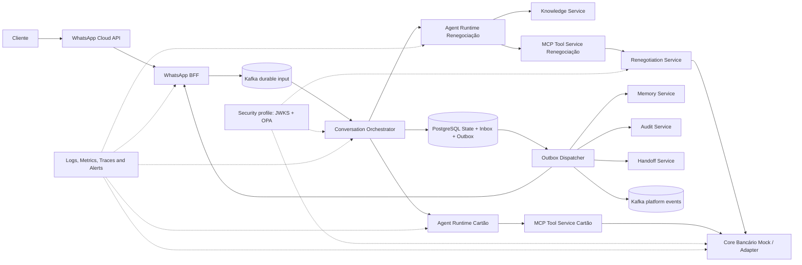
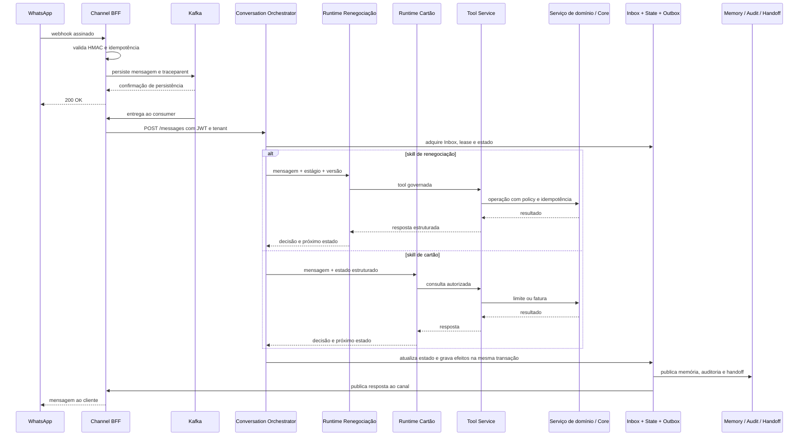

# Applied Case — Multi-skill banking conversational platform

[ Opening published documentation from Conversational AI Platform Architecture](https://leandrosflora.github.io/conversational-ai-platform-architecture/index.html){ .md-button .md-button--primary target="_blank" }

This case demonstrates how the capabilities of the Enterprise AI Platform Reference Architecture can be materialized in a banking conversational platform with multiple skills, governed journeys, integration by tools MCP, RAG, memory, audit, observability and executable evidence.

The current implementation covers two days via WhatsApp:

- debt renegotiation, including consultations, simulation and governed confirmation;
- limit consultation and card invoice, with only reading flow.

!!! info "State current"
    The solution is a **Implementable reference and hardened COP**. It proves architecture, contracts, controls and journeys with a bank Core mock, but does not represent certification for banking production.

## Context

The platform receives signed webhooks from WhatsApp, persists the entry into Kafka before acceptance, maintains the transactional state of conversation, selects the appropriate skill, consults knowledge, performs authorized tools and registers effects through Inbox and Outbox.

Shared services provide memory, audit, handoff, observability, evals and release governance.Specialized services isolate renegotiation rules and card, preventing the agent from directly accessing the bank Core.

## Jornadas implementadas

| Jornada | Agent Runtime | Tool Service | Domain integration | Natureza |
|---|---|---|---|---|
| Renewal |  `agent-runtime-renegotiation`  |  `tool-service-renegotiation`  |  `renegotiation-service` → Bank mock | governed consultations and changeable operations |
| Limit and card invoice |  `agent-runtime-fatura-cartao`  |  `tool-service-cartao-credito`  | Access to the bank Core Card API mock | somente leitura |

The Conversation Orchestrator maintains the state of the journey and routes the conversation to the specialized runtime. The inclusion of a second skill demonstrates that architecture is not limited to a single agent or banking product.

## Mapping for the reference architecture

| Reference capacity | Implementation in case | Current status |
|---|---|---|
| Channel / Agent Gateway | WhatsApp BFF, Input Kafka and Conversation Orchestrator | Implemented baseline; gateway responsibilities remain distributed |
| Agent Runtime | specialized runtimes for renegotiation and card | Implemented |
| MCP Tool Service | Tool Services for renegotiation and card | Implemented |
| Workflow / Journey State | state machine, lease, versioning, Inbox and Outbox in the Orchestrator | Implementado |
| Knowledge Service | OpenSearch with vector search and PDFs by tenant | Implemented; corporate connector and ACL by pending document |
| Memory Service | Redis for session and MongoDB for history | Implementado |
| Policy Enforcement | Deterministic rules in Tool Services and domain service; feasible profile with PAO | Implemented basis; corporate integration still pending |
| Workload Identity | JWT HS256 per pair in the standard profile; migration profile RS256, ICDC and JWKS | Part; native identity, mTLS and KMS remain pending |
| Hearing | PostgreSQL with tenant deduplication and idempotence key | Implemented |
| Event Backbone | Kafka for durable entry, retry, DLQ and platform events | Implemented partially; not all integration is event-oriented |
| Human Handoff | Conversation Handoff Service | Implemented as persistent request; bidirectional transfer to human platform still pending |
| Observability | Jaeger, Loki, Grafana Alloy, Prometheus, Grafana and Alertmanager | Implemented implementable basis; coverage of real metrics and receivers still evolving |
| Evaluation Service | evals offline and online versioned for the two skills | Implementable basis; continuous evaluation in production still pending |
| Release Governance | manifest, lock with exact SHAs, executable contracts and multi-repository E2E | Implemented basis; mandatory gate and promotion of certified images still pending |
| Banking Core Integration | functional doors, canonical models, adapters and environmental profiles | Readiness implemented with mock; production contract, certification and reconciliation pending |
| Model Gateway | directly configured model in each runtime | Recommended evolution |
| AI Catalog / Control Plane | documentation, contracts and repository configuration | Recommended evolution |
| FinOps | costs and tokens foreseen in future evaluations, without centralized service | Recommended evolution |

## Implemented architecture



The diagram represents the implemented state and the executable profiles.The target architecture may introduce additional central components, such as Agent Gateway, Model Gateway, AI catalog and FinOps.

## Simplified flow



## Declared guarantees

| Aspect | Implemented guarantee |
|---|---|
| Entry WhatsApp | ACK only after persistence in Kafka |
| Augmentative canal | HMAC webhook validation |
| Inbox | processamento idempotente por mensagem |
| Status of journey | lease, optimistic version and delayed message treatment |
| Side effects | Outbox at-least-once with deduplication |
| Order | effects of a previous version block the release of the next |
| Tenant | tenant no header and em claim assinada |
| Tools | allowlist, stage, version and policy validated before implementation |
| Movable transactions |  `Idempotency-Key`, replay and divergent payload conflict |
| Financial confirmation | it requires internship and evidence linked to the current message. |
| Memory | keys segregated by tenant and conversation |
| Audit and Handoff | tenant deduplication and idempotence key |
| Sensitive data | tools and CPF arguments are not published in platform events. |
| RAG | index and consultation segregated by tenant |

## Security and Policy Enforcement

The POC standard profile uses JWT HS256 with independent secrecy per service pair, which reduces the indiscriminate sharing of credentials, but remains based on symmetrical secrets.

An feasible migration profile demonstrates evolution to:

- RS256 issue;
- Discovery of ICD and JWKS publication;
- short tokens by workload and audience;
- allowlist between issuer and destination;
- OPA como PDP centralizado;
- fail-closed decision;
- obligatory evidence for financial actions.

This profile validates contracts and migration strategy. Production still requires native identity of workload, KMS or HSM, rotation, revocation, mTLS and integration with corporate AMI.

[Workload Identity and PDP details](https://leandrosflora.github.io/conversational-ai-platform-architecture/security/workload-identity-pdp.html){ target="_blank" }

## Evals and evidence

The platform has a versioned suite of renegotiation scenarios and a card covering:

- welcoming and identification of intention;
- Debt consultation;
- simulation and renegotiation journey;
- ceiling and invoice of card;
- handoff humano;
- messages outside the scope;
- attempt to ignore rules.

The evals can be executed offline, without infrastructure, or online against the two Agent Runtimes. The reports record approval, latency, handoff, threshold violations and expectation errors.

The necessary evolution is no longer to “create evals”, but to expand the evaluation to real models, groundedness, tool selection, cost, tokens, model regression and online production metrics.

[Detalhes dos evals](https://leandrosflora.github.io/conversational-ai-platform-architecture/testing/evals.html){ target="_blank" }

## Multi-repository release governance

The solution is composed of the architectural repository and 12 service repositories.The release manifest solves the entry references to 13 exact SHAs and produces a `release-lock.yaml` Immutable.

Multi-repository pipeline E2E may:

1. solve all repositories for exact commits;
2. perform builds and tests;
3. validate OpenAPI, AsyncAPI and policies;
4. subir o stack;
5. injetar um webhook assinado;
6. validar o Core autenticado;
7. performing evals online and loading;
8. publish evidence linked to the release lock.

Productive promotion should also reuse images per digest, signed and certified, without reconstructing the environment.

[Release details and implementing contracts](https://leandrosflora.github.io/conversational-ai-platform-architecture/governance/release-contract-governance.html){ target="_blank" }

## Readiness for integration with banking Core

Bank Core mock is not treated as equivalent to a productive system. Architecture uses domain services, canonical functional doors and adapters selected by environment:

```text
Agent / Tool Service
        ↓
Serviço de domínio
        ↓
Porta funcional canônica
        ↓
Adapter por ambiente
        ↓
Mock | Sandbox | API bancária real
```

The doors cover identification of the client, portfolio of debts, eligibility, simulation, formalization and care of the card.

The solution proves technical integration E2E with mock, workload control and security baseline between workloads, and it does not prove real financial rules, production contract, reconciliation or certification of the product.

A productive release should be blocked when using provider mock, synthetic data, changeable operation without persistent idempotence or formalization without reconciliation.

[Details of Banking Core Integration Readiness](https://leandrosflora.github.io/conversational-ai-platform-architecture/integration/banking-core-readiness.html){ target="_blank" }

## Observability and operation

The local environment provisions Jaeger, Loki, Grafana Alloy, Prometheus, Grafana and Alertmanager.There are versioned rules for infrastructure, DLQ, processing failures, Outbox, authentication and policy denials.

Initial SLOs were defined for webhook reception, Choreotor processing, Outbox publication, governed tools, RAG and observable infrastructure.

The baseline does not replace corporate operation. Real receivers, ownership, scheduling, shift, full coverage of application metrics and error budgets approved remain necessary.

[SLOs and alerts details](https://leandrosflora.github.io/conversational-ai-platform-architecture/operations/slo-alerting.html){ target="_blank" }

## Priority lacunes

1. consolidating Agent Gateway and cross-cutting policies;
2. to introduce Model Gateway with routing, fallback, quotas and cost measurement;
3. centralizing IA Catalog, configuration and lifecycle of agents;
4. integrate corporate identity of workload, KMS, rotation and mTLS;
5. Connecting real banking PPAs with certification, reconciliation and persistent inequality;
6. expanding evals to real models and continuous production monitoring;
7. activate receivers, ownership and corporate incident process;
8. implement approved retention, anonymity, exclusion and regional recovery;
9. promote images signed by digest with verifiable provenance;
10. Centralize FinOps by agent, skill, model, tenant and journey.

## Architectural result

The case demonstrates that the reference architecture supports a multi-skill conversational platform, with shared components and specialized agents per domain.

Implementation proves durable entry patterns, transactional status, governed tool calling, RAG, memory, audit, handoff, evals, observability, evolutionary security and release governance.

It also makes the border between three states explicit:

- **implemented:** validated in code, contract, compost or evidence E2E;
- **Implementable basis:** locally demonstrated control, still dependent on corporate integration;
- **production:** it requires real IPAs, strong identity, operation, compliance, resilience and promotion of approved artifacts.

This separation avoids treating a technically advanced COP as a bank platform ready for production, without reducing the value of architecture and already constructed evidence.
