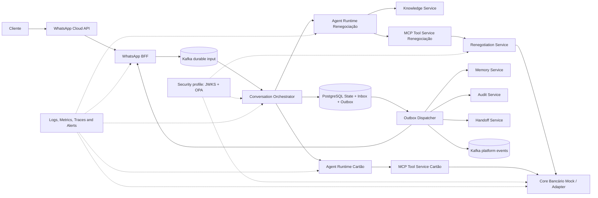
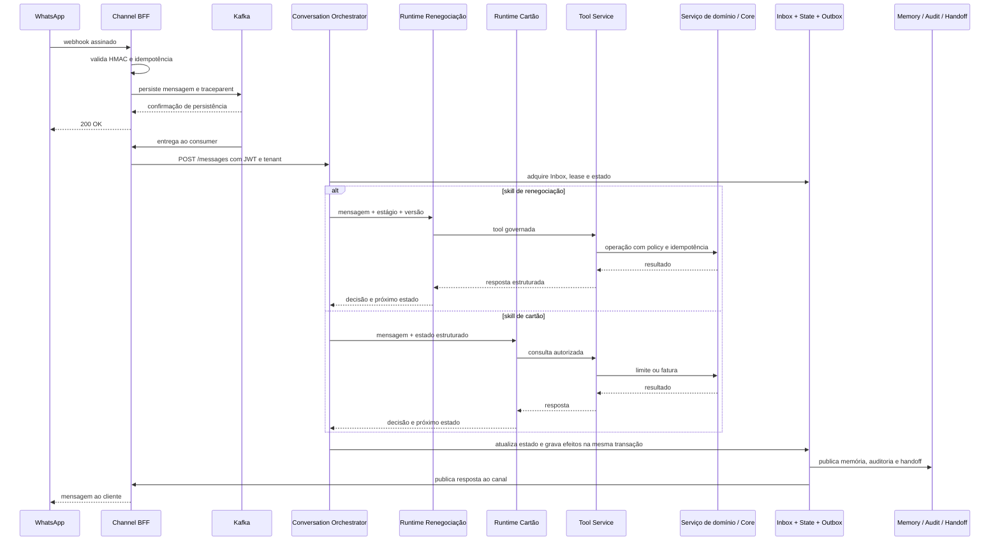

# Applied case  Multi-skill banking conversational platform

[ Open published documentation from Conversational AI Platform Architecture](https://leandrosflora.github.io/conversational-ai-platform-architecture/index.html){ .md-button .md-button--primary target="_blank" }

This case demonstrates how the capabilities of Enterprise AI Platform Reference Architecture can be materialized in a banking conversational platform with multiple skills, governed journeys, integration by tools MCP, RAG, memory, auditing, observability and executable evidence.

The current implementation covers two days via WhatsApp:

- debt renegotiation, including consultations, simulation and governed confirmation;
- limit consultation and card invoice, with read-only flow.

The Commission shall adopt implementing acts in accordance with the opinion of the European Parliament and of the Council.
    The solution is an executable reference and a hardened POC. It proves architecture, contracts, controls and routes with a mock core banking but does not represent certification for banking production.

## Contexto

The platform receives signed webhooks from WhatsApp, persists entering Kafka before acceptance, maintains transactional status of the conversation, selects the appropriate skill, query knowledge, runs authorized tools, and records effects through Inbox and Outbox.

Shared services provide memory, auditing, handoff, observability, evals and release governance.

## Jornadas implementadas

| Jornada | Agent Runtime | Tool Service | Integration of the domain | Natureza |
|---|---|---|---|---|
| Re-negotiation | `agent-runtime-renegotiation` | `tool-service-renegotiation` | `renegotiation-service` → Core banking mock | governed changeable consultations and operations |
| Card limit and invoice | `agent-runtime-fatura-cartao` | `tool-service-cartao-credito` | Access to the Core Banking Card API mock | somente leitura |

The Conversation Orchestrator maintains the status of the journey and routes the conversation to the specialized runtime.

## Mapping for reference architecture

| Reference capacity | Implementation in the case | Current status |
|---|---|---|
| Channel / Agent Gateway | WhatsApp BFF, Kafka entry and Conversation Orchestrator | Baseline implemented; gateway responsibilities remain distributed |
| Agent Runtime | Specialized renegotiation and card runtimes | Implementado |
| MCP Tool Service | Renegotiation tool services and card | Implementado |
| Workflow / Journey State | State machine, lease, versioning, Inbox and Outbox in the Orchestrator | Implementado |
| Knowledge Service | OpenSearch with vector search and PDFs per tenant | Implemented; corporate connector and ACL per document still pending |
| Memory Service | Redis for session and MongoDB for history | Implementado |
| Policy Enforcement | deterministic rules in Tool Services and domain service; executable profile with OPA | Baseline implemented; corporate integration still pending |
| Workload Identity | JWT HS256 per pair in the standard profile; migration profile RS256, OIDC and JWKS | Partial; native identity, mTLS and KMS remain pending |
| Audit | PostgreSQL with deduplication per tenant and idempotence key | Implementado |
| Event Backbone | Kafka for durable entry, retry, DLQ and platform events | Partially implemented; not all integration is event-oriented |
| Human Handoff | Conversation Handoff Service | Implemented as a persistent request; bidirectional transfer to human platform still pending |
| Observability | Jaeger, Loki, Grafana Alloy, Prometheus, Grafanaand Alertmanager | Implemented executable baseline; actual metrics and receivers coverage still evolving |
| Evaluation Service | Online and offline evaluations for both skills | Implemented executable baseline; ongoing production evaluation still pending |
| Release Governance | Manifesto, lock with exact SHAs, executable contracts and multi-repository E2E | Baseline implemented; mandatory gate and promotion by still pending certified images |
| Banking Core Integration | Functional ports, canonical models, adapters and profiles by environment | Readiness implemented with mock; production contract, certification and reconciliation pending |
| Model Gateway | Model set directly at each runtime | Recommended development |
| AI Catalog / Control Plane | documentation, contracts and configuration by repository | Recommended development |
| FinOps | Cost and tokens foreseen in future evaluations, without centralized service | Recommended development |

## Implemented architecture



The diagram represents the implemented state and executable profiles. The target architecture may introduce additional core components, such as Agent Gateway, Model Gateway, AI catalog and FinOps.

## Simplified flow



## Provided guarantees

| Aspecto | Garantia implementada |
|---|---|
| Entrada WhatsApp | ACK only after persistence in Kafka |
| Authenticity of the channel | HMAC validation of the webhook |
| Inbox | idempotent message processing |
| State of the journey | lease, optimistic version and delayed message processing |
| Side effects | Outbox at least once with deduplication |
| Regulation | Effects of an earlier version block the release of the next |
| Tenant | tenant in the header and in signed claim |
| Tools | allowlist, stage, version and policy validated before execution |
| Changing operations | `Idempotency-Key`, replay and conflict by divergent payload |
| Financial confirmation | requires stage and evidence linked to the current message |
| The memory | keys segregated by tenant and conversation |
| Audit and Handoff | deduplication by tenant and idempotence key |
| Sensitive data | tools and CPF arguments are not published in platform events |
| RAG | index and query segregated by tenant |

## Security and Policy Enforcement

The POC's standard profile uses JWT HS256 with independent pairs-of-service secrecy. This baseline reduces the indiscriminate sharing of credentials but remains based on symmetrical secrecy.

An executable migration profile shall demonstrate the evolution to:

- the emission RS256;
- the discovery of OIDC and the publication of JWKS;
- Short tokens by workload and audience;
- allowlist between issuer and destination;
- the OPA as a centralized PDP;
- the failure-closed decision;
- compulsory evidence for financial actions.

This profile validates contracts and migration strategy. Production also requires native workload identity, KMS or HSM, rotation, revocation, mTLS and integration with corporate IAM.

[Details of Workload Identity and PDP](https://leandrosflora.github.io/conversational-ai-platform-architecture/security/workload-identity-pdp.html){ target="_blank" }

## Evalue and evidence

The platform has a versioned suite of renegotiation and card scenarios covering:

- greeting and identification of intention;
- debt consultation;
- the simulation and renegotiation journey;
- card limit and invoice;
- handoff humano;
- out-of-scope messages;
- Trying to ignore the rules.

Evaluations can be performed offline, without infrastructure, or online against both Agent Runtimes. Reports record approval, latency, handoff, threshold violations, and expectation errors.

The evolution needed is no longer to create evaluations, but to extend the evaluation to real models, groundedness, tool selection, cost, tokens, model regression and online production metrics.

[Details of the evaluations](https://leandrosflora.github.io/conversational-ai-platform-architecture/testing/evals.html){ target="_blank" }

## Multi-repository release governance

The solution consists of the architecture repository and 12 service repositories. The release manifesto resolves the input references for 13 exact SHAs and produces an immutable `release-lock.yaml`.

The multi-repository E2E pipeline may:

1. resolve all repositories for exact commits;
2. perform builds and tests;
3. the validation of OpenAPI, AsyncAPI and policies;
4. up the stack;
5. Inject a signed webhook;
6. validate the authenticated Core;
7. carry out online and load evaluations;
8. publish evidence related to the release lock.

Production promotion must still reuse digested, signed and certified images without rebuilding between environments.

[Release details and enforceable contracts](https://leandrosflora.github.io/conversational-ai-platform-architecture/governance/release-contract-governance.html){ target="_blank" }

## Readiness for integration with Core Banking

Core banking mock is not treated as equivalent to a production system.

```text
Agent / Tool Service
        ↓
Serviço de domínio
        ↓
Porta funcional canônica
        ↓
Adapter por ambiente
        ↓
Mock | Sandbox | API bancária real
```

The doors cover customer identification, debt portfolio, eligibility, simulation, formalization and card service.

The solution proves technical integration of E2E with mock, journey control and safety baseline between workloads.

A productive release must be blocked when using provider mocks, synthetic data, variable operation without persistent idempotence or formalization without reconciliation.

[Banking Core Integration Readiness details](https://leandrosflora.github.io/conversational-ai-platform-architecture/integration/banking-core-readiness.html){ target="_blank" }

## Observability and operation

The local environment provides Jaeger, Loki, Grafana Alloy, Prometheus, Grafana and Alertmanager. There are versioned rules for infrastructure, DLQ, processing failures, Outbox, authentication and policy denials.

Initial SLOs were defined for webhook reception, orchestrator processing, Outbox publishing, governed tools, RAG and observable infrastructure.

The baseline does not replace corporate operations. Real receivers, ownership, scaling, planting, full coverage of application metrics and approved error budgets remain required.

[Details of SLOsand alerts](https://leandrosflora.github.io/conversational-ai-platform-architecture/operations/slo-alerting.html){ target="_blank" }

## Priority gaps

1. consolidate Agent Gateway and cross-channel policies;
2. introducing Model Gateway with routing, fallback, quotas and cost measurement;
3. centralize the AI Catalog, configuration and lifecycle of agents;
4. integrate workload, KMS, rotation and mTLS corporate identity;
5. connecting real APIs banking with certification, reconciliation and persistent idempotence;
6. enhancing evaluations for real models and continuous monitoring of production;
7. activate incident receivers, ownership and corporate process;
8. implement approved regional retention, anonymization, exclusion and recovery;
9. promote digest-signed images with verifiable provenance;
10. centralize FinOps by agent, skill, model, tenant and journey.

## Architectural result

The case demonstrates that the reference architecture supports a multi-skill conversational platform, with shared components and domain-specialized agents.

The implementation shall demonstrate sustainable input standards, transactional status, governed tool calling, RAG, memory, audit, handoff, evals, observability, evolutionary security and release governance.

It also makes explicit the border between three states:

- **implemented:** validated in code, contracts, composite or E2E evidence;
- **executable baseline:** locally demonstrated control, still dependent on corporate integration;
- **production:** requires real APIs, strong identity, operation, compliance, resilience and promotion of approved artefacts.

This separation avoids treating a technically advanced POC as a production-ready banking platform, without reducing the value of the architecture and evidence already built.
