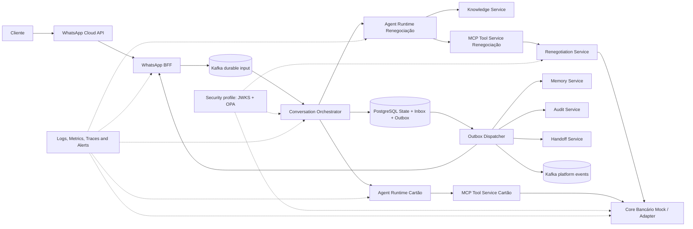
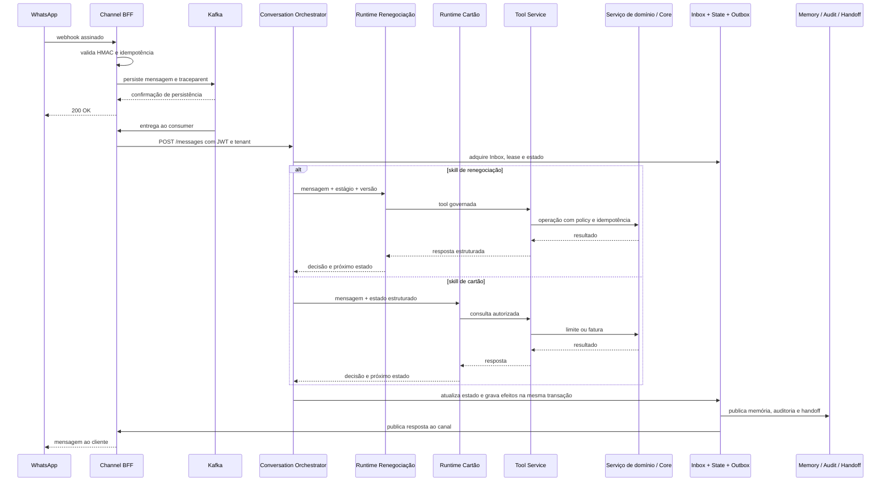

# Case applied — Multi-skill multi-skill linguistics platform

[                                                                                                                                                                                               AI Platform Architecture](https://leandrosflora.github.io/conversational-ai-platform-architecture/index.html){ .md-button .md-button--primary target="_blank" }

This case shows how the capabilities of the Enterprise AI Platform Reference Architecture can be materialised in a bank-based platform with a minimum skills, governed reports, integration by MCP, RAG, memory, auditory, observability and executed evidence.

The current implementation covers two messages via WhatsApp:

- renegotiation of debts, including consultations, simulation and government confirmation;
- a limit and letter size, with only reading flux.

!!! info "Estado atual"
    The solution is a **executive review and a sustained POC**. It offers architecture, contracts, checks and reports with a mock banker Core, but does not represent certification for bank production.

## Contexto

The platform receives webhooks signed by WhatsApp, persists the entry into Kafka before acceptance, maintains the transaccount status, selects the appropriate skill, consults knowledge, executes authorized tools and registers effects by means of Inbox and Outbox.

The corresponding services provide memory, auditory, handoff, observation, valuation, values and release governance. The Specialised services are subject to rules of renegotiation and letter, avoiding the agent from entering the central bank.

## Jornadas implementadas

| Jornada | Agent Runtime | Tool Service | Integration of field | Natureza |
|---|---|---|---|---|
| Renegotiation | `agent-runtime-renegotiation` | `tool-service-renegotiation` | `renegotiation-service`  mock banker core | Regulatory consultations and mutable operations |
| Limit and letter size | `agent-runtime-fatura-cartao` | `tool-service-cartao-credito` | access to Card API of the mock banker Core | somente leitura |

The Orchestrator keeps the state of the story and writes the conversation for the special runtime. The inclusion of a second skill shows that the arquival is not limited to one agent or banker product.

## Map of reference space

| Reference capacity | Implementation in the case | Estado atual |
|---|---|---|
| Channel / Agent Gateway | WhatsApp BFF, Kafka entry and Conversation Orchestrator | Implemented Baseline; gateway responsibility is still distributed |
| Agent Runtime | special runtimes for renegotiation and letter | Implementado |
| MCP Tool Service | Tool Services for renegotiation and lettering | Implementado |
| Workflow / Journey State | a set of seats, lease, version, Inbox and Outbox in the Orchestrator | Implementado |
| Knowledge Service | OpenSearch with veterinary and PDF search by tenant | Implemented; corporative conector and ACL by document still pending |
| Memory Service | Redis for session and MongoDB for historical | Implementado |
| Policy Enforcement | deterministic rules in Tool Services and domain service; executable profile with OPA | Implemented basis; corporative integration still in doubt |
| Workload Identity | JWT HS256 by side in the padrix profile; RS256 migraço profile, OIDC and JWKS | Parcial; identidade nativa, mTLS e KMS permanecem pendentes |
| Audit | PostgreSQL with decoding by tenant and key of idempotence | Implementado |
| Event Backbone | Kafka for hard entry, retry, DLQ and plate event | Developed partially; not all integration is geared towards events |
| Human Handoff | Conversation Handoff Service | Implemented as a persistent demand; bidirectional transfer to human platform still in doubt |
| Observability | Jaeger, Loki, Grafana Alloy, Prometheus, Grafana e Alertmanager | Implemented operational base; recurrent methods and receivers are still evolving |
| Evaluation Service | offline and online versions for both skills | Implemented executable base; continuous production evaluation still in doubt |
| Release Governance | manifest, lock with exassive SHAs, executable contracts and E2E multi-repository | Implemented Baseline; obligation gate and promotion by images taken still missing |
| Banking Core Integration | functional doors, canoon models, adapters and profiles for the environment | Ready to be implemented with mock; production contract, certification and reconciliation |
| Model Gateway | model configured directly in each runtime | Recommendation |
| AI Catalog / Control Plane | documentation, contracts and configuration by repository | Recommendation |
| FinOps | cost and tokens provided in the future, without centralised service | Recommendation |

## Developed arcade



The diagram represents the state implemented and the executable profiles. The algorithm can introduce additional core components, such as Agent Gateway, Model Gateway, IA catalog and FinOps.

## Simple flow



## Garantias demonstradas

| Aspecto | Garantia implementada |
|---|---|
| Entrada WhatsApp | ACK only after persisting in Kafka |
| Channel acousticity | webhook HMAC validation |
| Inbox | idempotent processing by message |
| State of the newspaper | lease, ottoist version and late message treatment |
| Side effects | Outbox at least once with decoding |
| Order | effects of a previous version blocked the release of the next one |
| Tenant | tenant in the header and claim inserted |
| Tools | allowlist, stat, version and policy valid before implementation |
| mutable operations | `Idempotency-Key`, replay and conflict by different payload |
| Financial confirmation | requires stature and evidence connected to the current message |
| Memory | separate keys by tenant and converse |
| Audit e Handoff | deduction by tenant and key of idempotence |
| Sensible data | tools arguments and CPF are not published in the platform events |
| RAG | Index and separate consultation by tenant |

## Security and Policy Enforcement

The POC profile pattern uses JWT HS256 with independent secrecy by service. This baseline reduces the indifference of credentials, but is still based on simetric secrecy.

A detailed migration profile shows the evolution for:

- RS256 emission;
- discovery OIDC and publication JWKS;
- short-term tokens by workload and audience;
- allowlist entre emissor e destino;
- OP as centralised PDP;
- failure to close decision;
- a duty to financial actions.

This valid profile still requires a national identity of workload, KMS or HSM, rotation, revogatation, mTLS and integration with the IAM corporative.

(Details of Workload Identity and PDP)(https://leandrosflora.github.io/conversational-ai-platform-architecture/security/workload-identity-pdp.html) target="_blank" 

## Evaluations and evidence

The plate has a suite version of renegotiations and letters, containing:

- apologies and identification of intention;
- a debt consultation;
- simulation and renegotiation report;
- limit and letter size;
- handoff humano;
- messages out of a splinter;
- Try to ignore rules.

The values can be executed offline, without infrastructure, or online against the two Agent Runtimes. The reports register approval, latence, handoff, threshold violations and expectative errors.

The necessary evolution is not more ‘creating values’, but amplify the assessment for real models, groundedness, selection of tools, cost, tokens, return by model and online production methods.

[Evaluations Details](https://leandrosflora.github.io/conversational-ai-platform-architecture/testing/evals.html) target="_blank" 

## Government to release multi-repository

The solution is composed of the aquacy repository and 12 service repository. The release manifest resolves the references to entry into 13 SHAs exaggerated and produces an imutable `release-lock.yaml`.

The E2E multi-repository pipeline may:

1. resolve all the repository for exaggerations;
2. executar builds e testes;
3. validar OpenAPI, AsyncAPI e policies;
4. slush the stack;
5. launching a slutted webhook;
6. validating the authenticated Core;
7. executar evals online e carga;
8. publish evidence relating to the release lock.

The production promotion should still be used for digesting, assimilating and adjusting images without reconstructing the environment.

(release details and executable contracts)(https://leandrosflora.github.io/conversational-ai-platform-architecture/governance/release-contract-governance.html) target="_blank" 

## Ready for integration with Core Bank

The mock banker core is not treated as equivalent to a production system. The application uses domain services, canoon functional ports and adapters selected by the environment:

```text
Agent / Tool Service
        ↓
Serviço de domínio
        ↓
Porta funcional canônica
        ↓
Adapter por ambiente
        ↓
Mock | Sandbox | API bancária real
```

The doors provide customer identification, debt card, elegitimity, simulation, formalisation and payment.

The solution provides for the E2E technical integration with mock, reporting and baseline security. It does not provide real financial rules, production contract, reconciliation or certification of the product.

A product release must be blocked when using the mock provider, statistical data, mutable operation without persistent idempotence or formalisation without reconciliation.

[Details of Banking Core Integration Readiness](https://leandrosflora.github.io/conversational-ai-platform-architecture/integration/banking-core-readiness.html) target="_blank" 

## Observability and operation

The local environment provides Jaeger, Loki, Grafana Alloy, Prometheus, Grafana and Alertmanager. There are versioned rules for infrastructure, DLQ, process failures, Outbox, authentication and policy negotiations.

Initial SLOs was defined for webhook reception, the Orchestrator's processing, Outbox publication, government tools, RAG and observeable infrastructure.

The baseline does not replace the corporative operation. The real receivers, ownership, escalonation, plant, full coverage of applied methods and approved budget errors will remain.

[Details of SLOs and alerts](https://leandrosflora.github.io/conversational-ai-platform-architecture/operations/slo-alerting.html) target="_blank" 

## Priority lacunes

1. consolidating Agent Gateway and transverse canal policies;
2. introduce Model Gateway with routing, fallback, quotas and cost measurement;
3. centralise AI Catalog, configuration and lifecycle of agents;
4. integrating a body identity of workload, KMS, rotation and mTLS;
5. conectar APIsreal banks with a certificate, reconciliation and persistent idempotence;
6. to increase the values for real models and continuous production monitoring;
7. ad hoc receivers, ownership and corporative proceedings of incidents;
8. implementing retention, anonimisation, excluding and regional recovery approved;
9. promote images accompanied by digesting with a verified provenance;
10. centralized FinOps by agent, skill, model, tenant and newspaper.

## Resultado arquitetural

The case shows that the reference architecture supports a multi-skill multi-skill conversative platform, with comparable components and special agents.

Implementation provides flexible entry rules, trans-country, tool calling government, RAG memory, auditory, handoff, values, observation, evolution-proof security and release-government.

She also leaves the border open between three states:

- **implemented:** valid in code, contracts, Compose or E2E evidence;
- **executive base:** control demonstrated locally, still dependent on corporative integration;
- **production:** requires real APIs, strong identity, operation, compliance, resilience and promotion of approved items.

This separation prevents a technologically advanced COP as a ready-to-production bank platform, without reducing the value of the architecture and evidence already built.
